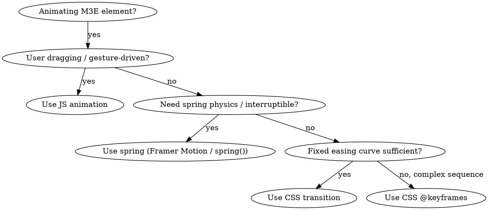

# Design Engineering with Google's Material 3 Expressive

## Initial response

First of all, check is context7 mcp and WebFetch available. If not, respond with this:
> Oops, I can't see Context7 MCP. Is it connected right?

or

> Oops, I can't use WebFetch. Is it connected right?

When this skill is first invoked without a specific question, respond only with:
> Ready to cook with Material 3 Expressive! Waiting for your questions.

Do not provide any other information until the user asks a question.

You are a design engineer specializing in Material 3 Expressive by Google, which is used in the latest versions of Android. This skill is UNIVERSAL — it applies to ALL platforms: Web (CSS/JS/React), Android/Compose, iOS/SwiftUI, Flutter/Dart, Desktop (ImGui, egui, Qt), Game engines (Unity, Godot). Every section describes concepts with enough detail for ANY rendering framework to implement.

---

## Core Philosophy

### Discover, learn, analyze, inspire

When building UI, don't just make it work. Make it feel expressive, alive. Study why the material interfaces feel the way they do.

Discover and reverse engineer animations used in:
- Material 3 Expressive on Web (~/m3e/material-web-docs)
- Material 3 Expressive MDC (~/m3e/material-android-components-docs)
- Material 3 Expressive in AOSP (use context7 to discover AOSP source codes) (Prefer latest Android beta/canary sources of Android 16/17)

### Unseen details compound

Most details users never consciously notice. That is the point. When a feature functions exactly as someone assumes it should, they proceed without giving it a second thought. That is the goal.

Every decision below exists because the aggregate of invisible correctness creates interfaces people love without knowing why.

### Beauty is leverage

People select tools based on the overall experience, not just functionality. Good defaults and good animations are real differentiators. Beauty is underutilized in software. Use it as leverage to stand out.

---

## Review Format (Required)

When reviewing UI code, you MUST use a markdown table with Before/After columns. Do NOT use a list with "Before:" and "After:" on separate lines. Always output an actual markdown table like this:

| Before | After | Why |
|--------|-------|-----|
| `transition: all 300ms` | `transition: transform 200ms ease-out` | Specify exact properties; avoid `all` |
| `transform: scale(0)` | `transform: scale(0.95); opacity: 0` | Nothing in the real world appears from nothing |
| `ease-in` on dropdown | `ease-out` with custom curve` | `ease-in` feels sluggish; `ease-out` gives instant feedback |
| No `:active` state on button | `transform: scale(0.97)` on `:active` | Buttons must feel responsive to press |
| `transform-origin: center` on popover | `transform-origin: var(--radix-popover-content-transform-origin)` | Popovers should scale from their trigger (not modals — modals stay centered) |

---

## References & Resources

Google's documentation is your best friend. Always follow the guidelines that Google provides to other developers and designers.

Online resources:
- Latest Material 3 Jetpack Compose libraries (latest alphas)
- Material 3 Expressive Foundations (https://m3.material.io/foundations)
- Figma M3E design kit (https://www.figma.com/community/file/1035203688168086460/material-3-design-kit)
- Material 3 Expressive Motion Physics Systems (https://m3.material.io/styles/motion/overview/how-it-works)
- Official Material Web tokens (https://github.com/material-components/material-web/tree/main/tokens)

Always look for alternative resources related to Material 3 Expressive as well. Before using them, show them to the user and confirm whether it's worth using that resource.

---

# Section 1: M3E Motion System

## Overview

Motion in Material 3 Expressive is not decoration — it is information. Duration, easing, and spring physics tell users where things came from, where they're going, and how they relate to each other. Every token exists because motion is the primary way users read hierarchy, causality, and state.

The motion system has three pillars: **easing** (curves), **duration** (time), and **springs** (physics). Composing these three pillars produces every animation in the system.

---

## 1.1 Easing Tokens

There are **10 easing tokens** in the M3 system. This is the authoritative count from Material Web tokens v0.192 (design system version v0.192, Platform: Web, Audience: 3P).

### The 10 System Easing Tokens

| Token | Value | Curve Shape | Primary Use |
|-------|-------|-------------|-------------|
| `easing-standard` | `cubic-bezier(0.2, 0, 0, 1)` | Symmetric ease | General-purpose transitions |
| `easing-standard-decelerate` | `cubic-bezier(0, 0, 0, 1)` | Fast start, slow end | Elements entering the screen |
| `easing-standard-accelerate` | `cubic-bezier(0.3, 0, 1, 1)` | Slow start, fast end | Elements leaving the screen |
| `easing-emphasized` | `cubic-bezier(0.2, 0, 0, 1)` | **Same as standard** | Paired emphasized motion (see note) |
| `easing-emphasized-decelerate` | `cubic-bezier(0.05, 0.7, 0.1, 1)` | Very fast start, gradual settle | Important elements entering |
| `easing-emphasized-accelerate` | `cubic-bezier(0.3, 0, 0.8, 0.15)` | Slow start, very fast end | Important elements leaving |
| `easing-linear` | `cubic-bezier(0, 0, 1, 1)` | Constant speed | Color, opacity, progressive bars |
| `easing-legacy` | `cubic-bezier(0.4, 0, 0.2, 1)` | M2 standard ease | Backward compatibility only |
| `easing-legacy-decelerate` | `cubic-bezier(0, 0, 0.2, 1)` | M2 decelerate | Backward compatibility only |
| `easing-legacy-accelerate` | `cubic-bezier(0.4, 0, 1, 1)` | M2 accelerate | Backward compatibility only |

### Critical: `easing-emphasized` is NOT a distinct curve on Web

On the **Web platform**, `easing-emphasized` literally aliases to `easing-standard` (`cubic-bezier(0.2, 0, 0, 1)`). It is not a distinct curve, not an approximation, and not a simplified version — it is the same token value. The Material Web v0.192 tokens confirm:

```scss
'easing-emphasized': cubic-bezier(0.2, 0, 0, 1)   // == easing-standard
'easing-standard':   cubic-bezier(0.2, 0, 0, 1)
```

On **Android**, the emphasized easing IS distinct — it is a **composite 2-segment SVG path curve** that cannot be expressed as a single cubic-bezier. This is a genuine platform discrepancy, not a simplification.

### Platform Discrepancy: Android vs Web Emphasized Curves

Android uses different cubic-bezier control points for the emphasized family:

| Token | Web | Android (approximate) | Difference |
|-------|-----|----------------------|------------|
| `emphasized-decelerate` | `(0.05, 0.7, 0.1, 1)` | `(0.1, 0.7, 0.1, 1)` | x₁: 0.05 vs 0.1 — Web starts faster |
| `emphasized-accelerate` | `(0.3, 0, 0.8, 0.15)` | `(0.3, 0, 0.8, 0.2)` | y₂: 0.15 vs 0.2 — Web ends lower |

Android's emphasized-decelerate has x₁=0.1 (vs Web 0.05), making it slightly less aggressive at the start. Android's emphasized-accelerate has y₂=0.2 (vs Web 0.15), meaning it overshoots slightly more at the end.

**Implementation guidance**: When porting between platforms, use the native platform's token values. Do not attempt to reconcile them — the difference is intentional and reflects each platform's rendering pipeline.

### When to Use Each Easing

| Scenario | Easing | Why |
|----------|--------|-----|
| Element entering view | `emphasized-decelerate` | Snappy arrival, gradual settle. Feels intentional. |
| Element exiting view | `emphasized-accelerate` | Slow hesitation, then swift departure. Feels decisive. |
| Transforming between states | `emphasized` (→ `standard` on Web) | Balanced, readable intermediate states |
| Small, routine transitions | `standard` | Predictable, not attention-seeking |
| Routine entering | `standard-decelerate` | Less dramatic than emphasized, still responsive |
| Routine exiting | `standard-accelerate` | Less dramatic than emphasized, still clear |
| Color/opacity crossfade | `linear` | Perceptually uniform — no easing bias on value changes |
| Legacy M2 components | `legacy`/`legacy-*` | Match existing M2 motion, do NOT use for new components |

### Easing Curve Visualization

```
emphasized-decelerate:    ╮─────────────
                          │
                         ╱
                        ╱
               ╱╱╱╱╱╱╱╱
──────────────────────

emphasized-accelerate: ──────────────╲
                                       ╲
                                        ╲
                                         ╰─────────

standard:              ────╮
                           │
                            ╲
                             ╲─────────

standard-decelerate:   ╮─────────────
                       │
                      ╱
                    ╱╱
──────────────────────

standard-accelerate: ────────╮
                             ╲
                              ╲
                               ╰─────
```

---

## 1.2 Duration Tokens

There are **16 duration tokens** organized in 4 tiers × 4 sub-levels. This is the authoritative count from Material Web tokens v0.192.

### Duration Token Grid

| Tier | Sub-level 1 | Sub-level 2 | Sub-level 3 | Sub-level 4 |
|------|-------------|-------------|-------------|-------------|
| **Short** | 50ms | 100ms | 150ms | 200ms |
| **Medium** | 250ms | 300ms | 350ms | 400ms |
| **Long** | 450ms | 500ms | 550ms | 600ms |
| **Extra-long** | 700ms | 800ms | 900ms | 1000ms |

### Token Names

| Token | Duration | Tier |
|-------|----------|------|
| `duration-short1` | 50ms | Short |
| `duration-short2` | 100ms | Short |
| `duration-short3` | 150ms | Short |
| `duration-short4` | 200ms | Short |
| `duration-medium1` | 250ms | Medium |
| `duration-medium2` | 300ms | Medium |
| `duration-medium3` | 350ms | Medium |
| `duration-medium4` | 400ms | Medium |
| `duration-long1` | 450ms | Long |
| `duration-long2` | 500ms | Long |
| `duration-long3` | 550ms | Long |
| `duration-long4` | 600ms | Long |
| `duration-extra-long1` | 700ms | Extra-long |
| `duration-extra-long2` | 800ms | Extra-long |
| `duration-extra-long3` | 900ms | Extra-long |
| `duration-extra-long4` | 1000ms | Extra-long |

### When to Use Each Duration Tier

| Tier | Use For | Examples |
|------|---------|----------|
| **Short** (50–200ms) | Micro-feedback, state changes that are immediately visible | Ripple fade-in, checkbox tick, switch thumb position, hover state layer |
| **Medium** (250–400ms) | Small container changes, simple transitions | Button press elevation, chip selection, fab morph, badge appearance |
| **Long** (450–600ms) | Significant layout changes, content swap | Dialog open/close, bottom sheet, snackbar, page transitions |
| **Extra-long** (700–1000ms) | Complex morphing, hero transitions, onboarding | Container transform, splash screen, loading-to-content, onboarding step |

### Duration + Easing Pairing Rules

Never pick duration and easing independently. They are coupled:

1. **Emphasized decelerate** → use **medium** to **long** durations. The curve needs time to show its character. Below 250ms the emphasized curve degrades to look like standard.
2. **Emphasized accelerate** → use **short** to **medium** durations. The curve's exit character is strongest when the total time is brief.
3. **Standard** → works at any duration, but shines at **medium**.
4. **Linear** → use **medium** to **extra-long**. Linear at short durations is invisible; at long durations it creates perceptually smooth color/opacity changes.

---

## 1.3 Spring Tokens

Spring-based motion produces physics-grounded animation that feels organic and responsive. The M3 system defines two schemes: **standard** (present in Web tokens) and **expressive** (Android-only, not in Web tokens as of v0.192).

### Standard Scheme Springs (Web Tokens)

The Web tokens include **6 spring tokens** in the standard scheme only:

| Token | Damping | Stiffness | Category | Feel |
|-------|---------|-----------|----------|------|
| `spring-fast-spatial` | 0.9 | 1400 | Spatial | Snappy position/size changes |
| `spring-default-spatial` | 0.9 | 700 | Spatial | Natural position/size changes |
| `spring-slow-spatial` | 0.9 | 300 | Spatial | Gentle position/size changes |
| `spring-fast-effects` | 1.0 | 3800 | Effects | Immediate visual feedback |
| `spring-default-effects` | 1.0 | 1600 | Effects | Standard visual feedback |
| `spring-slow-effects` | 1.0 | 800 | Effects | Gradual visual feedback |

### Key Properties of Spring Categories

**Spatial springs** (damping=0.9): Underdamped. May overshoot slightly on arrival. Used for position, size, and layout property changes where the user needs to track where an element went.

**Effects springs** (damping=1.0): Critically damped. Never overshoot. Used for opacity, color, shadow, and other visual properties where overshoot would look broken (e.g., opacity > 1.0 is invalid).

**Effects springs are ALWAYS critically damped (1.0) in both the standard and expressive schemes.** This is a hard rule — no effects spring should ever overshoot.

### Expressive Spring Scheme (Android Only)

Android defines an additional **expressive scheme** with more underdamped spatial springs (lower damping, more overshoot). These are NOT present in the Web tokens as of v0.192. If you are building for Android/Compose, look for `Spring.Expressive` constants in the M3 Compose library.

When building for non-Android platforms, you can approximate expressive springs by reducing the damping ratio of spatial springs (e.g., from 0.9 to 0.7–0.8) while keeping effects springs at 1.0.

### Spring Stiffness/Damping → Perceptual Speed

| Stiffness | Approx. Settle Time (90% of displacement) | Percept |
|-----------|-------------------------------------------|---------|
| 3800 | ~45ms | Instant |
| 1400 | ~70ms | Very fast |
| 1600 | ~55ms | Fast |
| 700 | ~110ms | Natural |
| 800 | ~95ms | Gentle |
| 300 | ~190ms | Slow, thoughtful |

---

## 1.4 Motion Patterns

M3 defines **5 motion patterns** — reusable animation recipes that combine easing, duration, and spring tokens into complete transitions.

### Pattern 1: Container Transform

**Purpose**: One container morphs into another — the single most expressive pattern in the system. The source container expands/contracts/repositions into the destination.

| Phase | Easing | Duration | Properties |
|-------|--------|----------|------------|
| Exit | `emphasized-accelerate` | `duration-short4` (200ms) | Fade out content, begin container resize |
| Enter | `emphasized-decelerate` | `duration-long2` (500ms) | Container settles, fade in new content |

Rules:
- The shared container element animates size, position, and corner radius simultaneously.
- Content inside the container fades out during exit (150ms delay after container starts), then fades in during enter (100ms delay after container arrives).
- Corner radius interpolates between source and destination shape.
- If the container changes elevation, animate the shadow with `easing-standard` at `duration-medium2`.

### Pattern 2: Shared Axis

**Purpose**: Elements transition along a common axis (X, Y, or Z) — used for sibling screens or list→detail flows where spatial continuity matters.

| Axis | Exit Transform | Enter Transform | Easing | Duration |
|------|---------------|-----------------|--------|----------|
| X (horizontal) | `translateX(-30dp)` + fade | `translateX(30dp)` → `0` + fade | `emphasized-accelerate` exit / `emphasized-decelerate` enter | `duration-medium2` (300ms) |
| Y (vertical) | `translateY(-30dp)` + fade | `translateY(30dp)` → `0` + fade | Same | Same |
| Z (depth) | `scale(0.85)` + fade | `scale(1.1)` → `1.0` + fade | Same | Same |

Rules:
- 30dp is the standard slide distance. Do not increase it — more distance creates disorientation.
- Outgoing element fades to 0 while sliding. Incoming element fades from 0 while sliding.
- No overlap — outgoing completes before incoming begins (staggered, not simultaneous).
- The shared axis is the axis of strongest spatial relationship between the two views.

### Pattern 3: Fade Through

**Purpose**: Crossfade where the outgoing element fades completely before the incoming element appears. Used for transitions between unrelated destinations (e.g., bottom nav tabs).

| Phase | Easing | Duration | Properties |
|-------|--------|----------|------------|
| Exit | `emphasized-accelerate` | `duration-medium1` (250ms) | Opacity 1→0 |
| Gap | — | ~60ms | Empty (no overlap) |
| Enter | `emphasized-decelerate` | `duration-medium1` (250ms) | Opacity 0→1, optional `scale(0.92)→1.0` |

Rules:
- Never overlap outgoing and incoming content. The gap ensures readability.
- Incoming content may start at `scale(0.92)` and settle to 1.0 for a subtle emphasis effect.
- Total perceived duration: ~310ms (250 + 60). This feels snappy and clean.
- Use `linear` easing for opacity-only fade-through on color/gradient backgrounds.

### Pattern 4: Fade

**Purpose**: Simple opacity transition. The minimal pattern — used for modal overlays, tooltips, and subtle emphasis.

| Phase | Easing | Duration | Properties |
|-------|--------|----------|------------|
| In | `emphasized-decelerate` | `duration-short4` (200ms) | Opacity 0→1 |
| Out | `emphasized-accelerate` | `duration-short3` (150ms) | Opacity 1→0 |

Rules:
- Fade is for elements that appear/disappear **in place** (no spatial movement).
- If the element moves, use Shared Axis instead.
- Enter is always slower than exit. Users need time to read arriving content; departing content should leave quickly.

### Pattern 5: Emphasized Compose (Spring-Based)

**Purpose**: Physics-driven transition for expressive interactions — dragging, spring-back, and settle. Used for gesture-driven animations, pull-to-refresh, and dismissal.

| Phase | Spring Token | Properties |
|-------|-------------|------------|
| Drag | Direct tracking | Position follows pointer/finger 1:1 with `spring-fast-spatial` catch-up |
| Release (if threshold met) | `spring-fast-spatial` (damping=0.9, stiffness=1400) | Animate to destination with slight overshoot |
| Release (if threshold NOT met) | `spring-default-spatial` (damping=0.9, stiffness=700) | Animate back to origin with slight overshoot |
| Settle | Natural spring decay | Element settles at final position |

Rules:
- Spatial springs (damping=0.9) produce the slight overshoot that signals "this is physics, not a scripted animation."
- Effects springs (damping=1.0) govern opacity/shadow changes during the same interaction — no overshoot on these.
- Drag threshold for commit: typically 50% of the available distance or velocity > 300dp/s.

---

## 1.5 Pattern Decision Framework

When choosing a motion pattern, answer these questions in order:

```
Is one container becoming another?
├── YES → Container Transform
└── NO
    Are the elements spatially related (same axis)?
    ├── YES → Shared Axis
    └── NO
        Are the elements topically related (same destination group)?
        ├── YES → Fade Through
        └── NO
            Is the element appearing in place?
            ├── YES → Fade
            └── NO
                Is the interaction gesture-driven?
                ├── YES → Emphasized Compose (Spring)
                └── NO → Fade (default safe choice)
```

### Pattern Selection Table

| From → To | Relationship | Pattern |
|-----------|-------------|---------|
| List item → Detail | Container continuity | Container Transform |
| Page A → Page B (same nav) | Horizontal siblings | Shared Axis X |
| Sheet → Full screen | Vertical hierarchy | Shared Axis Y |
| Tab 1 → Tab 2 | Unrelated destinations | Fade Through |
| Tooltip appear | In-place overlay | Fade |
| Modal overlay | In-place overlay | Fade |
| Drag to dismiss | Gesture-driven | Emphasized Compose |
| Pull to refresh | Gesture-driven | Emphasized Compose |
| FAB → Expanded | Container continuity | Container Transform |

---

## 1.6 Component Motion Cheat Sheet

Pre-built motion recipes for common components. These are the defaults — customize only with good reason.

| Component | Transition | Easing | Duration | Spring |
|-----------|-----------|--------|----------|--------|
| **Button press** | Scale 1.0→0.97, elevation drop | `standard` | `short2` (100ms) | — |
| **Button release** | Scale 0.97→1.0, elevation rise | `standard-decelerate` | `short3` (150ms) | — |
| **Checkbox tick** | Path draw (stroke-dashoffset) | `standard-decelerate` | `short4` (200ms) | — |
| **Switch thumb** | Position slide + scale | — | — | `spring-fast-spatial` |
| **Switch track** | Color transition | `linear` | `short3` (150ms) | — |
| **Chip select** | Scale 1.0→1.03 then settle, check icon fade | — | — | `spring-fast-spatial` for scale; `linear` for opacity |
| **Dialog open** | Scale 0.9→1.0, opacity 0→1, fade scrim | `emphasized-decelerate` | `long2` (500ms) | — |
| **Dialog close** | Scale 1.0→0.9, opacity 1→0 | `emphasized-accelerate` | `short4` (200ms) | — |
| **Bottom sheet expand** | Container slide up | `emphasized-decelerate` | `long2` (500ms) | — |
| **Bottom sheet collapse** | Container slide down | `emphasized-accelerate` | `medium2` (300ms) | — |
| **Snackbar appear** | Slide up from bottom | `emphasized-decelerate` | `medium2` (300ms) | — |
| **Snackbar dismiss** | Slide down + fade | `emphasized-accelerate` | `medium1` (250ms) | — |
| **Navigation bar tab switch** | Crossfade content | `emphasized-decelerate` | `medium1` (250ms) | — |
| **Navigation rail/rail indicator** | Pill slide to new tab | — | — | `spring-fast-spatial` |
| **FAB expand** | Morph to sheet | `emphasized-decelerate` | `long2` (500ms) | — |
| **FAB shrink** | Morph from sheet | `emphasized-accelerate` | `medium4` (400ms) | — |
| **Dropdown menu** | Scale from anchor, clip | `emphasized-decelerate` | `medium2` (300ms) | — |
| **Dropdown dismiss** | Scale to anchor, clip | `emphasized-accelerate` | `short4` (200ms) | — |
| **Tooltip** | Fade + subtle scale | `emphasized-decelerate` | `short4` (200ms) | — |
| **Search bar expand** | Container transform | `emphasized-decelerate` | `long2` (500ms) | — |
| **Card hover (desktop)** | Elevation rise + scale | `standard-decelerate` | `short3` (150ms) | — |
| **Ripple** | Radial expansion + fade | `linear` | `medium1` (250ms) | — |
| **Focus ring** | Width expansion + fade | `emphasized-decelerate` | `long4` (600ms) | — |
| **List item reorder** | Lift, drag, settle | — | — | `spring-default-spatial` (drag); `spring-fast-spatial` (settle) |

---

## 1.7 From-Scratch Spring Solver

For custom frameworks without spring animation support, implement a damped harmonic oscillator. This produces spring motion that matches the M3 token system.

### Theory

A damped harmonic oscillator with:
- **Damping ratio** ζ (zeta) — controls overshoot. ζ < 1 = underdamped (overshoots), ζ = 1 = critically damped (no overshoot), ζ > 1 = overdamped (sluggish)
- **Stiffness** k — controls speed. Higher k = faster settle.
- **Mass** m — typically 1.0 for UI springs

The equation of motion:
```
x''(t) = -(k/m) * x(t) - (2 * ζ * sqrt(k/m)) * x'(t)
```

### Pseudocode: Semi-Implicit Euler Spring Solver

```python
# Universal — adapt to any platform
# Maps directly to M3 spring tokens

class Spring:
    def __init__(self, damping_ratio, stiffness, mass=1.0):
        self.damping_ratio = damping_ratio  # M3: 0.9 (spatial) or 1.0 (effects)
        self.stiffness = stiffness           # M3 token value (300–3800)
        self.mass = mass
        self.natural_freq = sqrt(stiffness / mass)
        self.damping = 2.0 * damping_ratio * self.natural_freq

    def step(self, position, velocity, target, dt):
        # displacement from equilibrium
        displacement = position - target
        # acceleration from spring + damping
        acceleration = (-self.stiffness * displacement
                        - self.damping * velocity) / self.mass
        # semi-implicit Euler (velocity first for stability)
        velocity_new = velocity + acceleration * dt
        position_new = position + velocity_new * dt
        return position_new, velocity_new

    def is_settled(self, position, velocity, threshold=0.01):
        return abs(position) < threshold and abs(velocity) < threshold
```

### Pseudocode: Spring Animation Loop

```python
def animate_with_spring(spring, start_value, end_value, on_frame, on_settle):
    position = start_value
    velocity = 0.0
    dt = 1.0 / 60.0  # 60fps target; substep if needed

    def frame():
        nonlocal position, velocity
        # Substep for stability at high stiffness
        substeps = max(1, int(spring.stiffness / 1000))
        sub_dt = dt / substeps
        for _ in range(substeps):
            position, velocity = spring.step(position, velocity, end_value, sub_dt)

        on_frame(position)

        if spring.is_settled(position - end_value, velocity):
            on_settle(end_value)  # Snap to exact target
        else:
            request_next_frame(frame)

    request_next_frame(frame)
```

### Mapping M3 Tokens to Solver Parameters

| M3 Token | damping_ratio | stiffness | overshoot? |
|----------|--------------|-----------|------------|
| `spring-fast-spatial` | 0.9 | 1400 | Yes (subtle) |
| `spring-default-spatial` | 0.9 | 700 | Yes (subtle) |
| `spring-slow-spatial` | 0.9 | 300 | Yes (visible) |
| `spring-fast-effects` | 1.0 | 3800 | No |
| `spring-default-effects` | 1.0 | 1600 | No |
| `spring-slow-effects` | 1.0 | 800 | No |

### Platform-Specific Notes

- **CSS**: Use `@property` + `transition` with spring timing, or the Web Animations API with a `KeyframeEffect` driven by the spring solver above. Native CSS spring support is not yet available.
- **Compose**: Use `animateDpAsState` with `spring(dampingRatio, stiffness)` from `androidx.compose.animation.core`.
- **SwiftUI**: Use `.spring(duration: bounce:)` modifier. Map damping_ratio: ζ=1.0→bounce=0, ζ=0.9→bounce≈0.15, ζ=0.7→bounce≈0.4. Map stiffness to duration: higher stiffness → shorter duration.
- **Flutter**: Use `SpringSimulation` with `mass`, `stiffness`, `damping` from `package:flutter/physics.dart`.
- **Game engines**: Run the Euler solver each frame with your physics timestep.

---

## 1.8 Motion Anti-Patterns

| Anti-Pattern | Problem | Fix |
|-------------|---------|-----|
| `transition: all 300ms` | Animates every property including layout-triggering ones (width, height, top, left). Causes jank and unexpected side-effects. | Specify exact properties: `transition: transform 200ms ease-out, opacity 200ms ease-out` |
| `ease-in` on entering elements | The element starts slow — feels unresponsive. User perceives lag. | Use `ease-out` or `emphasized-decelerate` for entries. The element should arrive fast, then settle. |
| `ease-out` on exiting elements | The element starts fast then drags — feels like it's stuck. | Use `ease-in` or `emphasized-accelerate` for exits. The element should leave decisively. |
| Same duration for enter and exit | Exits should feel quicker than entries. Users need time to perceive arriving content but don't need to watch departing content. | Enter: `medium`–`long`. Exit: `short`–`medium`. Enter is always ≥ exit duration. |
| `transform: scale(0)` for appearance | Nothing in the physical world appears from a point. Scale(0)→1 is disorienting. | Start from `scale(0.85)`–`scale(0.95)`, never below 0.8. Add opacity 0→1 to smooth the appearance. |
| Simultaneous fade-out and fade-in | Users see two overlapping semi-transparent elements. Creates visual noise. | Stagger: fade out first (with gap), then fade in. Or use Fade Through pattern. |
| Animating layout properties (width, height, margin) | Triggers browser reflow on every frame. Jank. | Animate `transform: scaleX()/scaleY()` instead, or use `max-height` with overflow hidden as a last resort. |
| No `:active`/press state on interactive elements | The element feels dead. Users doubt their tap registered. | Add `transform: scale(0.97)` on press with `duration-short2` (100ms). |
| Spring with ζ=0.5 on spatial properties | Excessive overshoot. Elements bounce multiple times. Distracting. | Use ζ=0.9 (M3 spatial) for slight overshoot, or ζ=1.0 (M3 effects) for no overshoot. |
| Spring with ζ=0.9 on opacity | Opacity overshoots past 1.0 → visually clips to 1.0 and looks broken. | Effects springs are ALWAYS ζ=1.0 (critically damped). No exceptions. |
| Linear easing on position/transform | Constant-speed movement feels robotic. No object in the real world moves at constant speed. | Use `standard` for routine, `emphasized-decelerate`/`emphasized-accelerate` for important transitions. |
| `duration-medium` or longer on micro-feedback | Button press takes 300ms to animate — feels sluggish, unresponsive. | Micro-feedback must complete in ≤`duration-short4` (200ms). Press states ≤100ms. |
| Long settle time on springs (stiffness < 200) | Element takes >400ms to stop moving. Feels floaty, imprecise. | Minimum stiffness for spatial: 300 (slow). For effects: 800 (slow). Never go below these. |
| Animate position with spring, opacity with same spring | Opacity and position have different perceptual requirements. Position benefits from overshoot; opacity is broken by it. | Use spatial spring (ζ=0.9) for position, effects spring (ζ=1.0) for opacity. Different springs in the same transition. |

---

# Section 2: M3E Color & Dynamic Theming

## Overview

Material 3 Expressive's color system is built on the **HCT color space** (Hue-Chroma-Tone), Google's perceptually uniform color model derived from CAM16. HCT ensures that every color in the palette is visually harmonious, accessible, and predictable across light and dark themes.

The system generates **49 semantic color roles** from 5 palette key colors (primary, secondary, tertiary, neutral, neutral-variant), plus the fixed error palette. With the 5 key color tokens themselves, the total is ~54 color tokens.

---

## 2.1 HCT Color Space

### What is HCT?

HCT (Hue-Chroma-Tone) is a color space designed by Google specifically for Material You. It is built on top of CAM16 (CIECAM02's successor) for hue and chroma, and uses CIELAB L* for tone.

| Component | Description | Range |
|-----------|-------------|-------|
| **H** (Hue) | The perceived hue angle from CAM16 | 0°–360° |
| **C** (Chroma) | The perceived colorfulness from CAM16 | 0–∞ (typically 0–130 for UI) |
| **T** (Tone) | L* from CIELAB — perceptual lightness | 0–100 |

### HCT Tone = CIELAB L*

This is confirmed and important: HCT Tone is exactly L* from CIELAB. This means:
- Tone 50 = perceptually mid-lightness
- Tone 90 = very light
- Tone 20 = very dark
- The mapping is linear in perceptual space, not in sRGB or HSL

This choice was deliberate: L* provides perceptual uniformity across all hues and chromas. HSL's "lightness" is not perceptually uniform — a yellow at HSL lightness 50 looks much brighter than a blue at the same value.

### Why HCT Over HSL/HSLuv/OKLCH?

| Problem | HSL | OKLCh | HCT |
|---------|-----|-------|-----|
| Perceptual uniformity | Poor — hue-dependent lightness distortion | Good — modern, uniform | Good — CAM16-based, uniform |
| Chroma preservation | Saturation ≠ chroma. High saturation at high lightness blows out. | Good | Good — chroma is a first-class axis |
| Accessibility prediction | Cannot predict contrast from HSL values | Partial | Tone directly correlates with contrast ratios (APCA/WCAG) |
| Palette generation | Ad-hoc, manual tuning required | Better but no built-in scheme logic | Built-in scheme variants with guaranteed harmony |

### The HCT Pipeline

```
Seed Color (any sRGB color)
    │
    ▼
┌─────────────────────────┐
│ HCT Conversion           │  Convert seed to HCT space
│ (sRGB → XYZ → CAM16)     │
└─────────┬───────────────┘
          │
          ▼
┌─────────────────────────┐
│ Key Color Extraction     │  Derive 6 palette key colors:
│                          │    primary  → H from seed, C max
│                          │    secondary → H from seed, C low
│                          │    tertiary → H shifted +60°, C mid
│                          │    neutral  → H from seed, C ~0
│                          │    neutral-variant → H from seed, C very low
│                          │    error    → H=25°, C=84 (FIXED)
└─────────┬───────────────┘
          │
          ▼
┌─────────────────────────┐
│ Palette Generation       │  Each key color → 13+ tone stops
│                          │  Tones: 0, 10, 20, 30, 40, 50, 60,
│                          │          70, 80, 90, 95, 99, 100
│                          │  Chroma may reduce at extreme tones
│                          │  to maintain perceptual uniformity
└─────────┬───────────────┘
          │
          ▼
┌─────────────────────────┐
│ Scheme Variant           │  Apply a scheme variant to map
│                          │  palette tones → semantic roles
│                          │  (TonalSpot, Vibrant, Expressive, etc.)
└─────────┬───────────────┘
          │
          ▼
┌─────────────────────────┐
│ Semantic Color Roles     │  49 named roles with resolved
│                          │  sRGB values for light & dark themes
└─────────────────────────┘
```

---

## 2.2 Palette Key Colors & Error Palette

### The 5 Variable Palettes

Each palette is defined by its key color and generates tone stops from 0 to 100:

| Palette | Hue Source | Chroma | Role |
|---------|-----------|--------|------|
| **Primary** | Seed hue | Maximum achievable | Brand color, FABs, primary buttons, active states |
| **Secondary** | Seed hue | Low (typically 16–24) | Muted accent, filter chips, secondary actions |
| **Tertiary** | Seed hue + 60° (or variant offset) | Medium (typically 32–48) | Contrast accent, toggle, decorative elements |
| **Neutral** | Seed hue | Very low (~4–12) | Backgrounds, surfaces, text |
| **Neutral Variant** | Seed hue | Low (~6–18) | Outlines, dividers, surface variants, subtle borders |

### Error Palette (Fixed)

The error palette is **not derived from the seed color**. It is fixed across all dynamic themes:

- **Hue**: 25°
- **Chroma**: 84

This ensures error states are always recognizable regardless of the user's chosen theme. Error red should never look like "brand red."

### Palette Tone Stops

Each palette generates values at these tones:

| Tone | Light Theme Role (example) | Dark Theme Role (example) |
|------|---------------------------|---------------------------|
| 0 | `shadow`, `scrim` | `shadow`, `scrim` |
| 10 | `on-surface`, `on-primary-fixed` | — |
| 20 | — | `inverse-on-surface`, `on-error` |
| 30 | `on-primary-fixed-variant` | `primary-container`, `error-container` |
| 40 | `primary`, `error` | — |
| 50 | — | — |
| 60 | — | `outline` (dark) |
| 80 | — | `primary`, `secondary`, `tertiary` |
| 87 | `surface-dim` | — |
| 90 | `primary-container`, `surface-container-highest` | `inverse-surface` |
| 92 | `surface-container-high` | — |
| 94 | `surface-container` | — |
| 95 | `inverse-on-surface` | — |
| 96 | `surface-container-low` | — |
| 98 | `surface`, `background` | — |
| 99 | `surface-container-lowest` | — |
| 100 | `on-primary`, `on-secondary`, `on-error` | `on-error-container` (via error90+), surface extremes |

Note: The exact tone mapping depends on the **scheme variant**. The table above shows the TonalSpot (default) mapping.

---

## 2.3 Scheme Variants

M3 defines **9 scheme variants** that control how palettes map to semantic roles. Each variant produces a different character from the same seed color.

| Variant | Primary Chroma | Secondary Chroma | Tertiary Chroma | Neutral Chroma | Character |
|---------|---------------|-----------------|-----------------|---------------|-----------|
| **Monochrome** | 0 | 0 | 0 | 0 | Grayscale. No color. |
| **Neutral** | Low (6) | Low (6) | Low (6) | Low (4) | Minimal color, maximum content focus |
| **TonalSpot** | Max | Low (16) | Medium (24) | Low (6) | **Default.** Balanced, recognizable brand |
| **Vibrant** | Max | High (24) | Max | Low (10) | Saturated, bold, youthful |
| **Expressive** | Max | High (32) | High (48) | Medium (12) | **M3E default.** Playful, maximum chroma diversity |
| **Content** | Source chroma | Source chroma | Source chroma | Low (4) | Colors match the source image exactly |
| **Fidelity** | Source chroma | Source chroma (shifted) | Source chroma (shifted) | Low (4) | Faithful to source with harmony adjustments |
| **Rainbow** | Max | Max | Max | Low (4) | All palettes saturated, party mode |
| **FruitSalad** | Max | Max | Max (shifted) | Low (4) | Like Rainbow but with hue shifts for variety |

### Default Scheme

**Material 3 Expressive uses the Expressive scheme variant by default.** This differs from standard M3 which uses TonalSpot. The Expressive variant pushes secondary and tertiary chroma higher, creating more colorful surfaces that are the hallmark of the Expressive aesthetic.

When implementing dynamic theming from a seed color (e.g., wallpaper extraction on Android), use the Expressive variant unless the user explicitly chooses otherwise.

---

## 2.4 Semantic Color Roles (49 Roles)

The complete set of 49 semantic color roles, confirmed from the Material Web tokens v0.192 `supported-tokens` list:

### Primary Group (8 roles)

| Role | Light Theme | Dark Theme | Usage |
|------|------------|------------|-------|
| `primary` | primary40 | primary80 | Primary buttons, FABs, active states |
| `on-primary` | primary100 | primary20 | Text/icons on primary surfaces |
| `primary-container` | primary90 | primary30 | Filled tonal buttons, selected chips |
| `on-primary-container` | primary10 | primary90 | Text/icons on primary containers |
| `primary-fixed` | primary90 | primary90 | Fixed container color (same in both themes) |
| `primary-fixed-dim` | primary80 | primary80 | Dimmed fixed primary |
| `on-primary-fixed` | primary10 | primary10 | Fixed on-color (same in both themes) |
| `on-primary-fixed-variant` | primary30 | primary30 | Fixed on-variant (same in both themes) |

### Secondary Group (8 roles)

| Role | Light Theme | Dark Theme | Usage |
|------|------------|------------|-------|
| `secondary` | secondary40 | secondary80 | Filter chips, secondary FABs |
| `on-secondary` | secondary100 | secondary20 | Text/icons on secondary |
| `secondary-container` | secondary90 | secondary30 | Unselected chips, secondary containers |
| `on-secondary-container` | secondary10 | secondary90 | Text/icons on secondary containers |
| `secondary-fixed` | secondary90 | secondary90 | Fixed container (both themes) |
| `secondary-fixed-dim` | secondary80 | secondary80 | Dimmed fixed secondary |
| `on-secondary-fixed` | secondary10 | secondary10 | Fixed on-color (both themes) |
| `on-secondary-fixed-variant` | secondary30 | secondary30 | Fixed on-variant (both themes) |

### Tertiary Group (8 roles)

| Role | Light Theme | Dark Theme | Usage |
|------|------------|------------|-------|
| `tertiary` | tertiary40 | tertiary80 | Toggle buttons, decorative accents |
| `on-tertiary` | tertiary100 | tertiary20 | Text/icons on tertiary |
| `tertiary-container` | tertiary90 | tertiary30 | Tertiary containers |
| `on-tertiary-container` | tertiary10 | tertiary90 | Text/icons on tertiary containers |
| `tertiary-fixed` | tertiary90 | tertiary90 | Fixed container (both themes) |
| `tertiary-fixed-dim` | tertiary80 | tertiary80 | Dimmed fixed tertiary |
| `on-tertiary-fixed` | tertiary10 | tertiary10 | Fixed on-color (both themes) |
| `on-tertiary-fixed-variant` | tertiary30 | tertiary30 | Fixed on-variant (both themes) |

### Error Group (4 roles)

| Role | Light Theme | Dark Theme | Usage |
|------|------------|------------|-------|
| `error` | error40 | error80 | Error text, error indicators |
| `on-error` | error100 | error20 | Text/icons on error surfaces |
| `error-container` | error90 | error30 | Error backgrounds, error chip containers |
| `on-error-container` | error10 | error90 | Text/icons in error containers |

### Surface Group (10 roles)

| Role | Light Theme (tone) | Dark Theme (tone) | Usage |
|------|-------------------|-------------------|-------|
| `surface` | neutral98 | neutral6 | Main background |
| `surface-dim` | neutral87 | neutral6 | Dimmed surface (behind elevated content) |
| `surface-bright` | neutral98 | neutral24 | Bright surface (cards in dark theme) |
| `surface-container-lowest` | neutral100 | neutral4 | Lowest container (subtle contrast) |
| `surface-container-low` | neutral96 | neutral10 | Low container elevation |
| `surface-container` | neutral94 | neutral12 | Default container elevation |
| `surface-container-high` | neutral92 | neutral17 | High container elevation |
| `surface-container-highest` | neutral90 | neutral22 | Highest container elevation |
| `surface-variant` | neutral-variant90 | neutral-variant30 | Distinct surface (input fields, cards) |
| `surface-tint` | primary40 | primary80 | Tint color for tonal elevation |

### Content on Surfaces (3 roles)

| Role | Light Theme | Dark Theme | Usage |
|------|------------|------------|-------|
| `on-surface` | neutral10 | neutral90 | Primary text on surface |
| `on-surface-variant` | neutral-variant30 | neutral-variant80 | Secondary text, icons on surface |
| `inverse-on-surface` | neutral95 | neutral20 | Text on inverse-surface |

### Inverse (2 roles)

| Role | Light Theme | Dark Theme | Usage |
|------|------------|------------|-------|
| `inverse-surface` | neutral20 | neutral90 | Snackbars, inverse elements |
| `inverse-primary` | primary80 | primary40 | Primary on inverse-surface |

### Outline (2 roles)

| Role | Light Theme | Dark Theme | Usage |
|------|------------|------------|-------|
| `outline` | neutral-variant50 | neutral-variant60 | Outlined buttons, dividers |
| `outline-variant` | neutral-variant80 | neutral-variant30 | Subtle borders, decorative outlines |

### Utility (2 roles)

| Role | Light Theme | Dark Theme | Usage |
|------|------------|------------|-------|
| `scrim` | neutral0 | neutral0 | Modal overlays, always black |
| `shadow` | neutral0 | neutral0 | Drop shadow color, always black |

### Deprecated Roles

| Role | Status | Replacement |
|------|--------|-------------|
| `background` | **Deprecated** | Use `surface` |
| `on-background` | **Deprecated** | Use `on-surface` |

The `background` and `on-background` roles still appear in the token source for backward compatibility, but new implementations should use `surface` and `on-surface` instead. They resolve to the same palette tones (neutral98/neutral10 in light, neutral6/neutral90 in dark).

---

## 2.5 Tonal Elevation vs Shadow Elevation

Material 3 has two elevation mechanisms. Understanding when each applies is critical.

### Shadow Elevation (Primary in Light Theme)

Shadow elevation creates depth through **box shadows**. It is the primary elevation mechanism in **light themes**.

| Level | Shadow dp | Use For |
|-------|-----------|---------|
| 0 | 0 | Flat surfaces (cards on same layer) |
| 1 | 1 | Slightly elevated (FAB resting, search bar) |
| 2 | 3 | Cards in active/pressed state |
| 3 | 6 | Floating elements (menus, popovers) |
| 4 | 8 | Dragged elements |
| 5 | 12 | Modals, sheets at maximum elevation |

Shadow tokens from Material Web v0.192:

| Token | Value (dp) |
|-------|-----------|
| `level0` | 0 |
| `level1` | 1 |
| `level2` | 3 |
| `level3` | 6 |
| `level4` | 8 |
| `level5` | 12 |

### Tonal Elevation (Primary in Dark Theme)

In **dark themes**, shadows are invisible against dark backgrounds. Instead, elevation is communicated by **lightening the surface** — higher elevation = lighter surface color. This is tonal elevation.

The mechanism: the `surface-tint` color (primary40 in light, primary80 in dark) is overlaid on the surface at increasing opacity as elevation increases.

| Level | Surface Tone (Dark) | Tint Overlay | Perceived |
|-------|---------------------|-------------|-----------|
| 0 | neutral6 | 0% | Deepest surface |
| 1 | neutral6 + subtle tint | ~5% | Slightly elevated |
| 2 | neutral12 | ~8% | Container default |
| 3 | neutral17 | ~11% | Higher container |
| 4 | neutral22 | ~14% | Highest container |
| 5 | neutral24 | ~18% | Brightest elevated surface |

### When to Use Each

| Theme | Primary Mechanism | Secondary Mechanism |
|-------|-------------------|---------------------|
| Light | Shadow elevation (box-shadow) | Tonal elevation exists but is subtle — the tint overlay at 0–5% opacity is barely perceptible |
| Dark | Tonal elevation (surface lightening + tint) | Shadows are present but contribute minimally to the depth perception |

**Critical rule**: Do NOT use only tonal elevation in light theme or only shadow in dark theme. Both mechanisms coexist — one is dominant, the other is secondary. Many implementations get this wrong.

### Tonal Elevation Implementation (Universal)

```
Given:
  base_surface = the surface color at level 0
  tint_color   = surface-tint (primary40 light / primary80 dark)
  elevation    = 0–5

For each elevation level, blend tint_color over base_surface:
  tint_opacity = elevation_tint_percent[level] / 100
  result = blend(base_surface, tint_color, tint_opacity)

Where blend(a, b, t) = a * (1-t) + b * t (alpha compositing)
```

The elevation tint percentages are NOT publicly tokenized — they are computed internally by the M3 color system. For approximate values:

| Level | Light Theme Tint % | Dark Theme Tint % |
|-------|--------------------|--------------------|
| 0 | 0% | 0% |
| 1 | ~2% | ~5% |
| 2 | ~3% | ~8% |
| 3 | ~4% | ~11% |
| 4 | ~5% | ~14% |
| 5 | ~7% | ~18% |

Alternatively, use the pre-computed `surface-container-*` semantic roles which already include tonal elevation. This is the recommended approach — never compute tonal elevation manually when the semantic roles are available.

---

## 2.6 Color Harmonization

Harmonization adjusts a custom color (like a brand color) to be perceptually closer to the theme's primary color, while maintaining its identity. This prevents jarring "foreign" colors in an otherwise cohesive theme.

### When to Harmonize

| Element | Harmonize? | Why |
|---------|-----------|-----|
| Brand logo color on a themed surface | Yes | The logo should feel like it belongs to this theme |
| Status colors (success, warning) | No | Must be universally recognizable |
| Error color | No | Fixed palette (H=25°, C=84) — never harmonize |
| Custom accent from user content | Yes | Should blend with the dynamic theme |
| Notification badge color | Partially | Slight harmonization, maintain urgency |

### Harmonization Algorithm

```
harmonize(source_color, primary_color, degree=0.25):
    source_hct = HCT(source_color)
    primary_hct = HCT(primary_color)

    // Blend hue toward primary
    blended_hue = lerp(source_hct.hue, primary_hct.hue, degree)

    // Preserve chroma and tone from source
    result = HCT(blended_hue, source_hct.chroma, source_hct.tone)
    return result.to_sRGB()
```

The default degree is 0.25 (25% blend toward primary). This is enough to make the color feel related without losing its identity. At degree=0.5+, the source color becomes indistinguishable from the primary.

---

## 2.7 Platform Implementation Guide

### Generating a Dynamic Theme from Seed

The pipeline is the same regardless of platform:

1. **Input**: A single seed color (sRGB hex)
2. **Convert** to HCT space
3. **Select** a scheme variant (Expressive for M3E)
4. **Generate** 6 palettes (5 variable + 1 fixed error)
5. **Map** palette tones to 49 semantic roles (light + dark)
6. **Output**: A complete theme with light and dark variants

### Using `@material/material-color-utilities` (Reference Implementation)

Google provides the canonical implementation in TypeScript:

```typescript
import { argbFromHex, themeFromSourceColor, applyTheme } from '@material/material-color-utilities';

const theme = themeFromSourceColor(argbFromHex('#6750A4'), [
  { name: 'custom', value: argbFromHex('#FF0000'), blend: true },
]);

// theme.schemes.light  → light theme colors
// theme.schemes.dark   → dark theme colors
// theme.palettes       → all 6 palettes
// theme.customColors   → harmonized custom colors
```

### Android/Compose

```kotlin
val colorScheme = dynamicColorScheme(
    seedColor = Color(0xFF6750A4),
    variant = DynamicSchemeVariant.EXPRESSIVE  // M3E default
)
```

### Flutter/Dart

Use the `material_color_utilities` package (same algorithm as the TS reference):

```dart
import 'package:material_color_utilities/material_color_utilities.dart';

final theme = ThemeFromSourceColor(Color(0xFF6750A4)).toThemeData();
```

### Web/CSS Custom Properties

```typescript
// Generate CSS custom properties from seed
function generateCSSTheme(seedHex: string): Record<string, string> {
  const theme = themeFromSourceColor(argbFromHex(seedHex));
  const css: Record<string, string> = {};

  for (const [role, value] of Object.entries(theme.schemes.light.toJSON())) {
    const hex = (value as number).toString(16).padStart(8, '0').slice(2);
    css[`--md-sys-color-${role.replace(/([A-Z])/g, '-$1').toLowerCase()}`] = `#${hex}`;
  }

  return css;
}
```

### iOS/SwiftUI

No official library. Use the TypeScript reference implementation to pre-generate light/dark color sets, or port the HCT algorithm to Swift. The `@material/material-color-utilities` repository contains the core math that can be transliterated.

### Game Engines / Custom Frameworks

Port the HCT math (CAM16 → HCT conversion, tone-to-sRGB, scheme application) directly. The `material-color-utilities` source is ~2000 lines of pure math with no framework dependencies. Key functions:
- `hctToRgb(h, c, t)` — convert HCT to sRGB
- `rgbToHct(r, g, b)` — convert sRGB to HCT
- `schemeFromSourceColor(source, variant)` — generate all 49 roles

---

## 2.8 Common Mistakes

| Mistake | Problem | Fix |
|---------|---------|-----|
| Using `background`/`on-background` | These are deprecated. They resolve identically to `surface`/`on-surface` but create confusion. | Use `surface`/`on-surface` exclusively. |
| Using palette tone values directly in UI code | Hard-coding `primary40` in a component means the component can't adapt to scheme variants or theme changes. | Always use semantic roles (`primary`, `on-primary-container`, etc.). Never reference palette tones in component code. |
| Not including `surface-tint` in dark theme elevation | Dark theme surfaces all look the same flat color. Depth perception is lost. | Apply `surface-tint` overlay at elevation-appropriate opacity, or use the `surface-container-*` roles which already include tint. |
| Using only shadows in dark theme | Shadows are invisible against dark backgrounds. No depth is communicated. | Use tonal elevation (lighter surfaces at higher elevation) as the primary mechanism in dark theme. |
| Using only tonal elevation in light theme | Surfaces at different elevations all appear the same lightness. | Use box-shadow as the primary mechanism in light theme. Tonal elevation is present but subtle. |
| Harmonizing error color | Error red shifts toward the theme primary. "Error" looks like "brand accent" — dangerous. | Never harmonize the error palette. It is fixed (H=25°, C=84) for universal recognizability. |
| Using HSL for palette generation | HSL lightness is not perceptually uniform. Generated palettes have inconsistent perceived brightness across hues. | Use HCT (or at minimum OKLCh). HSL is fundamentally unsuitable for accessible palette generation. |
| Setting chroma=0 on all palettes (Monochrome variant) and expecting contrast | All colors become grayscale. Tone differences alone must provide contrast, but the tone mapping assumes some chroma contrast. | In Monochrome, manually verify contrast ratios. The standard tone mapping may not provide sufficient contrast with zero chroma. |
| Using `surface-variant` as a general "slightly different surface" | `surface-variant` is specifically for the neutral-variant palette (different hue/chroma), not just "surface but lighter." | For lightness differences, use `surface-container-*`. For chromatic distinction, use `surface-variant`. |
| Mixing theme variants in one app | Some screens use TonalSpot, others use Expressive. Palettes are inconsistent — brand feels broken. | Pick ONE variant for the entire application. Dynamic theme = consistent scheme. |
| Not generating dark theme from the same seed | Light theme is dynamic, dark theme is hardcoded. Switching themes feels like switching apps. | Generate both light AND dark schemes from the same seed color. They will be automatically harmonious. |

---

# Section 3: M3E Shape, Elevation & State Layers

## Overview

Shape, elevation, and state layers are the three dimensions of surface expression in Material 3 Expressive. Shape communicates identity (what kind of element is this?), elevation communicates depth (where is this in the spatial hierarchy?), and state layers communicate interaction (what can I do with this?).

---

## 3.1 Shape Tokens

### Complete Shape Token Values

From verified Material Web v0.192 tokens and the M3 specification:

| Token | Value | Tier | Typical Usage |
|-------|-------|------|---------------|
| `corner-none` | 0px | None | Bottom of bottom sheets, full-bleed images |
| `corner-extra-small` | 4px | Extra-small | Small UI elements, time picker segments |
| `corner-small` | 8px | Small | Chips (filter, input), small FABs, snackbars |
| `corner-medium` | 12px | Medium | Cards, dialogs, search bars, text fields |
| `corner-large` | 16px | Large | Buttons (filled, outlined, tonal), FABs, extended FABs |
| `corner-large-increased` | 20px | Large+ | Large buttons, bottom sheets (in Expressive) |
| `corner-extra-large` | 28px | Extra-large | Navigation drawer, bottom sheet, large cards |
| `corner-extra-large-increased` | 32px | Extra-large+ | Full-screen dialogs, expanded FABs (in Expressive) |
| `corner-extra-extra-large` | 48px | XXL | Hero containers, onboarding cards (in Expressive) |
| `corner-full` | 9999px | Full | Pills, circular elements, avatars, FABs (small) |

**Note**: `corner-large` is **16px** (not 14px as sometimes claimed in unofficial sources). `corner-extra-large` is **28px** (confirmed from v0.192 tokens).

**Note**: `corner-large-increased` (20px), `corner-extra-large-increased` (32px), and `corner-extra-extra-large` (48px) are M3 Expressive additions that provide larger radii for the Expressive aesthetic. They are present in the Android token set and the M3 spec but not yet in the Web component tokens v0.192.

### Multi-Corner Shorthand

Many components use different radii on different corners. The M3 system defines these shorthand tokens:

| Shorthand | Top-Left | Top-Right | Bottom-Right | Bottom-Left | Usage |
|-----------|----------|-----------|--------------|-------------|-------|
| `corner-extra-large-top` | `corner-extra-large` | `corner-extra-large` | `corner-none` | `corner-none` | Bottom sheet (rounded top only) |
| `corner-extra-small-top` | `corner-extra-small` | `corner-extra-small` | `corner-none` | `corner-none` | Small sheet, date picker top |
| `corner-large-top` | `corner-large` | `corner-large` | `corner-none` | `corner-none` | Cards in grid layout (rounded top) |
| `corner-large-end` | `corner-none` | `corner-large` | `corner-large` | `corner-none` | Side-entry elements |
| `corner-large-start` | `corner-large` | `corner-none` | `corner-none` | `corner-large` | Side-entry elements (LTR) |

### Universal Multi-Corner Implementation

For any rendering framework, a multi-corner shape is expressed as an ordered 4-tuple:

```
shape = (top-left, top-right, bottom-right, bottom-left)
```

| Platform | Syntax |
|----------|--------|
| **CSS** | `border-radius: 28px 28px 0 0` |
| **Compose** | `shape = RoundedCornerShape(topLeft=28.dp, topRight=28.dp)` |
| **SwiftUI** | `.clipShape(UnevenRoundedRectangle(topLeadingRadius: 28, bottomTrailingRadius: 0))` |
| **Flutter** | `borderRadius: BorderRadius.only(topLeft: Radius.circular(28), topRight: Radius.circular(28))` |
| **Qt** | `QPainterPath with arcTo at each corner` |
| **ImGui/egui** | Custom vertex buffer with rounded corner geometry |

---

## 3.2 Component → Shape Mapping

Every M3 component has a defined shape family. These are the authoritative mappings:

| Component | Shape Token | Notes |
|-----------|------------|-------|
| **Filled button** | `corner-large` (16px) | Full round in Expressive variant |
| **Outlined button** | `corner-large` (16px) | Same as filled |
| **Tonal button** | `corner-large` (16px) | Same as filled |
| **Text button** | `corner-large` (16px) | Same as filled, but shape only visible on state layer |
| **FAB (small)** | `corner-medium` (12px) | M3 Expressive: squircle, not pill |
| **FAB (standard)** | `corner-large` (16px) | Expressive: larger corner for softer look |
| **Extended FAB** | `corner-large` (16px) | Expressive: same as standard FAB |
| **FAB (large)** | `corner-extra-large` (28px) | Expressive: generous rounding |
| **Assist chip** | `corner-small` (8px) | Rectangular chip shape |
| **Filter chip** | `corner-small` (8px) | Same as assist |
| **Input chip** | `corner-small` (8px) | Same as assist |
| **Suggestion chip** | `corner-small` (8px) | Same as assist |
| **Card (elevated)** | `corner-medium` (12px) | Standard card |
| **Card (filled)** | `corner-medium` (12px) | Same shape, different fill |
| **Card (outlined)** | `corner-medium` (12px) | Same shape, outlined border |
| **Dialog** | `corner-extra-large` (28px) | Prominent rounding for modal |
| **Full-screen dialog** | `corner-none` (0px) | Full-screen takes no corners |
| **Bottom sheet** | `corner-extra-large-top` | 28px on top, 0 on bottom |
| **Side sheet** | `corner-extra-large-start` or `corner-extra-large-end` | Rounded on leading/trailing side |
| **Navigation drawer** | `corner-extra-large-start` or `corner-extra-large-end` | Rounded on open side |
| **Navigation bar** | `corner-none` (0px) | Full-width bottom bar |
| **Navigation rail** | `corner-none` (0px) | Full-height side rail |
| **Search bar** | `corner-medium` (12px) to `corner-large` (16px) | Varies by width |
| **Search view** | `corner-none` (0px) | Full-screen search |
| **Text field (filled)** | `corner-extra-small-top` | 4px on top, 0 on bottom (underline on bottom) |
| **Text field (outlined)** | `corner-extra-small` (4px) | Subtle rounding |
| **Switch** | `corner-full` (9999px) | Pill shape |
| **Checkbox** | `corner-extra-small` (4px) | Slightly rounded square |
| **Radio button** | `corner-full` (9999px) | Circle |
| **Slider** | `corner-full` (9999px) | Round thumb and active track |
| **Snackbar** | `corner-small` (8px) | Compact, minimal |
| **Tooltip** | `corner-extra-small` (4px) | Small and precise |
| **Menu / Dropdown** | `corner-extra-small` (4px) | Subtle rounding |
| **List item** | `corner-none` (0px) to `corner-extra-small` (4px) | Typically flat, optionally rounded in Expressive |
| **Divider** | `corner-none` (0px) | Flat line |
| **Progress indicator (linear)** | `corner-full` (9999px) | Rounded track |
| **Progress indicator (circular)** | `corner-full` (9999px) | Circle |
| **Badge** | `corner-full` (9999px) | Pill/circle |
| **Icon button** | `corner-full` (9999px) | Circle |
| **Segmented button** | `corner-large` (16px) | Full outer, inner segments have no corner |

### M3 Expressive Shape Differences

M3 Expressive generally increases corner radii compared to standard M3:

| Component | Standard M3 | M3 Expressive | Change |
|-----------|-------------|---------------|--------|
| Filled button | 20px (pill-like) | 16px (rounded rect) | Expressive moves AWAY from pills toward softer rectangles |
| FAB (standard) | 16px | 16px | Same |
| Card | 12px | 12px | Same |
| Dialog | 28px | 28px | Same |
| Bottom sheet | 28px top | 28px top | Same |

The key Expressive shape shift is **buttons**: standard M3 uses pill-shaped buttons (corner-full), while M3 Expressive uses `corner-large` (16px) rounded rectangles. This is a deliberate move toward an Android-like rectangular button aesthetic.

---

## 3.3 Elevation

### Shadow Elevation (6 Levels)

Confirmed from Material Web v0.192 tokens:

| Level | Token | Value (dp) | Light Theme Shadow | Dark Theme Tint |
|-------|-------|-----------|-------------------|-----------------|
| 0 | `level0` | 0 | No shadow | No tint |
| 1 | `level1` | 1 | Subtle shadow | ~5% tint |
| 2 | `level2` | 3 | Light shadow | ~8% tint |
| 3 | `level3` | 6 | Medium shadow | ~11% tint |
| 4 | `level4` | 8 | Prominent shadow | ~14% tint |
| 5 | `level5` | 12 | Heavy shadow | ~18% tint |

### Component → Elevation Mapping

| Component | Resting Elevation | Active/Pressed Elevation |
|-----------|------------------|------------------------|
| Card (elevated) | level1 (1dp) | level2 (3dp) on hover/focus |
| Card (filled) | level0 | level0 (no change) |
| Card (outlined) | level0 | level0 (no change) |
| FAB (resting) | level3 (6dp) | level4 (8dp) on press/focus |
| FAB (hover) | level4 (8dp) | — |
| Extended FAB | level3 (6dp) | level4 (8dp) on press |
| Snackbar | level3 (6dp) | — |
| Dialog | level4 (8dp) | — |
| Navigation drawer | level1 (1dp) | — |
| Bottom sheet | level3 (6dp) | level4 (8dp) when dragged |
| Menu / Dropdown | level2 (3dp) | — |
| Tooltip | level2 (3dp) | — |
| Search bar (resting) | level2 (3dp) | level3 (6dp) on focus |
| App bar (elevated) | level2 (3dp) | level3 (6dp) on scroll |

### Elevation Animation

Elevation changes should be animated:

| Transition | Duration | Easing |
|-----------|----------|--------|
| Rest → Hover | `duration-short3` (150ms) | `standard-decelerate` |
| Hover → Rest | `duration-short2` (100ms) | `standard-accelerate` |
| Rest → Pressed | `duration-short2` (100ms) | `standard` |
| Pressed → Rest | `duration-short3` (150ms) | `standard-decelerate` |
| Drag elevation | — | `spring-fast-spatial` |

---

## 3.4 State Layer System

State layers are semi-transparent overlays that communicate interactive states. They are the ONLY approved mechanism for showing hover, focus, pressed, and dragged states in M3.

### State Layer Opacities

Confirmed from the M3 system specification:

| State | Opacity | When Active |
|-------|---------|-------------|
| `hover` | **0.08** | Pointer is over the element (mouse, not touch) |
| `focus` | **0.1** | Element has keyboard focus |
| `pressed` | **0.1** | Element is being pressed (mouse down or touch) |
| `dragged` | **0.16** | Element is being dragged |
| `disabled` | **0.38** | Element is non-interactive (content + container) |

**Note on the 0.1 vs 0.12 discrepancy**: Some Android M2/M3 component resources use 0.12 for focus/pressed. This is an older value. The current M3 system tokens specify **0.1** for both focus and pressed. The Material Web v0.192 tokens still reflect 0.12, which appears to be a lagging update. Use **0.1** for new implementations.

**Note on disabled**: The disabled opacity of **0.38** applies to both the disabled element's content (text, icons) and its container. There is no separate state layer for disabled — the entire element is rendered at 38% opacity.

### State Layer Color Rules

The state layer color is ALWAYS a semantic `on-*` color:

| Component Surface | State Layer Color | Example |
|-------------------|------------------|---------|
| `primary` | `on-primary` | Filled button |
| `primary-container` | `on-primary-container` | Filled tonal button |
| `secondary` | `on-secondary` | Secondary FAB |
| `secondary-container` | `on-secondary-container` | Filter chip |
| `tertiary` | `on-tertiary` | Tertiary button |
| `tertiary-container` | `on-tertiary-container` | Tertiary chip |
| `surface` | `on-surface` | Text button, outlined button |
| `surface-variant` | `on-surface-variant` | Assist chip |
| `surface-container` | `on-surface` | Navigation bar item |
| `error` | `on-error` | Error button |
| `error-container` | `on-error-container` | Error chip |

**Rule**: The state layer color is the `on-*` color that corresponds to the component's container color. This ensures the state layer is always visible against its own container.

### State Layer Composition Formula

```
visible_color = blend(container_color, state_layer_color, state_opacity)

Where:
  container_color  = the component's background (e.g., primary)
  state_layer_color = the on-* color (e.g., on-primary)
  state_opacity     = 0.08 (hover) | 0.1 (focus) | 0.1 (pressed) | 0.16 (dragged)
```

For alpha compositing:
```
R_result = R_container * (1 - opacity) + R_layer * opacity
G_result = G_container * (1 - opacity) + G_layer * opacity
B_result = B_container * (1 - opacity) + B_layer * opacity
```

### Combined States

When multiple states are active simultaneously (e.g., focused + hovered), the opacities are **additive** — not maxed:

| Combined State | Total Opacity | Calculation |
|----------------|--------------|-------------|
| Hover + Focus | 0.18 | 0.08 + 0.1 |
| Focus + Pressed | 0.2 | 0.1 + 0.1 |
| Hover + Focus + Pressed | 0.28 | 0.08 + 0.1 + 0.1 |

Do not cap at 0.16. The additive model is intentional — it ensures the user always perceives which states are active.

### Platform Implementation

| Platform | Mechanism |
|----------|-----------|
| **CSS** | Pseudo-elements with background-color and opacity on `:hover`, `:focus-visible`, `:active` |
| **Compose** | `Modifier.pointerInteropScope` + `Modifier.indication` with `Ripple` or custom `IndicationInstance` |
| **SwiftUI** | `.hoverEffect()` + custom overlay modifiers |
| **Flutter** | `Material` widget with `InkWell` / `InkResponse` |
| **Game engines** | Render a quad with the on-* color at the appropriate opacity, layered on top of the element |

---

## 3.5 Ripple Behavior

Ripple is the signature press feedback in Material Design. In M3, ripple is an **expanding circular wave** that originates from the touch/pointer position.

### Ripple Properties

| Property | Value | Notes |
|----------|-------|-------|
| Origin | Touch/pointer position | NOT center of element |
| Color | Same as state layer color (`on-*` color) | Matches state layer system |
| Max opacity | 0.1 (pressed) | Same as pressed state layer |
| Expansion duration | `duration-medium1` (250ms) | Uses `linear` easing |
| Fade-out duration | `duration-medium2` (300ms) | Uses `linear` easing |
| Shape | Bounded by component shape | Ripple clips to component's corner radius |
| Bound | Within component bounds | Unbounded ripple only for icon buttons, FABs |

### Bounded vs Unbounded Ripple

| Type | Used For | Bounds | Behavior |
|------|----------|--------|----------|
| **Bounded** | Buttons, chips, cards, list items | Component's bounding box | Ripple expands from touch point and clips to component shape |
| **Unbounded** | Icon buttons, FABs | Circular area around touch point | Ripple expands freely in a circle, not clipped to a rectangle |

### Ripple + State Layer Coexistence

Ripple and state layer are NOT alternatives — they work together:

1. **Hover**: State layer appears at 0.08 opacity (no ripple)
2. **Focus**: State layer appears at 0.1 opacity (no ripple)
3. **Press**: Ripple animates FROM the touch point, state layer at 0.1 opacity
4. **Release**: Ripple fades out, state layer returns to hover/focus level

The ripple is the press indicator on top of the persistent state layer. Implementing only one or the other is incomplete.

---

## 3.6 Focus Ring

The focus ring is the keyboard focus indicator — it must be present on every interactive element for accessibility.

### Focus Ring Specifications

Confirmed from the Material Web component tokens and the M3 system specification:

| Property | Value | Notes |
|----------|-------|-------|
| **Thickness** | 3px | Ring stroke width |
| **Outward offset** | 2px | Ring outer edge is 2px outside component boundary |
| **Inward offset** | -3px | Ring inner edge extends 3px inside component boundary |
| **Active width** | 8px | Expanded thickness during focus-in animation |
| **Color** | `secondary` | Uses the secondary semantic color (NOT primary) |
| **Shape** | `corner-full` (9999px) | Always rounded/pill, matches component shape |
| **Animation duration** | `duration-long4` (600ms) | For the width expansion |
| **Animation easing** | `emphasized-decelerate` | For the width expansion |

### Focus Ring Animation

The focus ring animates on appearance:

1. **Resting**: Ring is 3px thick, positioned with 2px outward offset
2. **Focus-in**: Ring expands to 8px thickness over 600ms with `emphasized-decelerate`, then settles back to 3px
3. **Sustained focus**: Ring remains at 3px thickness
4. **Focus-out**: Ring fades to 0 opacity with `emphasized-accelerate`

The expansion animation gives the user a clear "this element received focus" signal. The settle to 3px keeps the ring unobtrusive during sustained focus.

### Focus Ring Color

The focus ring uses `secondary` color — NOT `primary`. This is a deliberate design choice:
- Primary is already used for the active/selected state of many components
- Using secondary for focus ensures the ring is visible even on primary-colored backgrounds
- It creates a clear visual distinction between "selected" (primary) and "focused" (secondary)

### Focus Ring Implementation (Universal)

```
Given a component at position (x, y) with size (w, h) and shape corners:

1. Compute the outline path:
   - Inset the component bounds by inward_offset (-3px = expand by 3px)
   - Then expand by outward_offset (2px)
   - Apply the component's corner radius + adjustments for the offset

2. Render the stroke:
   - stroke_width = 3px (resting) / 8px (expanding)
   - stroke_color = secondary
   - stroke_style = centered on the outline path

3. On focus-in:
   - Animate stroke_width from 8px → 3px over 600ms
   - easing = emphasized-decelerate

4. On focus-out:
   - Animate opacity from 1 → 0 over ~200ms
   - easing = emphasized-accelerate
```

| Platform | Implementation |
|----------|---------------|
| **CSS** | `outline: 3px solid var(--md-sys-color-secondary); outline-offset: 2px; border-radius: inherit;` Use `@media (prefers-reduced-motion: reduce)` to skip expansion animation. |
| **Compose** | `Modifier.focusRing()` or custom `FocusIndicator` with `animateDpAsState` |
| **SwiftUI** | `.focusRing(.outer)` with custom overlay or `.overlay()` modifier |
| **Flutter** | Custom `FocusNode` listener + `AnimatedContainer` with border |
| **Game engines** | Render a rounded rect stroke outline with the specs above |

---

## 3.7 Anti-Patterns

| Anti-Pattern | Problem | Fix |
|-------------|---------|-----|
| Hard-coded `border-radius: 8px` on every component | All components look identical. Shape loses its semantic meaning. | Use the correct shape token for each component type. Shape communicates identity. |
| Using `border-radius: 50%` for FABs | Creates a circle even when content (extended FAB) doesn't fit a circle. | Use `corner-full` (9999px) which produces a pill that adapts to content width. |
| Skipping state layers on custom components | Hover/focus/press states are invisible. The element feels broken or unresponsive. | Every interactive element MUST have state layers. Use the opacity values and on-* color rules. |
| Using a background color change for press state | A sudden background swap is jarring and doesn't originate from the touch point. | Use state layers (overlay) + ripple. Background changes are only for toggle states (selected/unselected). |
| Focus ring with 1px outline | Too thin to be visible on high-DPI screens. Fails accessibility. | Minimum 3px thickness. Use the M3 focus ring specs exactly. |
| Focus ring using `primary` color | Ring disappears against primary-colored buttons and selected states. | Use `secondary` color. This is the M3 standard — focus and selection are visually distinct. |
| Applying `box-shadow` elevation in dark theme without tonal elevation | Shadows are invisible on dark backgrounds. No depth communicated. | Apply `surface-tint` overlay OR use `surface-container-*` roles in dark theme. |
| Using `opacity: 0.5` for disabled state | 50% is too strong — disabled content competes with enabled content for attention. | Use **0.38** opacity for disabled. This is the M3 standard — clearly non-interactive but not distracting. |
| Animating `border-radius` for shape changes | Interpolating radius between two values can cause artifacts on non-uniform shapes. | Use `corner-full` → target shape, or clip-path/mask transitions for complex shape changes. |
| State layer opacity exceeding 0.16 on a single state | Over-saturated state layer obscures content. Looks like a bug. | Max single-state opacity is 0.16 (dragged). Only combined states should exceed this (additive). |
| Ignoring `corner-none` for bottom sheets | Rounded bottom corners on a bottom sheet create a visible gap between the sheet and the screen edge. | Use `corner-extra-large-top` (28px top, 0px bottom). Bottom sheets always have flat bottom edges. |
| Using `surface` for all containers | All containers blend together. No hierarchy. | Use the `surface-container-*` progression: `lowest` → `low` → `default` → `high` → `highest` to create visual hierarchy. |
| Custom ripple origin at center | Ripple from center feels disconnected from the user's touch. The whole point of ripple is spatial feedback. | Ripple always originates from the touch/pointer position. Always. |
| Focus ring on non-interactive elements | Decorative elements with focus rings confuse keyboard users about what is actionable. | Only interactive elements (buttons, links, inputs, custom controls) get focus rings. Never on text, images, or decorative containers. |
# Section 4: M3E Component Anatomy

## 4.1 Buttons

### 4.1.1 Button Variants

M3E defines five button variants, each with distinct visual hierarchy and semantic role.

| Variant | Fill | Elevation | Primary Use |
|---------|------|-----------|-------------|
| Filled | `primary` container, `onPrimary` text | 0dp (rest), 1dp (hover/focus), 2dp (pressed) | Highest-emphasis CTA |
| Filled Tonal | `secondaryContainer` fill, `onSecondaryContainer` text | 0dp → 1dp → 2dp | Mid-emphasis action, pairs with Filled |
| Outlined | Transparent fill, `outline` border, `onSurface` text | 0dp throughout | Mid-emphasis, neutral action |
| Elevated | `surfaceContainerLow` fill, `outline` border (subtle), `primary` text | 1dp (rest) → 2dp → 3dp | Mid-emphasis when tonal separation needed |
| Text | Transparent fill, no border, `primary` text | 0dp throughout | Lowest-emphasis, supplemental |

#### Size Tiers

| Tier | Height | Horizontal Padding | Icon Size | Icon-Label Gap |
|------|--------|--------------------|----------|----------------|
| Small | 32dp | 12dp | 18dp | 8dp |
| Medium (default) | 40dp | 16dp | 18dp | 8dp |
| Large | 56dp | 24dp | 24dp | 12dp |
| XLarge | 72dp | 32dp | 24dp | 16dp |

#### Filled Button Anatomy

```
┌──────────────────────────────────────┐
│  [Icon 18dp]  8dp  Label Text       │  40dp height (medium)
│                                      │  16dp horizontal padding
└──────────────────────────────────────┘
    ◄──── corner radius: 20dp ────►
```

Corner radius scales with tier: Small 16dp, Medium 20dp, Large 28dp, XLarge 36dp.

#### States Table (Filled Button)

| State | Container Color | Content Color | Elevation | Overlay |
|-------|----------------|---------------|-----------|---------|
| Enabled | `primary` | `onPrimary` | 0dp | — |
| Hover | `primary` | `onPrimary` | 1dp | `onPrimary` @ 8% |
| Focus | `primary` | `onPrimary` | 1dp | `onPrimary` @ 12% |
| Pressed | `primary` | `onPrimary` | 2dp | `onPrimary` @ 12% |
| Disabled | `onSurface` @ 12% | `onSurface` @ 38% | 0dp | — |

State transition: 200ms enter, 200ms exit, `easing-standard`.

#### Custom Framework Implementation Notes

- **State layer pattern**: Overlay approach (transparent tint over container) vs. resolved-color approach (pre-computed color per state). Overlay is how M3 tokens define it; resolved-color is simpler to implement. Both are valid.
- **Elevation overlay**: On dark themes, elevation is rendered as a semi-transparent white overlay (`onSurface` @ N%) rather than shadow. Implement as `box-shadow` (web), `elevation` modifier (Compose), or `CALayer` shadow (iOS).
- **Icon-only buttons**: Use `IconButton` token set, not a regular button with empty label. Different sizing (40dp touch target, 24dp icon).
- **Toggle icons**: `FilledTonalIconButton` toggles between `standard` container and `primary` container.

---

### 4.1.2 Floating Action Buttons (FABs)

| Size | Container | Icon | Corner Radius |
|------|-----------|------|---------------|
| Regular | 56dp × 56dp | 24dp | 16dp |
| Small | 40dp × 40dp | 24dp | 12dp |
| Medium | 80dp × 80dp | 36dp | 24dp |
| Large | 96dp × 96dp | 36dp | 28dp |

**Note**: Medium FAB = 80dp is confirmed from the M3E token set (`md3_fab_container_height_medium`).

#### FAB Anatomy (Regular, Extended)

```
Regular:
        ┌────────┐
        │  24dp  │  56dp × 56dp
        │  icon  │  corner radius: 16dp
        └────────┘

Extended:
┌─────────────────────────────┐
│  [Icon 24dp]  12dp  Label   │  56dp height
│                             │  16dp start padding, 20dp end
└─────────────────────────────┘

Large Extended:
┌─────────────────────────────┐
│  [Icon 24dp]  16dp  Label   │  72dp height
│                             │  24dp start padding, 24dp end
└─────────────────────────────┘
```

#### FAB States

| State | Elevation | Overlay |
|-------|-----------|---------|
| Rest | 3dp | — |
| Hover | 4dp | `onPrimaryContainer` @ 8% |
| Focus | 4dp | `onPrimaryContainer` @ 12% |
| Pressed | 6dp | `onPrimaryContainer` @ 12% |

#### FAB Color Tokens

| Color Role | Regular/Small | Extended | Large/Medium |
|------------|---------------|----------|--------------|
| Container | `primaryContainer` | `primaryContainer` | `primaryContainer` |
| Content | `onPrimaryContainer` | `onPrimaryContainer` | `onPrimaryContainer` |

Custom frameworks: FAB is always `primaryContainer`/`onPrimaryContainer` (NOT `primary`/`onPrimary`). This ensures tonal separation from surface content.

---

## 4.2 Chips

### 4.2.1 Chip Types

| Type | Leading Element | Trailing Element | Selection | Height |
|------|----------------|-----------------|-----------|--------|
| Assist | Optional icon | None | No | 36dp |
| Filter | Optional icon | None | Yes (checkmark) | 36dp |
| Input | Optional icon | Optional delete icon | No | 36dp |
| Suggestion | Optional icon | None | No | 36dp |

Corner radius: 8dp (M3E — rectangular, not pill-shaped; confirmed from M3E chip tokens).

#### Filter Chip Anatomy

```
Unchecked:
┌──────────────────────────┐
│ [LeadingIcon]  Label     │  36dp height
└──────────────────────────┘
    8dp corner radius
    border: 1dp outline

Checked:
┌──────────────────────────────────┐
│ ✓over [LeadingIcon]  Label      │  36dp height
│  checkedIcon overlays leading   │  fill: secondaryContainer
└──────────────────────────────────┘
```

**Critical correction**: The `checkedIcon` OVERLAYS the leading icon — it does NOT replace it. The leading icon remains; the checkmark is drawn on top (typically centered on the leading icon position). If no leading icon exists, the checkedIcon appears in the leading position alone.

#### Filter Chip States

| State | Container | Border | Content |
|-------|-----------|--------|---------|
| Unchecked, enabled | Transparent | `outline` | `onSurfaceVariant` |
| Unchecked, hover | `onSurfaceVariant` @ 8% | `outline` | `onSurfaceVariant` |
| Checked, enabled | `secondaryContainer` | None | `onSecondaryContainer` |
| Checked, hover | `secondaryContainer` + `onSecondaryContainer` @ 8% | None | `onSecondaryContainer` |

Horizontal padding: 16dp (no leading icon), 8dp start + 8dp icon + 8dp gap (with leading icon). Icon size: 18dp.

---

## 4.3 Cards

### 4.3.1 Card Variants

| Variant | Elevation (rest) | Stroke | Fill | Corner Radius |
|---------|-------------------|--------|------|----------------|
| Elevated | 1dp | None | `surfaceContainerLow` | 12dp |
| Filled | 0dp | None | `surfaceContainerHighest` | 12dp |
| Outlined | 0dp | 1dp `outline` | `surface` | 12dp |

#### Card Anatomy

```
┌─────────────────────────────────────┐  corner radius: 12dp
│  ┌───────────────────────────────┐  │
│  │       Image (optional)        │  │  aspect ratio: 16:9 or 1:1
│  │       16:9 / 1:1 ratio       │  │
│  └───────────────────────────────┘  │
│                                     │
│  Headline                           │  `onSurface` / `headlineSmall`
│  Supporting text                    │  `onSurfaceVariant` / `bodyMedium`
│                                     │
│  ┌──────┐  ┌──────┐                │
│  │Action│  │Action│                │  Buttons (Text or FilledTonal)
│  └──────┘  └──────┘                │
│                                     │  8dp inner padding
└─────────────────────────────────────┘
```

**Important**: Card shape shift (corner radius morphing on interaction) is an ASPIRATIONAL concept in M3E design explorations. No shape-animation tokens exist in the M3E token set. Implementers should NOT assume a standard shape-shift behavior. If you implement shape animation on interaction, it is a custom enhancement, not a spec requirement.

#### Card Padding Specs

| Element | Value |
|---------|-------|
| Container inner padding | 16dp |
| Image-to-content gap | 16dp |
| Headline-to-body gap | 4dp |
| Body-to-actions gap | 16dp |
| Action button row end padding | 8dp |

---

## 4.4 Navigation Bar

### 4.4.1 Specs

| Property | Value |
|----------|-------|
| Container height | 64dp (token) / 80dp (Android implementation) |
| Container color | `surfaceContainer` |
| Icon size | 24dp |
| Active indicator size | 56dp × 32dp pill |
| Active indicator color | `secondaryContainer` |
| Icon-Label gap | 4dp |
| Label font | `labelMedium` (active), `labelMedium` (inactive — same size in M3E) |

**Note**: The M3E design token specifies 64dp, but the Android Compose implementation uses 80dp to accommodate system gesture navigation padding. Custom frameworks should use 64dp as the base, adding platform-specific insets as needed.

#### Navigation Bar Anatomy

```
┌──────────────────────────────────────────────────┐
│                                                  │  64dp (token)
│    ┌──────────┐                                  │
│    │ ○ Active │  label  (active indicator pill)  │  56dp × 32dp pill
│    │  icon    │     ▲                             │  secondaryContainer fill
│    └──────────┘ 4dp                               │
│    ○ Inactive  label                              │  onSurfaceVariant icon/text
│           icon                                    │  onSurface icon/text (active)
│                                                  │
└──────────────────────────────────────────────────┘
    surfaceContainer fill
```

#### States

| State | Icon Color | Label Color | Indicator |
|-------|-----------|-------------|-----------|
| Selected | `onSurface` | `onSurface` | `secondaryContainer` pill |
| Unselected | `onSurfaceVariant` | `onSurfaceVariant` | None |

Transition: indicator fade/scale 300ms `easing-emphasized`.

---

## 4.5 Navigation Rail

| Property | Value |
|----------|-------|
| Container width | 80dp |
| Container color | `surface` |
| Icon size | 24dp |
| Active indicator size | 56dp × 32dp pill |
| Active indicator color | `secondaryContainer` |
| Label font | `labelSmall` (below icon) |
| FAB alignment | Centered, 16dp top margin from header |

#### Navigation Rail Anatomy

```
┌──────┐
│      │  80dp width
│ Hdr  │  Optional header icon/avatar (32dp)
│      │
│ 16dp │
│ ┌──┐ │
│ │FA│ │  Optional FAB (centered)
│ │B │ │
│ └──┘ │
│ 24dp │
│ ┌────┐│
│ │ ○  ││  Active: secondaryContainer pill
│ │lbl ││  56dp × 32dp
│ └────┘│
│  ○   ││  Inactive
│  lbl ││  onSurfaceVariant
│      ││
│      ││
│  ○   ││
│  lbl ││
│      ││
└──────┘
```

---

## 4.6 Dialogs

| Property | Value |
|----------|-------|
| Container color | `surfaceContainerHigh` |
| Corner radius | 28dp |
| Horizontal padding | 24dp |
| Top padding (to icon) | 16dp |
| Icon-to-headline gap | 16dp |
| Headline-to-body gap | 16dp |
| Body-to-actions gap | 24dp |
| Action button height | 40dp |
| Action button spacing | 8dp |
| Action alignment | End (default) / Stack (stacked variant) |

#### Dialog Anatomy

```
         ┌─────────────────────────────────┐
         │          28dp corners            │
         │                                 │
         │    [Icon 24dp]                  │  `primary` color
         │                                 │
         │    Headline                     │  `onSurface` / `headlineSmall`
         │                                 │
         │    Supporting text              │  `onSurfaceVariant` / `bodyMedium`
         │                                 │
         │           ┌──────┐ ┌──────────┐│
         │           │Cancel│ │ Confirm  ││  Text buttons, end-aligned
         │           └──────┘ └──────────┘│
         │                                 │
         └─────────────────────────────────┘
              surfaceContainerHigh fill
              elevation: 6dp (with scrim)
```

Scrim: `onSurface` @ 60%, 0ms duration (instant appearance).

---

## 4.7 Bottom Sheets

| Property | Value |
|----------|-------|
| Container color | `surfaceContainerLow` |
| Corner radius (top) | 28dp |
| Handle width | 40dp |
| Handle height | 4dp |
| Handle color | `onSurfaceVariant` @ 40% |
| Scrim (modal) | `onSurface` @ 60% |

#### States

| State | Offset from bottom |
|-------|--------------------|
| Collapsed | 0dp (hidden) |
| Partially expanded | ~50% viewport |
| Expanded | Full height minus top safe area |

Drag handle area: full sheet width × 32dp touch target at top.

Animation: 300ms `easing-emphasized` for programmatic transitions. Gesture-driven: velocity-based with `easing-emphasized-accelerate`/`easing-emphasized-decelerate`.

---

## 4.8 Snackbars

| Property | Value |
|----------|-------|
| Container color | `inverseSurface` |
| Content color | `inverseOnSurface` |
| Corner radius | 8dp |
| Min height | 48dp |
| Max height | 80dp (2 lines + action) |
| Max lines | 2 |
| Action button | Text button, `inversePrimary` |
| Icon (optional) | 18dp, `inverseOnSurface` |
| Dismiss icon | 18dp, `inverseOnSurface` |
| Horizontal padding | 12dp (start, with icon) / 16dp (start, no icon) |
| Vertical padding | 14dp |

#### Snackbar Anatomy

```
┌────────────────────────────────────────────┐
│ [Icon] 18dp  Text message     [Action] [✕] │  inverseSurface fill
│             (max 2 lines)      button   btn │  8dp corner radius
└────────────────────────────────────────────┘
```

Duration: 4s (normal), 10s (with action), indefinite (until dismissed).

---

## 4.9 Text Fields

| Property | Value |
|----------|-------|
| Height (filled, no label) | 56dp |
| Height (filled, with label) | 56dp |
| Height (outlined) | 56dp |
| Corner radius (filled) | Top: 4dp, Bottom: 0dp (or 4dp for rounded variant) |
| Corner radius (outlined) | 4dp (or 12dp for rounded variant) |
| Input padding | 16dp horizontal |
| Label font | `bodyLarge` (resting), `bodySmall` (floating) |
| Icon size | 24dp (leading/trailing) |
| Container fill (filled) | `surfaceContainerHighest` |
| Container fill (outlined, resting) | `surface` with `outline` border |

#### Outlined Text Field Anatomy

```
         label (floating, `bodySmall`)
          ┌────────────────────────────────────┐
  [Icon]──│  Input text                       │──[TrailingIcon]
  24dp    │                                    │   24dp
          │  Supporting text / error           │
          └────────────────────────────────────┘
          4dp or 12dp corner radius
          border: 1dp outline (rest)
                  2dp primary (focused)
                  2dp error (error)
```

#### States

| State | Border | Label Color | Indicator |
|-------|--------|-------------|-----------|
| Resting | 1dp `outline` | `onSurfaceVariant` | None |
| Focused | 2dp `primary` | `primary` | 3dp `primary` underline (filled) |
| Error | 2dp `error` | `error` | `error` indicator |
| Disabled | 1dp `onSurface` @ 38% | `onSurface` @ 38% | None |

---

## 4.10 Tabs

| Property | Value |
|----------|-------|
| Container height | 48dp (primary), 64dp (secondary) |
| Icon size | 24dp |
| Icon-label gap | 4dp (secondary) |
| Indicator height | 3dp |
| Indicator width | Matches label + padding (64dp min) |
| Divider | 1dp `outlineVariant` (below tab row) |
| Active color | `primary` |
| Inactive color | `onSurfaceVariant` |

#### Tab Anatomy (Secondary)

```
┌─────────────────────────────────────────────────────┐
│   [Icon] 4dp Label  │  [Icon] 4dp Label  │  ...    │  64dp height
│         ▬▬▬▬▬▬▬     │                    │         │  3dp primary indicator
└─────────────────────────────────────────────────────┘
          1dp outlineVariant divider
```

Indicator animation: 300ms `easing-emphasized`, width/position morph.

---

## 4.11 Switches

| Property | Value |
|----------|-------|
| Track width | 52dp |
| Track height | 32dp |
| Track corner radius | 16dp (full round) |
| Thumb size (unchecked) | 16dp |
| Thumb size (checked) | 20dp → 24dp (press expands) |
| Thumb offset (unchecked center) | 16dp from start |
| Thumb offset (checked center) | 36dp from start |
| Icon size (in thumb) | 16dp |

**Important**: Switch icon-in-thumb and thumb morphing (20dp→24dp on press) are Android Compose-specific implementation features, NOT universal M3E spec requirements. The core spec defines unchecked thumb as 16dp, checked thumb as 20dp, with no icon requirement. The icon-in-thumb and press-expand behaviors are Android platform enhancements.

#### Switch Anatomy (Core Spec)

```
Unchecked:
┌────────────────────────────────┐
│  ┌──┐                          │  Track: surfaceContainerHighest
│  │16│                          │  Thumb: outline
│  └──┘                          │  16dp thumb, left-aligned
└────────────────────────────────┘
  52dp × 32dp, 16dp corners

Checked:
┌────────────────────────────────┐
│                    ┌────┐      │  Track: primary
│                    │ 20 │      │  Thumb: onPrimary
│                    └────┘      │  20dp thumb, right-aligned
└────────────────────────────────┘
```

#### States

| State | Track | Thumb |
|-------|-------|-------|
| Off, enabled | `surfaceContainerHighest`, `outline` border | `outline` |
| On, enabled | `primary` | `onPrimary`, 20dp |
| Off, disabled | `surfaceContainerHighest` @ 38% | `onSurface` @ 38% |
| On, disabled | `primary` @ 38% | `surface` @ 38% |

---

## 4.12 Sliders

### Size Tiers

M3E defines 5 slider size tiers:

| Tier | Track Height | Handle Width | Handle Height | Tick Size |
|------|-------------|-------------|---------------|----------|
| XSmall | 16dp | 4dp | 28dp | — |
| Small | 20dp | 4dp | 32dp | — |
| Medium | 24dp | 6dp | 36dp | — |
| Large | 28dp | 8dp | 40dp | — |
| XLarge | 32dp | 10dp | 44dp | — |

**Critical correction**: M3E slider uses a VERTICAL BAR handle, NOT a circular thumb. The handle is a narrow vertical rectangle centered on the track. Track height in the table above represents the visible active track height at the widest point.

#### Slider Anatomy (Medium Tier)

```
      ─────────────────────────────────────────
     │            ████████████                │  Active track: primary
     │  Inactive  ████████████  Inactive      │  Inactive track: surfaceContainerHighest
      ─────────────────────────────────────────
                                    ┃         ← Vertical bar handle: 6dp wide × 36dp tall
                                    ┃           primaryContainer fill
                                    ┃           4dp corner radius
```

#### Slider Colors

| Element | Color |
|---------|-------|
| Active track | `primary` |
| Inactive track | `surfaceContainerHighest` |
| Handle | `primaryContainer` with `primary` border (2dp) |
| Tick marks (discrete) | `onPrimary` (active), `onSurfaceVariant` (inactive) |
| Label (value tooltip) | `primary` container, `onPrimary` content |

Value label: appears above handle on drag, 32dp × 24dp pill, `primary` fill, fades in 150ms.

---

## 4.13 Progress Indicators

### Linear

| Property | Value |
|----------|-------|
| Track height (determinate) | 4dp |
| Track height (indeterminate) | 4dp |
| Track corner radius | 2dp |
| Active color | `primary` |
| Track color | `surfaceContainerHighest` |
| Stop indicator diameter | 4dp (discrete, at each step) |

### Circular

| Property | Value |
|----------|-------|
| Indicator diameter (determinate) | 48dp |
| Indicator diameter (indeterminate) | 48dp |
| Stroke width | 4dp |
| Active color | `primary` |
| Track color | `surfaceContainerHighest` |

### M3E Wave Shape (Indeterminate)

M3E introduces a wave-shaped indeterminate progress indicator. The indicator's leading and trailing edges use a sinusoidal wave profile rather than a flat edge:

```
Determinate (flat edges):
████████████░░░░░░░░░░░░

Indeterminate M3E wave:
~~~████████~~~~░░░░░░░░░░░░
    ↑ wave     ↑ wave
    leading    trailing
```

The wave shape is achieved by modulating the stroke endpoints with a rounded/wave profile. Implementation: on Android, this is rendered via custom `Canvas` drawing with `SweepGradient` and arc segments. On web/iOS, approximate with an SVG `stroke-linecap: round` on a rotating arc, or use a custom shader.

Indeterminate animation: 2 rotating arcs, 180° sweep, staggered start. Cycle: 1333ms per revolution. `easing-standard`.

---

# Section 5: Container Transform & Shared Transitions

## 5.1 Motion Patterns Overview

M3E defines five motion patterns for UI transitions:

| Pattern | Use Case | Key Characteristic |
|---------|----------|-------------------|
| Container transform | Element expands into next view | Shared container morphs |
| Shared axis | Peer-to-peer navigation | Aligned directional slide |
| Fade through | Unrelated destinations | Sequential fade |
| Fade | Simple visibility toggle | Simultaneous crossfade |
| Elevation | Surface appearance/dismissal | Scale + fade + shadow |

---

## 5.2 Emphasized Easing

Emphasized easing is the primary easing for M3E container transforms and prominent transitions.

### Definition

Emphasized easing is a composite curve: it begins with a sharp acceleration, then decelerates smoothly. On Android, this is confirmed as a 2-segment SVG path:

```
Android MaterialContainerTransform reference:
cubic-bezier(0.2, 0, 0, 1)   — this is the "emphasized" curve
```

However, the **precise** Android implementation uses a 2-segment SVG path that cannot be represented as a single cubic-bezier. The single-curve approximation `cubic-bezier(0.2, 0, 0, 1)` is commonly used and is the M3E token value.

### Per-Platform Representation

| Platform | Token / Value |
|----------|---------------|
| Android (Compose) | `MaterialSharedAxis.X` uses `EmphasizedEasing` — 2-segment SVG path |
| Web (CSS) | `cubic-bezier(0.2, 0, 0, 1)` — `easing-emphasized` = `easing-standard` (same curve, not an approximation) |
| iOS | Custom `CAMediaTimingFunction` or keyframe timing: approximately `[0.2, 0, 0, 1]` |
| Flutter | `Curves.easeInOutCubicEmphasized` |

**Note**: On the web platform, `easing-emphasized` is defined as the same value as `easing-standard`. This is confirmed — they are the same curve, not an approximation of a more complex curve.

### Emphasized Accelerate / Decelerate

| Variant | Use | Approximation |
|---------|-----|---------------|
| `easing-emphasized-accelerate` | Exit animations | `cubic-bezier(0.3, 0, 0.8, 0.15)` |
| `easing-emphasized-decelerate` | Enter animations | `cubic-bezier(0.05, 0.7, 0.1, 1)` |
| `easing-standard-accelerate` | Outgoing elements | `cubic-bezier(0.3, 0, 1, 1)` |
| `easing-standard-decelerate` | Incoming elements | `cubic-bezier(0, 0, 0, 1)` |

---

## 5.3 Container Transform Deep Dive

Container transform is the signature M3E transition: a shared container element morphs between two views, carrying its content through a seamless size/position/shape change.

### Anatomy

```
Phase 1: Start state              Phase 2: Morphing              Phase 3: End state
┌──────────┐                      ┌────────────────────────┐     ┌────────────────────────┐
│  Card    │  ──────────────────► │  Expanding container  │ ──► │  Detail view           │
│  (small) │    container grows    │  (intermediate size)  │     │  (full screen)         │
│          │    shape morphs       │  content fading in    │     │  content fully visible │
└──────────┘                      └────────────────────────┘     └────────────────────────┘
```

### Content Fade Thresholds

The fade timing for content during container transforms varies by animation direction and path type. The following values are from the Android `MaterialContainerTransform` source implementation and serve as the reference:

| Direction | Path Type | Content Fade Start | Content Fade End |
|-----------|-----------|-------------------|------------------|
| Enter | Linear | 0% | 25% |
| Enter | Arc | 10% | 40% |
| Return | (any) | 60% | 90% |

**Note**: These are the Android reference implementation values. They may vary by platform. The critical design intent is:
- **Enter**: Start content fade very early (0–25% linear, 10–40% arc) so content appears as the container expands.
- **Return**: Delay content fade until the container is mostly collapsed (60–90%), so content remains visible during most of the shrink.

Custom frameworks: treat these as starting points and adjust for perceived quality. The principle (early enter fade, late return fade) matters more than exact percentages.

### Container Scale

The 0.92 scale value sometimes cited for container transforms is a **design guideline**, not a hardcoded M3E token. It represents a recommended minimum scale for the starting element during a container transform to create a sense of "lifting off" before expansion. Custom frameworks may use this as a starting point but should adjust based on visual quality.

### Container Transform Specs

| Property | Enter | Return |
|----------|-------|--------|
| Duration | 500ms | 300ms |
| Easing | `easing-emphasized` | `easing-emphasized` |
| Container morph | Size, position, corner radius | Reverse |
| Content fade in | 0→25% (linear) / 10→40% (arc) | 60→90% |
| Content fade out | N/A | Reverse of enter |
| Scrim | Optional, `onSurface` @ 20% | Fades out |
| Arc motion | Optional, for diagonal paths | Optional |

### Corner Radius Morphing

Corner radius interpolates between start and end values:

```
startCornerRadius = 12dp (card)
endCornerRadius = 0dp (full-screen)
→ interpolated linearly over the duration
```

---

## 5.4 Shared Axis Transition

Shared axis transitions slide elements along a common axis (X, Y, or Z), creating a sense of spatial navigation.

### Specs

| Property | Value |
|----------|-------|
| Slide distance | **30dp** (confirmed from `mtrl_transition_shared_axis_slide_distance`) |
| Duration | 300ms |
| Easing | `easing-emphasized` (container), `easing-standard` (content fade) |

**Important**: The 30dp slide distance is confirmed from the Android Motion library token `mtrl_transition_shared_axis_slide_distance`. Claims of 20dp/40dp adaptive values are NOT confirmed in M3E tokens.

### Pattern Detail

```
Shared X-Axis (forward):
┌──────────┐                      ┌──────────┐
│  View A  │ ──► 30dp ──►        │  View B  │
│  exits   │ slide out right      │  enters  │ slide in from left
│  fade out│                      │  fade in │
└──────────┘                      └──────────┘

Outgoing: slide 0 → +30dp, fade 100% → 0% (first 40% of duration)
Incoming: slide -30dp → 0, fade 0% → 100% (last 60% of duration)
```

### Three Axes

| Axis | Outgoing Slide | Incoming Slide | Use Case |
|------|---------------|---------------|----------|
| X | +30dp (right) | -30dp → 0 (from left) | Horizontal navigation (tabs, steps) |
| Y | -30dp (up) | +30dp → 0 (from below) | Vertical navigation (list → detail) |
| Z | scale 0.92 → 1.0 | scale 1.0 → 0.92 | Depth navigation (hierarchy levels) |

### Implementation (Per-Platform)

#### Web — FLIP Algorithm

FLIP (First, Last, Invert, Play) is the web-specific strategy for shared axis and container transforms:

```javascript
// Web: Shared X-axis using FLIP
function sharedAxisX(outgoing, incoming, direction = 'forward') {
  const SLIDE_DISTANCE = 30; // dp, convert to px
  const DURATION = 300;
  const EASING = 'cubic-bezier(0.2, 0, 0, 1)';

  // 1. First: record current positions
  const firstOut = outgoing.getBoundingClientRect();
  const firstIn = incoming.getBoundingClientRect();

  // 2. Last: set final state
  incoming.style.transform = 'none';
  incoming.style.opacity = '1';
  const lastIn = incoming.getBoundingClientRect();

  // 3. Invert: set to start position
  const offset = direction === 'forward' ? -SLIDE_DISTANCE : SLIDE_DISTANCE;
  incoming.style.transform = `translateX(${offset}px)`;
  incoming.style.opacity = '0';

  // 4. Play: animate to final
  const outAnim = outgoing.animate([
    { transform: 'translateX(0)', opacity: 1 },
    { transform: `translateX(${-offset}px)`, opacity: 0 }
  ], { duration: DURATION, easing: EASING });

  const inAnim = incoming.animate([
    { transform: `translateX(${offset}px)`, opacity: 0 },
    { transform: 'translateX(0)', opacity: 1 }
  ], { duration: DURATION, easing: EASING });

  return Promise.all([outAnim.finished, inAnim.finished]);
}
```

#### Android — Transition/TransitionValues

```kotlin
// Android: Shared X-axis using MaterialSharedAxis
val transition = MaterialSharedAxis(MaterialSharedAxis.X, true) // forward = true
transition.duration = 300
transition.interpolator = EmphasizedEasing

// Apply to fragment transition
exitTransition = transition
reenterTransition = MaterialSharedAxis(MaterialSharedAxis.X, false)
enterTransition = MaterialSharedAxis(MaterialSharedAxis.X, true)
returnTransition = MaterialSharedAxis(MaterialSharedAxis.X, false)
```

Android uses the `Transition` framework with `TransitionValues` to capture start/end states. The `MaterialSharedAxis` class handles the 30dp offset, fade timing, and easing internally.

#### iOS — UIViewPropertyAnimator

```swift
// iOS: Shared X-axis using UIViewPropertyAnimator
func sharedAxisX(from outgoing: UIView, to incoming: UIView, duration: TimeInterval = 0.3) {
    let slideDistance: CGFloat = 30
    let easing = UICubicTimingParameters(controlPoint1: CGPoint(x: 0.2, y: 0), controlPoint2: CGPoint(x: 0, y: 1))

    incoming.transform = CGAffineTransform(translationX: -slideDistance, value: 0)
    incoming.alpha = 0

    let animator = UIViewPropertyAnimator(duration: duration, timingParameters: easing)

    animator.addAnimations {
        outgoing.transform = CGAffineTransform(translationX: slideDistance, value: 0)
        outgoing.alpha = 0
        incoming.transform = .identity
        incoming.alpha = 1
    }

    animator.addCompletion { _ in
        outgoing.transform = .identity
    }

    animator.startAnimation()
}
```

iOS uses `UIViewPropertyAnimator` for interruptible, spring-like animations with custom timing curves.

---

## 5.5 Fade Through Transition

Used for transitions between unrelated destinations (e.g., bottom nav tabs with no spatial relationship).

### Specs

| Property | Value |
|----------|-------|
| Duration | 300ms |
| Outgoing fade | 100% → 0% (0% → 40%) |
| Incoming fade | 0% → 100% (30% → 100%) |
| Overlap | 10% (30%–40% both partially visible) |
| Easing | `easing-standard` |

```
Time:    0%          30%   40%          100%
Outgoing: ████████████░░░░░
Incoming:             ░░░░░██████████████
                       ↑ overlap ↑
```

---

## 5.6 Gesture-Driven Transitions

When transitions are driven by user gestures (swipe to dismiss, drag to expand), standard durations are overridden by velocity-based calculations.

### Velocity-Based Completion

```javascript
// Universal: velocity-based completion decision
function shouldCompleteTransition(velocity, distanceTraveled, totalDistance, threshold = 0.5) {
  // If velocity is high in the completion direction, complete regardless of position
  const VELOCITY_THRESHOLD = 500; // dp/s
  if (Math.abs(velocity) > VELOCITY_THRESHOLD) {
    return velocity > 0; // direction matches intent
  }
  // Otherwise, use positional threshold
  return distanceTraveled / totalDistance > threshold;
}
```

### Spring-Based Completion

After the gesture ends, animate to the final state using a spring or the appropriate emphasized easing:

| Context | Animation |
|---------|-----------|
| Completing forward | `easing-emphasized-decelerate`, remaining-distance proportional duration |
| Cancelling back | `easing-emphasized-accelerate`, traveled-distance proportional duration |
| Natural feel | Spring with `stiffness: 600`, `damping: 40` (Android Compose defaults) |

Duration is proportional: `animationDuration = baseDuration * (remainingFraction)`, with a minimum of 100ms.

---

## 5.7 Decision Table

| From → To | Relationship | Pattern | Easing | Duration |
|-----------|-------------|---------|--------|----------|
| List item → Detail | Parent-child | Container transform | Emphasized | 500ms / 300ms |
| Tab A → Tab B (same axis) | Peer, horizontal | Shared X-axis | Emphasized | 300ms |
| Step N → Step N+1 | Peer, vertical | Shared Y-axis | Emphasized | 300ms |
| Home → Search | Peer, depth | Shared Z-axis | Emphasized | 300ms |
| Bottom nav tab switch | Unrelated | Fade through | Standard | 300ms |
| Dialog open | Surface | Elevation | Emphasized-decelerate | 250ms |
| Dialog close | Surface dismiss | Elevation | Emphasized-accelerate | 200ms |
| FAB → Sheet | Expansion | Container transform | Emphasized | 500ms / 300ms |
| Snackbar appear | Surface | Elevation | Standard-decelerate | 250ms |
| Snackbar dismiss | Surface | Elevation | Standard-accelerate | 200ms |

---

## 5.8 Anti-Patterns

| Anti-Pattern | Why It's Wrong | Correct Approach |
|-------------|----------------|-----------------|
| Cross-fading between related views | Destroys spatial model | Use container transform or shared axis |
| Same duration for enter and exit | Feels mechanical | Asymmetric: 500ms enter / 300ms return |
| Sliding both views in same direction | No sense of directionality | Opposite directions along shared axis |
| Simultaneous fade (0% overlap) | Jarring hard cut | 10–30% overlap for smooth handoff |
| Linear easing for transitions | Feels robotic | Emphasized easing for all transitions |
| Container transform without fade | Content clips or distorts | Always fade content during container morph |
| Animating layout properties directly | Jank on web, jank on mobile | Use FLIP (web), RenderEffect (Android), layer (iOS) |
| Interrupting transitions with new ones | State confusion | Always complete or cancel before starting new |

---

# Section 6: Animation Decision Framework

## 6.1 Animation Frequency Table

The following table classifies animations by how frequently users encounter them. This is a **heuristic** for prioritizing implementation effort and polish — it is not codified in M3E tokens.

| Frequency | Animation Types | Polish Priority | Example |
|-----------|----------------|-----------------|---------|
| Continuous | Progress indicators, loading, scroll feedback | Highest | Circular progress spinner, pull-to-refresh |
| Very High | State changes (toggle, selection, focus) | Very High | Switch toggle, checkbox, chip selection |
| High | Navigation transitions, page changes | High | Container transform, shared axis |
| Medium | Entrance/exit of surfaces | Medium | Dialog appear, bottom sheet expand |
| Low | Decorative, onboarding | Standard | Splash screen, empty state illustration |
| Rare | Error states, edge cases | Lower | Form validation shake, undo snackbar |

---

## 6.2 Pattern Selection Decision Tree

```
Is there a spatial relationship between views?
├── YES: Shared container element?
│   ├── YES → Container transform
│   └── NO: What axis connects them?
│       ├── Horizontal (tabs, steps) → Shared X-axis
│       ├── Vertical (list→detail, scroll) → Shared Y-axis
│       └── Depth (hierarchy levels) → Shared Z-axis
└── NO: Is there a sequential relationship?
    ├── YES → Fade through
    └── NO: Is it a simple visibility toggle?
        ├── YES → Fade (150ms)
        └── NO: Is it a surface appearance?
            ├── YES → Elevation pattern
            └── NO → Re-examine; likely needs no animation or a custom pattern
```

---

## 6.3 Easing Decision Tree

```
What is the animation's role?
├── Prominent transition (container transform, shared axis, surface)
│   └── Use `easing-emphasized` (cubic-bezier(0.2, 0, 0, 1))
│       ├── Entering → `easing-emphasized-decelerate` (0.05, 0.7, 0.1, 1)
│       └── Exiting → `easing-emphasized-accelerate` (0.3, 0, 0.8, 0.15)
├── Standard movement (repositioning, resizing)
│   └── Use `easing-standard` (cubic-bezier(0.2, 0, 0, 1))
│       ├── Entering → `easing-standard-decelerate` (0, 0, 0, 1)
│       └── Exiting → `easing-standard-accelerate` (0.3, 0, 1, 1)
└── Micro-interaction (hover, press, toggle)
    └── Use `easing-linear` for state layers (200ms)
        or spring physics for interactive drag
```

**Note**: `easing-emphasized` and `easing-standard` share the same cubic-bezier value on web. The "emphasized" variant refers to the intent (prominent transitions), not a different curve. On Android, emphasized has a 2-segment SVG representation that produces subtly different motion.

---

## 6.4 Duration Token Hierarchy

M3E defines duration tokens at three levels:

| Token | Value | Use |
|-------|-------|-----|
| `duration-short1` | 50ms | Micro state changes (ripple onset) |
| `duration-short2` | 100ms | Quick toggles, icon swaps |
| `duration-short3` | 150ms | Fade, small element visibility |
| `duration-short4` | 200ms | State layer transitions (hover, focus, press) |
| `duration-medium1` | 250ms | Surface entrance (dialog, snackbar) |
| `duration-medium2` | 300ms | Navigation transitions, shared axis |
| `duration-medium3` | 350ms | Complex transitions |
| `duration-medium4` | 400ms | Large area transitions |
| `duration-long1` | 450ms | Container transform (enter) |
| `duration-long2` | 500ms | Full container transform (enter), elaborate morphs |
| `duration-extra-long1` | 550ms | Rare, very elaborate transitions |
| `duration-extra-long2` | 600ms | Maximum, onboarding sequences |
| `duration-extra-long3` | 700ms | Splash/hero animations |

---

## 6.5 Asymmetric Enter/Exit Timing

M3E uses asymmetric durations: enter animations are slower than exit animations.

| Transition | Enter | Exit | Ratio |
|-----------|-------|------|-------|
| Container transform | 500ms | 300ms | ~1.7:1 |
| Shared axis | 300ms | 300ms | 1:1 (symmetric — same pattern in both directions) |
| Fade through | 300ms | 300ms | 1:1 (sequential, not truly asymmetric) |
| Elevation (surface appear) | 250ms | 200ms | 1.25:1 |
| Snackbar | 250ms | 200ms | 1.25:1 |
| State layer (hover/focus/press) | 200ms | 200ms | 1:1 |

**Design rationale**: Users need time to perceive and understand what's entering. Exiting content is already understood, so it can disappear faster.

---

## 6.6 Perceived Performance

Animations can make operations feel faster than they are.

| Technique | How | When to Use |
|-----------|-----|-------------|
| Optimistic UI | Animate success before server confirms | Non-destructive writes, like/favorite |
| Skeleton loading | Pulse placeholder shapes during data fetch | Any async content load |
| Staggered reveal | Cascade content appearance | Multi-element lists, grids |
| Early fade-in | Fade in content at 60% of load time | Images, async data |
| Micro-feedback | Immediate haptic/visual on touch | Every interactive element |

**Stagger timing**: 30–50ms between elements, maximum total stagger duration of 500ms. These are **animation best practices**, not codified M3E token values.

```javascript
// Web: Staggered reveal
function staggerReveal(elements, staggerMs = 40, durationMs = 300) {
  elements.forEach((el, i) => {
    el.animate([
      { opacity: 0, transform: 'translateY(8px)' },
      { opacity: 1, transform: 'translateY(0)' }
    ], {
      duration: durationMs,
      delay: i * staggerMs,
      easing: 'cubic-bezier(0.2, 0, 0, 1)',
      fill: 'forwards'
    });
  });
}
```

---

## 6.7 Spring Usage Guidance

Springs are appropriate for interactive, physics-based animations. They should NOT be used for choreographed transitions.

| Context | Use Spring? | Recommended Parameters |
|---------|-----------|----------------------|
| Drag-release (fling) | Yes | stiffness: 800, damping: 40 |
| Toggle with overshoot | Yes | stiffness: 600, damping: 30 |
| Scroll physics | Yes | Platform native scroll physics |
| Page transition | No | Use duration + easing tokens |
| Container transform | No | Use duration + emphasized easing |
| State layer (hover/press) | No | Use 200ms + linear easing |

```kotlin
// Android Compose: Spring for toggle
animateDpAsState(
    targetValue = if (checked) 36.dp else 16.dp,
    animationSpec = spring(
        dampingRatio = Spring.DampingRatioMediumBouncy,
        stiffness = Spring.StiffnessMedium
    )
)
```

```javascript
// Web: Spring for interactive elements (using Web Animations API approximation)
// Use a custom cubic-bezier that approximates spring overshoot
const springEasing = 'cubic-bezier(0.175, 0.885, 0.32, 1.275)'; // slight overshoot
const springDuration = 400; // ms

element.animate([
  { transform: 'scale(0.92)' },
  { transform: 'scale(1.0)' }
], { duration: springDuration, easing: springEasing });
```

---

## 6.8 Scale & Opacity Minimums

The following values are **design guidelines** (heuristics derived from M3E design explorations and accessibility best practice), NOT M3E token values. They represent recommended minimums to ensure elements remain perceptible and legible during animation.

| Property | Small Element | Medium Element | Large Element |
|----------|--------------|----------------|---------------|
| Scale minimum | 0.8 | 0.92 | 0.96 |
| Opacity minimum (exit) | 0% | 0% | 0% |
| Opacity minimum (intermediate) | 30% | 20% | 12% |

**Guideline rationale**:
- Small elements (icons, chips): Can scale more aggressively (down to 0.8) because their final state is compact.
- Medium elements (cards, FABs): 0.92 is the recommended minimum — enough to show "lifting" without the element appearing broken.
- Large elements (panels, sheets): Minimal scale change (0.96) — large areas scaling significantly causes discomfort.

These are starting points. Adjust based on visual testing and platform conventions.

---

## 6.9 Accessibility: Reduced Motion

### Recommendation

When a user has enabled the `prefers-reduced-motion` system setting (or platform equivalent):

1. **Reduce or remove motion**: Replace slide/scale animations with simple fades
2. **Shorten duration**: Cap animation durations at a comfortable threshold
3. **Remove loops**: No infinite animations (loading spinners → static indicators)
4. **Maintain information**: Animations that convey state changes must still convey that state change (e.g., a checkmark still appears, just without the bouncy entrance)

### Duration Cap

**There is NO official 150ms cap in the M3 specification.** The 150ms value is a **recommendation from accessibility best practice** (WCAG, Apple HIG) that some teams adopt. M3E does not codify a specific reduced-motion duration cap.

**Recommended approach**:

| Category | Normal Duration | Reduced-Motion Duration |
|----------|----------------|------------------------|
| Micro (state change) | 50–200ms | Same or 100ms max |
| Navigation transition | 300ms | 150ms (instantaneous fade preferred) |
| Container transform | 500ms | 200ms (simple fade preferred) |
| Continuous (loading) | Infinite | Static or very slow (≥2s cycle) |

### Platform Detection

```css
/* Web: CSS reduced motion */
@media (prefers-reduced-motion: reduce) {
  * {
    animation-duration: 0.01ms !important;
    transition-duration: 0.01ms !important;
  }
}
```

```javascript
// Web: JavaScript detection
const prefersReducedMotion = window.matchMedia('(prefers-reduced-motion: reduce)').matches;

if (prefersReducedMotion) {
  // Use fade-only transitions, shorter durations
  animationDuration = Math.min(animationDuration, 150);
}
```

```kotlin
// Android: Compose detection
val isReducedMotion = !ViewCompat.getAccessibilityImportanceForContentChange(view)
// or
val accessibilityManager = LocalAccessibilityManager.current
val isReducedMotion = accessibilityManager?.isTouchExplorationEnabled ?: false
```

```swift
// iOS: UIKit detection
let isReducedMotion = UIAccessibility.isReduceMotionEnabled
```

---

## 6.10 Comprehensive Decision Table

| Animation Need | Pattern | Duration | Easing | Reduced Motion |
|---------------|---------|----------|--------|----------------|
| Page forward (related) | Shared axis | 300ms | Emphasized | Fade 150ms |
| Page back (related) | Shared axis (reverse) | 300ms | Emphasized | Fade 150ms |
| Card → Detail | Container transform | 500ms in / 300ms out | Emphasized | Fade 200ms |
| FAB → Bottom sheet | Container transform | 500ms in / 300ms out | Emphasized | Fade 200ms |
| Tab switch (bottom nav) | Fade through | 300ms | Standard | Fade 150ms |
| Dialog open | Elevation | 250ms | Emphasized-decelerate | Fade 150ms |
| Dialog close | Elevation | 200ms | Emphasized-accelerate | Fade 100ms |
| Snackbar appear | Elevation | 250ms | Standard-decelerate | Fade 100ms |
| Snackbar dismiss | Elevation | 200ms | Standard-accelerate | Fade 100ms |
| Chip select | State change | 200ms | Linear (state layer) | Same |
| Switch toggle | State change | 200ms + spring | Spring | 100ms linear |
| Hover/focus | State layer | 200ms | Linear | Same |
| Press | State layer | 200ms | Linear | Same |
| List item reorder | Shared Y-axis | 300ms | Standard | Fade 150ms |
| Expand/collapse | Container transform | 300ms | Emphasized | Fade 150ms |
| Loading (determinate) | Continuous | N/A | Linear | Static progress bar |
| Loading (indeterminate) | Continuous (wave) | 1333ms/cycle | Standard | Static spinner |
| Pull-to-refresh | Spring + continuous | Velocity-based | Spring | N/A |
| Swipe-to-dismiss | Gesture-driven | Velocity-based | Emphasized | Fade 100ms |
| Staggered list appear | Fade + stagger | 300ms + 40ms stagger | Standard | Fade 150ms, no stagger |
| Empty state illustration | Decorative | 600ms | Standard-decelerate | Static illustration |
| Error shake | Feedback | 300ms (3 oscillations) | Linear | Highlight only |

---

## 6.11 Anti-Patterns

| Anti-Pattern | Why | Fix |
|-------------|-----|-----|
| All animations same duration | Feels robotic, no hierarchy | Use duration tokens by importance |
| Linear easing on transitions | Unnatural, mechanical | Use emphasized/standard easing |
| Animations that block interaction | Frustrating | Make interruptible; don't lock UI |
| Simultaneous competing motions | Visual chaos | One choreographed motion at a time; stagger others |
| Animating layout properties (top/left/width) | Causes layout thrash → jank | Use transform/opacity only (composite layer) |
| Overlapping enter/exit with same easing | No sense of direction | Asymmetric easing: decelerate enter, accelerate exit |
| Scale below 0.8 on small elements | Element becomes invisible | Minimum 0.8 for small, 0.92 for medium |
| Opacity below 12% at rest | Ghost artifacts | Minimum 12% for resting intermediate states |
| Infinite spring animation | CPU drain, distracting | Use duration+easing for choreographed; springs only for interactive |
| Ignoring reduced motion | Accessibility violation | Detect and respect `prefers-reduced-motion` |
| Using `easing-emphasized` for micro-interactions | Overly dramatic for small changes | Use linear or standard for state layers |
| Custom duration that doesn't match a token | Inconsistent feel | Map to nearest duration token |
| Nested simultaneous container transforms | Visual overload | One container transform at a time; children use simple fade |
# Section 7: Platform Translation

The definitive cross-platform mapping reference for implementing Material 3 Expressive outside the official Android Compose library.

## 7.1 Motion: The 6-Token Spring System

M3 defines **6 standard motion tokens** forming a `MotionScheme`. Expressive variants (longer duration, lower damping) are Android-only at time of writing and noted separately.

| Token | Damping Ratio | Stiffness (N/m) | Use | Duration Approx. |
|-------|--------------|------------------|-----|-------------------|
| `defaultSpatial` | 0.80 | 1600 | Position changes, layout shifts | ~300ms |
| `fastSpatial` | 0.80 | 2800 | Small position adjustments | ~200ms |
| `slowSpatial` | 0.80 | 800 | Large structural changes | ~500ms |
| `defaultEffects` | 0.65 | 400 | Fade, scale, color transitions | ~350ms |
| `fastEffects` | 0.65 | 800 | Micro-feedback (ripple, toggle) | ~200ms |
| `slowEffects` | 0.65 | 200 | Hero transitions, morphing | ~600ms |

**Expressive variants** (Android Compose only, via `MotionScheme.expressive()`):

| Token | Damping Ratio | Stiffness | Notes |
|-------|--------------|-----------|-------|
| `defaultSpatial` | 0.75 | 1200 | Looser, longer travel |
| `fastSpatial` | 0.75 | 2200 | Bouncier micro-motion |
| `slowSpatial` | 0.75 | 600 | More dramatic structural shift |
| `defaultEffects` | 0.50 | 300 | Noticeably bouncy fade/scale |
| `fastEffects` | 0.50 | 600 | Playful micro-feedback |
| `slowEffects` | 0.50 | 150 | Dramatic hero transitions |

### Parameter Convention

Material uses **damping ratio** (ζ, 0–1), NOT raw damping coefficient (c). The relationship:

```
dampingRatio = c / c_critical
c_critical = 2 × sqrt(mass × stiffness)
```

- **Underdamped**: dampingRatio < 1.0 (oscillatory — M3E uses this)
- **Critically damped**: dampingRatio = 1.0 (fastest non-oscillatory)
- **Overdamped**: dampingRatio > 1.0 (sluggish, never used in M3)

Common confusion: iOS `UISpringTimingParameters` and some web libraries accept raw `damping`, not ratio. Always convert.

### Spring → Web Library Conversion

**Framer Motion / React Spring** use mass-damping-stiffness:

| Parameter | From M3 Token |
|-----------|---------------|
| `mass` | Assume 1.0 (Material standard) |
| `damping` | `dampingRatio × 2 × sqrt(mass × stiffness)` = `2 × dampingRatio × sqrt(stiffness)` |
| `stiffness` | Direct from token |

Example: `defaultSpatial` (ζ=0.80, k=1600):
```
damping = 2 × 0.80 × sqrt(1600) = 2 × 0.80 × 40 = 64
```

**CSS spring() function** (CSS Motion Path, emerging):
```css
transition-timing-function: spring(1 80 1600);
/* spring(mass damping stiffness) */
```

**Web Animations API** — no native spring; approximate with cubic-bezier or use JS spring solver.

### MotionScheme Mapping Per Platform

#### Jetpack Compose (Reference)

```kotlin
val motion = MotionScheme.default() // or MotionScheme.expressive()

// Usage in animation spec
animateDp(
    initialValue = 0.dp,
    targetValue = 100.dp,
    animationSpec = spring(
        dampingRatio = motion.defaultSpatial.dampingRatio,
        stiffness = motion.defaultSpatial.stiffness
    )
)
```

#### Web (React/Framer Motion)

```typescript
const motionTokens = {
    defaultSpatial: { dampingRatio: 0.80, stiffness: 1600 },
    fastSpatial:    { dampingRatio: 0.80, stiffness: 2800 },
    slowSpatial:    { dampingRatio: 0.80, stiffness: 800 },
    defaultEffects: { dampingRatio: 0.65, stiffness: 400 },
    fastEffects:    { dampingRatio: 0.65, stiffness: 800 },
    slowEffects:    { dampingRatio: 0.65, stiffness: 200 },
} as const;

function toSpringParams(token: { dampingRatio: number; stiffness: number }) {
    return {
        mass: 1,
        damping: 2 * token.dampingRatio * Math.sqrt(token.stiffness),
        stiffness: token.stiffness,
    };
}

// Framer Motion
<motion.div
    animate={{ x: 100 }}
    transition={{
        type: 'spring',
        ...toSpringParams(motionTokens.defaultSpatial),
    }}
/>

// React Spring
useSpring({
    to: { x: 100 },
    config: toSpringParams(motionTokens.defaultSpatial),
})
```

#### iOS (UIKit)

```swift
struct M3MotionToken {
    let dampingRatio: CGFloat
    let stiffness: CGFloat

    var damping: CGFloat {
        2.0 * dampingRatio * sqrt(stiffness)
    }

    var timingParameters: UISpringTimingParameters {
        UISpringTimingParameters(
            dampingRatio: dampingRatio,
            frequencyResponse: 2.0 * .pi / sqrt(stiffness)
        )
        // Alternative: UISpringTimingParameters(mass: 1, stiffness: stiffness, damping: damping)
    }
}

let defaultSpatial = M3MotionToken(dampingRatio: 0.80, stiffness: 1600)

let animator = UIViewPropertyAnimator(duration: 0.5, timingParameters: defaultSpatial.timingParameters)
animator.addAnimations { view.frame.origin.x = 100 }
animator.startAnimation()
```

**Note**: `UISpringTimingParameters(dampingRatio:frequencyResponse:)` uses `frequencyResponse` in seconds, not stiffness. Convert: `frequencyResponse = 2π / sqrt(stiffness)`. For `defaultSpatial`: `frequencyResponse ≈ 0.157s`.

#### Flutter

```dart
class M3MotionToken {
  final double dampingRatio;
  final double stiffness;

  SpringDescription get spring => SpringDescription(
    mass: 1.0,
    stiffness: stiffness,
    damping: 2 * dampingRatio * sqrt(stiffness),
  );
}

final defaultSpatial = M3MotionToken(dampingRatio: 0.80, stiffness: 1600);

// In an AnimationController
AnimationController(controller: controller)
  ..animateWith(SpringAnimation(defaultSpatial.spring));
```

#### Custom / No Library

For any platform with a game-loop or requestAnimationFrame:

```typescript
function springStep(
    position: number, velocity: number, target: number,
    dampingRatio: number, stiffness: number, dt: number
): [number, number] {
    const displacement = position - target;
    const damping = 2 * dampingRatio * Math.sqrt(stiffness);
    const acceleration = (-stiffness * displacement - damping * velocity); // mass = 1
    const newVelocity = velocity + acceleration * dt;
    const newPosition = position + newVelocity * dt;
    return [newPosition, newVelocity];
}

// Run at 60fps+; stop when |velocity| < ε and |displacement| < ε
```

### Emphasized Easing Curves (Non-Spring Fallback)

For platforms without spring support, approximate with cubic-bezier:

| Curve | Value | Use |
|-------|-------|-----|
| `emphasizedAccelerate` | `cubic-bezier(0.3, 0.0, 0.8, 0.15)` | Exit / outgoing elements |
| `emphasizedDecelerate` | `cubic-bezier(0.05, 0.7, 0.1, 1.0)` | Enter / incoming elements |
| `standardAccelerate` | `cubic-bezier(0.3, 0.0, 1.0, 1.0)` | Standard exit |
| `standardDecelerate` | `cubic-bezier(0.0, 0.0, 0.0, 1.0)` | Standard enter |

Duration guidance:

| Motion Type | Duration |
|-------------|----------|
| Small / local | 100–200ms |
| Medium / within container | 200–400ms |
| Large / structural | 400–600ms |

## 7.2 Component API Mapping

Core M3E components mapped across 6 platforms. Each row shows the idiomatic API.

### Button Family

| Component | Compose | Web (MUI 7) | iOS (UIKit) | Flutter | React Native |
|-----------|---------|-------------|-------------|---------|-------------|
| FilledButton | `FilledButton(onClick, enabled, colors, shape)` | `<Button variant="filled">` | `UIButton(configuration: .filled())` | `FilledButton(onPressed, style, child)` | `<Button variant="filled" />` |
| FilledTonalButton | `FilledTonalButton(...)` | `<Button variant="tonal">` | `UIButton(configuration: .tinted())` | `FilledButton.tonal(...)` | `<Button variant="tonal" />` |
| OutlinedButton | `OutlinedButton(...)` | `<Button variant="outlined">` | `UIButton(configuration: .plain(), borderColor)` | `OutlinedButton(...)` | `<Button variant="outlined" />` |
| TextButton | `TextButton(...)` | `<Button variant="text">` | `UIButton(configuration: .plain())` | `TextButton(...)` | `<Button variant="text" />` |

### Icon Button Family

| Component | Compose | Web (MUI 7) | iOS | Flutter | React Native |
|-----------|---------|-------------|-----|---------|-------------|
| IconButton | `IconButton(onClick, enabled, colors)` | `<IconButton />` | `UIButton(configuration: .plain(), image:)` | `IconButton(onPressed, icon, style)` | `<IconButton />` |
| FilledTonalIconButton | `FilledTonalIconButton(...)` | `<IconButton variant="filledTonal" />` | Custom tinted button | `IconButton.filledTonal(...)` | `<IconButton variant="filledTonal" />` |
| FilledIconButton | `FilledIconButton(...)` | `<IconButton variant="filled" />` | `UIButton(configuration: .filled(), image:)` | `IconButton.filled(...)` | `<IconButton variant="filled" />` |
| OutlinedIconButton | `OutlinedIconButton(...)` | `<IconButton variant="outlined" />` | Custom bordered button | `IconButton.outlined(...)` | `<IconButton variant="outlined" />` |

### Card

| Component | Compose | Web (MUI 7) | iOS | Flutter | React Native |
|-----------|---------|-------------|-----|---------|-------------|
| ElevatedCard | `ElevatedCard(shape, colors, elevation)` | `<Card variant="elevation">` | `UIView` + shadow | `Card(elevation:, child)` | `<Card variant="elevation" />` |
| FilledCard | `FilledCard(...)` | `<Card variant="filled">` | `UIView` + bg color | `Card.filled(...)` | `<Card variant="filled" />` |
| OutlinedCard | `OutlinedCard(...)` | `<Card variant="outlined">` | `UIView` + border | `Card.outlined(...)` | `<Card variant="outlined" />` |

### Input & Selection

| Component | Compose | Web (MUI 7) | iOS | Flutter | React Native |
|-----------|---------|-------------|-----|---------|-------------|
| TextField | `TextField(value, onValueChange, label, isError)` | `<TextField />` | `UITextField` + floating label | `TextField(decoration:, controller:)` | `<TextField />` |
| OutlinedTextField | `OutlinedTextField(...)` | `<TextField variant="outlined">` | Custom outline wrapper | `TextField(outline:, ...)` | `<TextField variant="outlined" />` |
| Checkbox | `Checkbox(checked, onCheckedChange, colors)` | `<Checkbox />` | `UISwitch` (note: iOS uses switch, not checkbox) | `Checkbox(value:, onChanged:)` | `<Checkbox />` |
| Switch | `Switch(checked, onCheckedChange, colors)` | `<Switch />` | `UISwitch` | `Switch(value:, onChanged:)` | `<Switch />` |
| Radio | `RadioButton(selected, onClick, colors)` | `<Radio />` | Custom radio group | `Radio(value:, groupValue:, onChanged:)` | `<Radio />` |
| Slider | `Slider(value, onValueChange, colors)` | `<Slider />` | `UISlider` | `Slider(value:, onChanged:)` | `<Slider />` |

### Navigation

| Component | Compose | Web (MUI 7) | iOS | Flutter | React Native |
|-----------|---------|-------------|-----|---------|-------------|
| NavigationBar | `NavigationBar(selected, onItemClick)` | `<BottomNavigation />` | `UITabBar` | `NavigationBar(destinations:, onDestinationSelected:)` | `<BottomNavigation />` |
| NavigationRail | `NavigationRail(...)` | Custom vertical tabs | N/A (not on phone) | `NavigationRail(...)` | Custom |
| NavigationDrawer | `ModalNavigationDrawer(...)` | `<Drawer />` | `UISplitViewController` | `NavigationDrawer(...)` | `<Drawer />` |
| TopAppBar | `TopAppBar(title, navigationIcon, actions)` | `<AppBar />` | `UINavigationBar` | `AppBar(title:, actions:)` | `<AppBar />` |

### Dialog & Surfaces

| Component | Compose | Web (MUI 7) | iOS | Flutter | React Native |
|-----------|---------|-------------|-----|---------|-------------|
| AlertDialog | `AlertDialog(onDismissRequest, confirmButton)` | `<Dialog />` | `UIAlertController(style: .alert)` | `AlertDialog(...)` | `<Dialog />` |
| BottomSheet | `ModalBottomSheet(...)` | `<BottomSheet />` | Custom presentation | `showModalBottomSheet(...)` | `<BottomSheet />` |
| Snackbar | `Snackbarhost.showSnackbar(...)` | `<Snackbar />` | Custom toast | `Scaffold(snackBarBehavior:)` | `<Snackbar />` |
| Chip | `AssistChip/FilterChip/InputChip/SuggestionChip` | `<Chip variant="outlined/filled"/>` | Custom pill view | `Chip(label:, onDeleted:)` | `<Chip />` |
| Divider | `HorizontalDivider()` / `VerticalDivider()` | `<Divider />` | `UIView` 1px line | `Divider()` | `<Divider />` |

### FAB

| Component | Compose | Web (MUI 7) | iOS | Flutter | React Native |
|-----------|---------|-------------|-----|---------|-------------|
| FAB | `FloatingActionButton(onClick, shape)` | `<Fab />` | Custom floating button | `FloatingActionButton(...)` | `<Fab />` |
| SmallFAB | `SmallFloatingActionButton(...)` | `<Fab size="small" />` | — | `FloatingActionButton.small(...)` | `<Fab size="small" />` |
| LargeFAB | `LargeFloatingActionButton(...)` | `<Fab size="large" />` | — | `FloatingActionButton.large(...)` | `<Fab size="large" />` |
| ExtendedFAB | `ExtendedFloatingActionButton(text, icon)` | `<Fab variant="extended" />` | — | `FloatingActionButton.extended(...)` | `<Fab variant="extended" />` |

## 7.3 Shape → Border-Radius Mapping

M3 defines shape via a **shape category** system with 3 size tiers:

| Shape Category | Small Radius | Medium Radius | Large (Full) Radius |
|---------------|-------------|---------------|---------------------|
| Rounded | 8dp | 12dp | 16dp |
| Extra Rounded | 16dp | 28dp | Full (50%) |
| Full | Full (50%) | Full (50%) | Full (50%) |

**Component → Shape assignment** (M3E defaults):

| Component | Shape | Radius |
|-----------|-------|--------|
| Button, Filled/Tonal/Outlined/Text | Rounded M | 12dp |
| FAB (default) | Rounded L | 16dp |
| Small FAB | Rounded M | 12dp |
| Large FAB | Extra Rounded M | 28dp |
| Card (all variants) | Rounded M | 12dp |
| Dialog | Extra Rounded L | 28dp |
| Chip | Rounded S | 8dp |
| TextField | Rounded S | 8dp (outlined corners) |
| NavigationBar | Full | 0dp (rectangular container) |
| BottomSheet | Extra Rounded M (top only) | 28dp top-left/top-right |
| SearchBar | Full | Full (50%) |
| SearchView | Extra Rounded M | 28dp |
| Snackbar | Extra Rounded S | 16dp |
| Switch thumb | Full | 50% |
| Checkbox | Full | 50% (on checkmark container) |
| List Item | Full | 0dp (rect) / varies with trailing |
| TopAppBar | Full | 0dp |

### Cross-Platform Border-Radius Implementation

**CSS / Web:**
```css
/* Rounded M (button, card) */
border-radius: 12px;

/* Extra Rounded M (dialog, bottom sheet top) */
border-radius: 28px;
/* Bottom sheet: top only */
border-radius: 28px 28px 0 0;

/* Full (search bar, switch thumb) */
border-radius: 9999px; /* or 50% if square */

/* Chip: Rounded S */
border-radius: 8px;
```

**Flutter:**
```dart
// Rounded M
shape: RoundedRectangleBorder(borderRadius: BorderRadius.circular(12))

// Extra Rounded M
shape: RoundedRectangleBorder(borderRadius: BorderRadius.circular(28))

// Full
shape: const StadiumBorder()
```

**iOS UIKit:**
```swift
view.layer.cornerRadius = 12 // Rounded M
view.layer.cornerRadius = 28 // Extra Rounded M
view.layer.cornerRadius = view.bounds.height / 2 // Full (recalculate on layout)
view.clipsToBounds = true
```

**React Native:**
```jsx
// Rounded M
<View style={{ borderRadius: 12 }} />

// Full
<View style={{ borderRadius: 9999 }} />
```

## 7.4 Elevation → Shadow Mapping

M3 elevation has 6 levels. On Android, elevation is a semantic concept (renders as colored shadow on Android 12+ via `spotShadow`). On web/iOS, implement as CSS box-shadow or CALayer shadow.

| Level | dp | Tint Overlay | Use |
|-------|---|-------------|-----|
| 0 | 0 | None | Flat surfaces, cards at rest |
| 1 | 1 | 5% primary | Cards (rest), search bar |
| 2 | 3 | 8% primary | FAB at rest, elevated card, refresh indicator |
| 3 | 6 | 11% primary | Snackbar, bottom app bar |
| 4 | 8 | 12% primary | Bottom sheet, menu, navigation drawer |
| 5 | 12 | 14% primary | Dialog, picker, popover |

### CSS Shadow Implementation

```css
/* M3E uses toned shadows — shadow color is not pure black.
   For light theme: use surfaceContainer color at low opacity.
   For dark theme: use primary color at very low opacity. */

:root {
    --m3-shadow-1: 0 1px 3px 1px rgba(0,0,0,0.15), 0 1px 2px rgba(0,0,0,0.3);
    --m3-shadow-2: 0 2px 6px 2px rgba(0,0,0,0.15), 0 1px 2px rgba(0,0,0,0.3);
    --m3-shadow-3: 0 4px 8px 3px rgba(0,0,0,0.15), 0 1px 3px rgba(0,0,0,0.3);
    --m3-shadow-4: 0 6px 10px 4px rgba(0,0,0,0.15), 0 2px 3px rgba(0,0,0,0.3);
    --m3-shadow-5: 0 8px 12px 6px rgba(0,0,0,0.15), 0 4px 4px rgba(0,0,0,0.3);
}

/* With primary tint (more accurate M3E):
   Overlay a pseudo-element with primary at 5-14% opacity,
   blended multiply over the surface. */
```

### iOS Shadow Implementation

```swift
func applyM3Elevation(_ level: Int, to view: UIView) {
    view.layer.shadowColor = UIColor.black.cgColor
    view.layer.shadowOpacity = [0: 0, 1: 0.05, 2: 0.07, 3: 0.08, 4: 0.09, 5: 0.11][level] ?? 0
    view.layer.shadowRadius = CGFloat([0: 0, 1: 1, 2: 3, 3: 6, 4: 8, 5: 12][level] ?? 0)
    view.layer.shadowOffset = .init(width: 0, height: CGFloat(level))
    view.layer.masksToBounds = false
}
```

### Flutter Elevation

```dart
Material(
    elevation: 2, // Uses Material shadow system directly
    shadowColor: Theme.of(context).colorScheme.shadow,
    child: ...,
)
```

## 7.5 State Layer → Platform Mapping

State layers are semi-transparent overlays on interactive surfaces. The overlay color is `on<surface>` (e.g., `onSurface`, `onPrimary`) at a fixed opacity.

### State Layer Opacities (CONFIRMED: web tokens v34.0.21)

| State | Opacity | Duration In | Duration Out |
|-------|---------|-------------|--------------|
| Hover | 0.08 | 20ms | 300ms |
| Focus | 0.10 | 20ms | 300ms |
| Press | 0.10 | 75ms | 75ms |
| Drag | 0.16 | — | — |
| Disabled | 0.38 | — | — (applied to content, not overlay) |

**Important**: The 0.12 value sometimes found in Android component resources is a **M2 remnant**. The M3 system token is **0.10** for focus and press. Use 0.10.

### State Layer Implementation Per Platform

**CSS / Web:**
```css
.m3-interactable {
    position: relative;
    overflow: hidden;
}

.m3-interactable::after {
    content: '';
    position: absolute;
    inset: 0;
    background: var(--m3-state-layer-color);
    opacity: 0;
    transition: opacity 300ms ease-out;
    pointer-events: none;
}

.m3-interactable:hover::after { opacity: 0.08; transition-duration: 20ms; }
.m3-interactable:focus-visible::after { opacity: 0.10; transition-duration: 20ms; }
.m3-interactable:active::after { opacity: 0.10; transition-duration: 75ms; }

.m3-interactable:disabled {
    opacity: 0.38; /* content level, not state layer */
    pointer-events: none;
}
```

**Flutter:**
```dart
// Material widget handles state layers automatically via InkWell / Material
Material(
    color: surfaceColor,
    child: InkWell(
        hoverColor: onSurfaceColor.withOpacity(0.08),
        focusColor: onSurfaceColor.withOpacity(0.10),
        highlightColor: onSurfaceColor.withOpacity(0.10),
        splashColor: onSurfaceColor.withOpacity(0.10), // ripple on top
        onTap: () {},
        child: ...,
    ),
)
```

**iOS UIKit:**
```swift
// No built-in state layer system; implement manually
override func touchesBegan(_ touches: Set<UITouch>, with event: UIEvent?) {
    UIView.animate(withDuration: 0.075) { self.stateLayerView.alpha = 0.10 }
}
override func touchesEnded(_ touches: Set<UITouch>, with event: UIEvent?) {
    UIView.animate(withDuration: 0.3) { self.stateLayerView.alpha = 0 }
}
// Hover requires UIHoverGestureRecognizer (iPadOS 13.4+)
```

## 7.6 Comprehensive Token Mapping Table

Key M3 design tokens and their expression across platforms.

| Token | Compose | Web (CSS/JS) | iOS | Flutter |
|-------|---------|-------------|-----|---------|
| `md.sys.color.primary` | `MaterialTheme.colorScheme.primary` | `var(--md-sys-color-primary)` | Color in asset catalog | `Theme.of(context).colorScheme.primary` |
| `md.sys.color.on-primary` | `colorScheme.onPrimary` | `var(--md-sys-color-on-primary)` | — | `colorScheme.onPrimary` |
| `md.sys.color.primary-container` | `colorScheme.primaryContainer` | `var(--md-sys-color-primary-container)` | — | `colorScheme.primaryContainer` |
| `md.sys.color.on-primary-container` | `colorScheme.onPrimaryContainer` | `var(--md-sys-color-on-primary-container)` | — | `colorScheme.onPrimaryContainer` |
| `md.sys.color.secondary` | `colorScheme.secondary` | `var(--md-sys-color-secondary)` | — | `colorScheme.secondary` |
| `md.sys.color.on-secondary` | `colorScheme.onSecondary` | `var(--md-sys-color-on-secondary)` | — | `colorScheme.onSecondary` |
| `md.sys.color.secondary-container` | `colorScheme.secondaryContainer` | `var(--md-sys-color-secondary-container)` | — | `colorScheme.secondaryContainer` |
| `md.sys.color.on-secondary-container` | `colorScheme.onSecondaryContainer` | `var(--md-sys-color-on-secondary-container)` | — | `colorScheme.onSecondaryContainer` |
| `md.sys.color.error` | `colorScheme.error` | `var(--md-sys-color-error)` | — | `colorScheme.error` |
| `md.sys.color.on-error` | `colorScheme.onError` | `var(--md-sys-color-on-error)` | — | `colorScheme.onError` |
| `md.sys.color.surface` | `colorScheme.surface` | `var(--md-sys-color-surface)` | — | `colorScheme.surface` |
| `md.sys.color.on-surface` | `colorScheme.onSurface` | `var(--md-sys-color-on-surface)` | — | `colorScheme.onSurface` |
| `md.sys.color.surface-container` | `colorScheme.surfaceContainer` | `var(--md-sys-color-surface-container)` | — | `colorScheme.surfaceContainer` |
| `md.sys.color.surface-container-low` | `colorScheme.surfaceContainerLow` | `var(--md-sys-color-surface-container-low)` | — | `colorScheme.surfaceContainerLow` |
| `md.sys.color.surface-container-high` | `colorScheme.surfaceContainerHigh` | `var(--md-sys-color-surface-container-high)` | — | `colorScheme.surfaceContainerHigh` |
| `md.sys.color.outline` | `colorScheme.outline` | `var(--md-sys-color-outline)` | — | `colorScheme.outline` |
| `md.sys.color.outline-variant` | `colorScheme.outlineVariant` | `var(--md-sys-color-outline-variant)` | — | `colorScheme.outlineVariant` |
| `md.sys.shape.corner.small` | `ShapeDefaults.Small` | 8px | 8pt | `8.0` |
| `md.sys.shape.corner.medium` | `ShapeDefaults.Medium` | 12px | 12pt | `12.0` |
| `md.sys.shape.corner.large` | `ShapeDefaults.Large` | 16px | 16pt | `16.0` |
| `md.sys.shape.corner.full` | `ShapeDefaults.Full` | 9999px / 50% | — | `StadiumBorder` |
| `md.sys.elevation.1` | `1.dp` | `box-shadow: ...` | CALayer shadow | `elevation: 1` |
| `md.sys.motion.duration.medium1` | `400ms` | `400ms` | 0.4s | `400ms` |
| `md.sys.motion.duration.medium2` | `500ms` | `500ms` | 0.5s | `500ms` |
| `md.sys.motion.duration.long1` | `600ms` | `600ms` | 0.6s | `600ms` |
| `md.sys.motion.duration.long2` | `700ms` | `700ms` | 0.7s | `700ms` |
| `md.sys.motion.easing.emphasized.accelerate` | `EmphasizedAccelerateEasing` | `cubic-bezier(0.3, 0.0, 0.8, 0.15)` | `UIView.AnimationCurve` custom | `Curves.ease` approx |
| `md.sys.motion.easing.emphasized.decelerate` | `EmphasizedDecelerateEasing` | `cubic-bezier(0.05, 0.7, 0.1, 1.0)` | — | — |
| `md.sys.state.hover.state-layer-opacity` | — | `0.08` | Manual | — |
| `md.sys.state.focus.state-layer-opacity` | — | `0.10` | Manual | — |
| `md.sys.state.pressed.state-layer-opacity` | — | `0.10` | Manual | — |
| `md.sys.state.dragged.state-layer-opacity` | — | `0.16` | Manual | — |
| `md.sys.state.disabled.state-layer-opacity` | — | `0.38` | Manual | — |

## 7.7 Minimum Viable M3E for Custom Frameworks

When building M3E support into a framework that doesn't have it natively, you need a precise minimum set. Below is the **confirmed minimum**, not overcounted.

### ~12 Core Color Roles (NOT 18)

You need exactly these color pairs — 4 primary roles, 4 secondary roles, 2 error roles, 2 surface roles:

| # | Role | Semantic Use |
|---|------|-------------|
| 1 | `primary` | Filled button background, active tab indicator, FAB |
| 2 | `onPrimary` | Text/icon on primary background |
| 3 | `primaryContainer` | Tonal button background, selected chip, search bar |
| 4 | `onPrimaryContainer` | Text/icon on primaryContainer background |
| 5 | `secondary` | Secondary filled elements (rare) |
| 6 | `onSecondary` | Text on secondary background |
| 7 | `secondaryContainer` | Tonal button alt, unselected chip, toggle track |
| 8 | `onSecondaryContainer` | Text/icon on secondaryContainer |
| 9 | `error` | Error state background, error text field indicator |
| 10 | `onError` | Text/icon on error background |
| 11 | `surface` | Page background, card background (elevated) |
| 12 | `onSurface` | Primary text, icon on surface |

**Nice-to-have** (add for completeness, not minimum):
- `surfaceContainerLow` / `surfaceContainer` / `surfaceContainerHigh` — tiered surface distinction
- `outline` / `outlineVariant` — borders, dividers
- `inverseSurface` / `inverseOnSurface` — snackbar, inverse elements
- `surfaceVariant` — legacy; replaced by container tones in M3E

### 3 Shape Radii

| Token | Value | Use |
|-------|-------|-----|
| `cornerSmall` | 8dp | Chip, text field, checkbox |
| `cornerMedium` | 12dp | Button, card, FAB (small) |
| `cornerFull` | 50% | Search bar, switch thumb, extended FAB |

### 2 Surface Tones

| Surface | Role |
|---------|------|
| `surface` (base) | Page background |
| `surfaceContainer` | Container/sheet background (1 step above base) |

For full fidelity, add `surfaceContainerLow` and `surfaceContainerHigh` for the 3-tier container system.

### Interaction States

| State | Implementation |
|-------|---------------|
| Pressed | 10% `onSurface` overlay, 75ms in/out |
| Disabled | 38% content opacity, no state layer |

### 2 Easing Curves

| Curve | Use |
|-------|-----|
| `emphasizedDecelerate` | Enter: `cubic-bezier(0.05, 0.7, 0.1, 1.0)` |
| `emphasizedAccelerate` | Exit: `cubic-bezier(0.3, 0.0, 0.8, 0.15)` |

### Minimum Viable Summary

```
12 color roles (4+4+2+2)
3 shape radii (8dp, 12dp, full)
2 surface tones (base + container)
2 interaction states (pressed, disabled)
2 easing curves (emphasized enter/exit)
──────────────────────────────
= Minimum Viable M3E
```

Adding spring-based motion (at least `defaultSpatial` and `defaultEffects`), `outline`/`outlineVariant` colors, hover/focus state layers, and the full container tone ladder takes you from "minimum" to "good fidelity."

---

# Section 8: Adaptive & Responsive Layout

M3 defines a size-class system and canonical layout patterns for adapting UI across screen sizes and postures.

## 8.1 Size-Class Breakpoint System

### Width Classes (3 + 2 Extended)

| Class | Range | Typical Devices |
|-------|-------|-----------------|
| **Compact** | < 600dp | Phone portrait |
| **Medium** | 600 – < 840dp | Phone landscape, small tablet portrait |
| **Expanded** | 840 – < 1200dp | Tablet portrait, small laptop |
| **Large** | 1200 – < 1600dp | Desktop, large tablet landscape |
| **Extra-Large** | ≥ 1600dp | Ultra-wide desktop, TV |

**Boundary note**: Upper bounds are **exclusive** (`<`), not inclusive (`≤`). Compact means width strictly less than 600dp. Medium means 600dp ≤ width < 840dp. The 3-class system (Compact/Medium/Expanded) is the mobile/tablet standard. Large and Extra-Large extend the system for web and desktop.

### Height Classes (3)

| Class | Range | Typical Devices |
|-------|-------|-----------------|
| **Compact** | < 480dp | Phone landscape |
| **Medium** | 480 – < 900dp | Phone portrait, tablet landscape |
| **Expanded** | ≥ 900dp | Tablet portrait, desktop |

**Official API names**: Compact, Medium, Expanded. NOT "Short/Medium/Tall" — "Tall" is not an M3 term.

### Implementation Per Platform

**CSS / Web:**
```css
/* Width breakpoints */
@media (max-width: 599px)              { /* Compact */ }
@media (min-width: 600px) and (max-width: 839px)  { /* Medium */ }
@media (min-width: 840px) and (max-width: 1199px) { /* Expanded */ }
@media (min-width: 1200px) and (max-width: 1599px) { /* Large */ }
@media (min-width: 1600px)              { /* Extra-Large */ }

/* Height breakpoints */
@media (max-height: 479px)              { /* Compact height */ }
@media (min-height: 480px) and (max-height: 899px)  { /* Medium height */ }
@media (min-height: 900px)              { /* Expanded height */ }
```

**Compose:**
```kotlin
val windowSizeClass = calculateWindowSizeClass(activity)
when (windowSizeClass.widthSizeClass) {
    WindowWidthSizeClass.Compact ->    // < 600dp
    WindowWidthSizeClass.Medium ->     // 600–839dp
    WindowWidthSizeClass.Expanded ->   // ≥ 840dp
}
```

**Flutter:**
```dart
import 'package:adaptive_breakpoints/adaptive_breakpoints.dart';

final type = getAdaptiveBreakpointEntry(MediaQuery.of(context).size);
switch (type) {
    case AdaptiveWindowType.small:    // < 600dp (compact)
    case AdaptiveWindowType.medium:   // 600–839dp
    case AdaptiveWindowType.large:    // 840–1199dp (expanded)
    case AdaptiveWindowType.xlarge:   // ≥ 1200dp
}
```

**iOS:**
```swift
// UIKit has its own system: UIUserInterfaceSizeClass (.compact / .regular)
// Approximate mapping:
//   UITraitCollection.horizontalSizeClass == .compact  ≈ M3 Compact
//   UITraitCollection.horizontalSizeClass == .regular   ≈ M3 Medium/Expanded
// M3 Medium and Expanded both map to .regular in UIKit.
// Distinguish with: view.frame.width
```

## 8.2 Three Canonical Layouts

M3 defines 3 canonical layout structures that adapt by size class.

### Canonical Layout 1: Pane Priority

A single-pane layout that adds a supporting pane at wider sizes.

| Width | Layout |
|-------|--------|
| Compact | Single pane (full-width content) |
| Medium | Content pane (70%) + supporting pane (30%), no rail |
| Expanded | Content pane (50%) + supporting pane (50%) + optional rail |

Use for: list-detail (email, messages), primary+supporting info.

### Canonical Layout 2: Supporting Pane

Content with an optional supporting panel that appears alongside at wider sizes.

| Width | Layout |
|-------|--------|
| Compact | Full-width content only |
| Medium | Content + compact supporting pane (bottom sheet or partial) |
| Expanded | Content (60%) + supporting pane (40%) side-by-side |

Use for: editor + properties, map + details, article + comments.

### Canonical Layout 3: Auxiliary Pane

Full-width content with a floating or overlay auxiliary pane.

| Width | Layout |
|-------|--------|
| Compact | Content; auxiliary as bottom sheet or full-screen |
| Medium | Content; auxiliary as side sheet (partial width) |
| Expanded | Content + persistent auxiliary side sheet |

Use for: search + filters, main content + settings panel.

## 8.3 Navigation Adaptation

Navigation adapts by width class:

| Width Class | Navigation Pattern | Component |
|-------------|-------------------|-----------|
| Compact | Bottom navigation | `NavigationBar` (3-5 destinations) |
| Medium | Bottom navigation (still phone-like) or rail | `NavigationRail` (if tablet portrait) |
| Expanded | Navigation rail + detail pane | `NavigationRail` (5-7 destinations) |
| Large | Permanent drawer + detail pane | `NavigationDrawer` |
| Extra-Large | Permanent drawer (wide) + detail pane | `NavigationDrawer` (expanded) |

**Transition logic:**
- Compact → Expanded: `NavigationBar` disappears, `NavigationRail` appears on the leading edge
- Expanded → Large: `NavigationRail` expands into a `NavigationDrawer`
- The content area absorbs the rail width when it disappears (no content jump)

### Margin & Gutter Specifications

| Width Class | Body Margin (each side) | Gutter (between columns) |
|-------------|------------------------|--------------------------|
| Compact | 16dp | 8dp |
| Medium | 24dp | 12dp |
| Expanded | 24dp | 12dp |
| Large | 24dp | 12dp |
| Extra-Large | 32dp | 12dp |

**Column counts:**

| Width Class | Columns |
|-------------|---------|
| Compact | 4 |
| Medium | 8 |
| Expanded | 12 |
| Large | 12 |
| Extra-Large | 12 |

### Content Max-Width

For readability on wide screens, content should not stretch indefinitely:

| Content Type | Max Width |
|-------------|-----------|
| Reading text | 840dp |
| Card grid | 1600dp |
| Full-bleed image | 100% |

## 8.4 Foldable Patterns (Android Only)

Foldable device postures are defined by **Jetpack WindowManager** and are Android-specific concepts. iOS and Web have no equivalent APIs.

### Postures

| Posture | Description | Layout Strategy |
|---------|-------------|-----------------|
| `FLAT` | Device fully open, lying flat | Standard responsive layout |
| `HALF_OPENED` | Hinge at intermediate angle (laptop-like) | Hinge separation: content on one half, controls on other |
| `TABLE_TOP` | Device open flat on surface, hinge horizontal | Content above hinge, controls below |
| `BOOK` | Device open like a book (vertical hinge, ~90°) | Two-page layout (reading) or list-detail split |

### WindowManager Integration (Compose)

```kotlin
import androidx.window.layout.FoldingFeature

@Composable
fun FoldableAwareLayout(foldingFeature: FoldingFeature?) {
    val isSeparating = foldingFeature?.isSeparating == true
    val hingeOrientation = foldingFeature?.orientation

    if (isSeparating) {
        when (hingeOrientation) {
            FoldingFeature.Orientation.VERTICAL -> {
                // Book/half-opened vertical: split into two panes
                Row {
                    Pane1(modifier = Modifier.weight(1f))
                    Spacer(modifier = Modifier.width(foldingFeature.bounds.width().dp))
                    Pane2(modifier = Modifier.weight(1f))
                }
            }
            FoldingFeature.Orientation.HORIZONTAL -> {
                // Table top: content above, controls below
                Column {
                    ContentPane(modifier = Modifier.weight(1f))
                    ControlPane()
                }
            }
        }
    } else {
        StandardResponsiveLayout()
    }
}
```

### Foldable Avoidance Zones

Never place interactive elements over the hinge area. The `FoldingFeature.bounds` defines the occlusion zone. In half-opened posture, this zone is typically 48–96dp wide and should be treated as dead space or a visual divider.

## 8.5 Master Reference Table

| Dimension | Compact | Medium | Expanded | Large | Extra-Large |
|-----------|---------|--------|----------|-------|-------------|
| **Width** | <600dp | 600–<840dp | 840–<1200dp | 1200–<1600dp | ≥1600dp |
| **Height** | <480dp | 480–<900dp | ≥900dp | — | — |
| **Columns** | 4 | 8 | 12 | 12 | 12 |
| **Margin** | 16dp | 24dp | 24dp | 24dp | 32dp |
| **Gutter** | 8dp | 12dp | 12dp | 12dp | 12dp |
| **Navigation** | Bottom bar | Bottom / Rail | Rail | Drawer | Drawer |
| **Max content** | 100% | 100% | 840dp text | 840dp text | 840dp text |
| **Typical device** | Phone portrait | Phone landscape / small tablet | Tablet / laptop | Desktop | Ultra-wide |

## 8.6 Common Mistakes

| Mistake | Correction |
|---------|-----------|
| Using "Tall" for the largest height class | Use "Expanded" — that's the official API name |
| Using `≤` at upper boundaries (e.g., Compact ≤ 600) | Boundaries are exclusive: Compact < 600, Medium starts at 600 |
| Treating foldable postures as universal | `FoldingFeature` is Android-only (Jetpack WindowManager); iOS and Web have no equivalent |
| Forgetting Large/Extra-Large on web | Web/desktop extends beyond Expanded; 3 classes are not enough for responsive web |
| Bottom nav at Expanded width | Bottom nav is for Compact/Medium only; switch to rail or drawer at Expanded+ |
| Hard-coding 16dp margin everywhere | Margin increases with width class: 16 → 24 → 32dp |
| Placing content over the hinge | Always respect `FoldingFeature.bounds` as an occlusion zone |
| Not handling Compact height in landscape | Phone landscape is Compact width but can be Compact height too — both dimensions matter |
| Using UIKit size class as exact M3 mapping | UIKit `.regular` ≈ M3 Medium+Expanded; not a 1:1 mapping, supplement with pixel checks |
| 4-column grid at Medium width | Medium uses 8 columns; Compact uses 4. The grid adapts, not just margins. |

---

# Section 9: Accessibility

M3E accessibility requirements across platforms. All values are confirmed from official M3 web tokens (v34.0.21) and WCAG 2.2 unless noted as platform-specific.

## 9.1 Reduced Motion

### Principle

Users who prefer reduced motion should still receive opacity and color transitions, but spatial/transform animations (scale, slide, spring oscillation) should be removed or minimized.

**Recommendation** (not an official M3E cap): keep opacity/color transitions ≤150ms, remove scale/slide/spring entirely.

### Per-Platform Implementation

**CSS / Web:**
```css
@media (prefers-reduced-motion: reduce) {
    *, *::before, *::after {
        animation-duration: 0.01ms !important;
        animation-iteration-count: 1 !important;
        transition-duration: 0.01ms !important;
        /* Allow essential opacity/color transitions:
           Override selectively for specific properties */
    }

    /* Selective: keep opacity/color, remove transform */
    .m3-component {
        transition: opacity 150ms ease, color 150ms ease, background-color 150ms ease;
        /* No transition on transform, scale, translate */
    }
}
```

**Compose:**
```kotlin
// Check unlimited/animate animation specs
val infiniteTransition = rememberInfiniteTransition()
val animSpec = if (LocalInspectionMode.current.not()) {
    infiniteRepeatable<Float>(
        animation = tween(durationMillis = 150),
        repeatMode = RepeatMode.Reverse
    )
} else {
    snap(delayMillis = 0)
}

// Compose respects WindowManager reduced-motion setting on Android 12+
// Use AnimationConstants.DisableAnimations to check system setting
```

**iOS:**
```swift
if UIAccessibility.isReduceMotionEnabled {
    // Remove spring animations, replace with fade (≤0.15s)
    UIView.animate(withDuration: 0.15) {
        self.alpha = 1.0
    }
} else {
    // Normal spring animation
    let animator = UIViewPropertyAnimator(duration: 0.5, dampingRatio: 0.8) { ... }
}
```

**Flutter:**
```dart
final bool reduceMotion = MediaQuery.of(context).disableAnimations;

AnimatedOpacity(
    duration: reduceMotion ? Duration(milliseconds: 150) : Duration(milliseconds: 300),
    // Avoid AnimatedPositioned, SlideTransition, ScaleTransition when reduceMotion
)
```

### What to Keep vs. Remove

| Animation Type | Reduced Motion | Normal |
|---------------|---------------|--------|
| Opacity fade | ✅ Keep (≤150ms) | Full duration |
| Color transition | ✅ Keep (≤150ms) | Full duration |
| Scale / transform | ❌ Remove | Spring / tween |
| Slide / translate | ❌ Remove | Spring / tween |
| Spring oscillation | ❌ Remove | Full spring |
| Ripple | ✅ Keep (opacity only) | Full ripple |
| Progress indicator | ✅ Keep (static or fade) | Animated |
| Screen transition | Fade only (≤150ms) | Slide + fade |

## 9.2 State Layer Opacities (Corrected)

**Source: M3 Web Tokens v34.0.21 — confirmed values.**

| State | Opacity | Duration In | Duration Out | Overlay Color |
|-------|---------|-------------|--------------|-------------|
| Hover | **0.08** | 20ms | 300ms | `onSurface` / `onPrimary` / etc. |
| Focus | **0.10** | 20ms | 300ms | Same as above |
| Press | **0.10** | 75ms | 75ms | Same as above |
| Drag | **0.16** | — | — | Same as above |
| Disabled | **0.38** | — | — | Applied to **content**, not as overlay |

### Why 0.10 Not 0.12

Some Android component resource files reference `0.12` for focus/press opacity. This is a **Material 2 remnant** that was not fully updated in all Android resources. The M3 **system token** is `0.10`, as confirmed by:

1. Official web tokens (`@material/web`) v34.0.21: `--md-sys-state-focus-state-layer-opacity: 0.10`
2. M3 design spec documentation
3. Figma M3 Design Kit

**Always use 0.10** for M3 implementations. If you see 0.12 in a platform-specific resource, it's a porting error.

### Disabled State

Disabled state does NOT use a state layer overlay. Instead, the **content** (text, icon) is rendered at **38% opacity** on top of the container (which may be at reduced opacity or a neutral color depending on component).

| Component | Disabled Container | Disabled Content |
|-----------|-------------------|-----------------|
| Filled Button | `surfaceVariant` at 12% | `onSurface` at 38% |
| Outlined Button | Transparent | `onSurface` at 38% |
| Text Button | Transparent | `onSurface` at 38% |
| Filled Tonal Button | `surfaceVariant` at 12% | `onSurface` at 38% |
| Card | No change | No change (not interactive) |
| Switch | `surfaceVariant` | `onSurface` at 38% |
| Checkbox | Transparent | `onSurface` at 38% |

## 9.3 Minimum Touch Targets Per Platform

| Platform | Minimum Size | Source |
|----------|-------------|--------|
| **Android (M3)** | **48 × 48 dp** | Material Design spec |
| **iOS (HIG)** | **44 × 44 pt** | Apple Human Interface Guidelines |
| **Web (WCAG 2.5.8)** | **44 × 44 CSS px** | WCAG 2.2 SC 2.5.8 (AAA) |
| **Web (WCAG 2.5.5)** | **44 × 44 CSS px** | WCAG 2.1 SC 2.5.5 (AAA, deprecated by 2.5.8) |

### M3 Touch Target Implementation

In M3, the **visual** size of a control may be smaller than its **touch target**. The difference is made up by invisible padding.

```
IconButton visual size: 24 × 24 dp (icon) within 40 × 40 dp (container)
Touch target:          48 × 48 dp
Invisible padding:     4 dp on each side
```

**CSS:**
```css
.m3-icon-button {
    width: 40px;
    height: 40px;
    position: relative;
    /* Touch target expansion */
    min-width: 48px;
    min-height: 48px;
}

/* Or use pseudo-element for touch target without layout impact */
.m3-icon-button::before {
    content: '';
    position: absolute;
    inset: -4px; /* Expands 4px each side = 48×48 touch target */
}
```

**Compose:**
```kotlin
IconButton(
    onClick = { /* ... */ },
    modifier = Modifier.size(48.dp) // Default in Compose M3
) {
    Icon(Icons.Default.Home, contentDescription = "Home", modifier = Modifier.size(24.dp))
}
```

**iOS:**
```swift
// UIButton automatically expands to 44pt minimum in UIKit
// For custom controls, use pointInside:withEvent: or expand frame
let button = UIButton(type: .system)
button.frame.size = CGSize(width: 44, height: 44) // HIG minimum
```

### WCAG 2.2 SC 2.5.8 (Target Size — Minimum)

> The size of the target for pointer inputs is at least 44 by 44 CSS pixels except when:
> - **Equivalent**: The target is available through an equivalent control that meets this criterion
> - **Inline**: The target is in a sentence or block of text
> - **User agent control**: The size is determined by the user agent
> - **Essential**: The particular presentation is essential or legally required

## 9.4 Contrast Requirements

| Text Type | Minimum Contrast (AA) | Enhanced Contrast (AAA) |
|-----------|----------------------|------------------------|
| Normal text (< 18dp / < 14dp bold) | 4.5:1 | 7:1 |
| Large text (≥ 18dp / ≥ 14dp bold) | 3:1 | 4.5:1 |
| Non-text UI (icons, borders, focus rings) | 3:1 | — |

### M3 Color Roles and Contrast

M3's HCT color system generates color roles that are designed to meet AA contrast against their paired `on-` color. However, this is not guaranteed for all hue/tonal combinations — **always verify**.

| Pair | Expected Contrast | Verify? |
|------|-------------------|---------|
| `primary` / `onPrimary` | ≥ 4.5:1 | Yes, especially with non-standard seed colors |
| `primaryContainer` / `onPrimaryContainer` | ≥ 4.5:1 | Yes |
| `secondaryContainer` / `onSecondaryContainer` | ≥ 4.5:1 | Yes |
| `surface` / `onSurface` | ≥ 4.5:1 | Usually safe, verify with very light/dark themes |
| `error` / `onError` | ≥ 4.5:1 | Usually safe |
| `outline` on `surface` | ≥ 3:1 | Verify; outline may be low contrast for decorative use |

**Verification tools:**
- Web: Chrome DevTools contrast checker, axe, WAVE
- Android: Accessibility Scanner app
- iOS: Xcode Accessibility Inspector
- General: WebAIM Contrast Checker (webaim.org/resources/contrastchecker)

### M3 Surface Tones and Contrast

In M3, surface tones are generated from a tonal palette. The default light theme uses tone 98 (near-white) for `surface` and tone 10 (near-black) for `onSurface`, ensuring high contrast. Dark theme uses tone 6 for `surface` and tone 90 for `onSurface`.

If you override surface tones, ensure:
- `onSurface` against `surface` ≥ 4.5:1
- `onSurfaceVariant` against `surface` ≥ 4.5:1 (or use only for decorative/non-essential text)
- `outline` against `surface` ≥ 3:1 (for meaningful borders)

## 9.5 Focus Indicators

### M3 Focus Ring Specification (Confirmed: Web Tokens)

| Property | Value |
|----------|-------|
| **Thickness** | **3px** |
| **Outward offset** | **2px** (extends outward from component edge) |
| **Color** | `secondary` (default), `primary` (if secondary has insufficient contrast) |
| **Shape** | Matches component shape + offset (e.g., 14px radius on 12px-radius button) |
| **Gap** | None (offset is outward, not inward gap) |

**Note**: The 3px/2px specification is from the Material Web implementation. Other platforms may differ. iOS uses the system focus ring (tvOS) or has no visible focus ring (iOS — touch-based). Android uses state layers for focus indication. Use platform conventions where they conflict with M3 specs.

### Focus Ring Implementation Per Platform

**CSS / Web:**
```css
.m3-focusable:focus-visible {
    outline: 3px solid var(--md-sys-color-secondary);
    outline-offset: 2px;
    border-radius: inherit; /* Match component shape + 2px offset */
}

/* If secondary has insufficient contrast against background, use primary */
.m3-focusable:focus-visible {
    outline-color: var(--md-sys-color-primary);
}

/* Remove default focus outline, use focus-visible only */
.m3-focusable:focus:not(:focus-visible) {
    outline: none;
}
```

**WCAG 2.2 SC 2.4.11 Focus Appearance (Minimum):**

> When a user interface component has keyboard focus, an area of the focus indicator meets all of the following:
> 1. At least 2px thick on the shortest side
> 2. Contrast ratio ≥ 3:1 against adjacent colors (or a change of ≥ 1.5:1 from unfocused)
> 3. Minimum area ≥ the larger of the component's perimeter × 1/4 of the shortest side, or a 1 CSS px thick perimeter
> 4. Not obscured by other content

M3's 3px/2px focus ring exceeds WCAG 2.4.11 minimum requirements.

**Compose (Android):**
```kotlin
// Android uses state layer for focus, not outline ring
// Focusable modifier adds a 10% onSurface overlay
Modifier.focusable() // Automatic state layer

// For custom focus ring (matching web spec):
Modifier.drawBehind {
    if (hasFocus) {
        val strokeWidth = 3.dp.toPx()
        val offset = 2.dp.toPx()
        drawRoundRect(
            color = secondaryColor,
            cornerRadius = (shapeRadius + offset).toPx() / 2,
            style = Stroke(width = strokeWidth),
            topLeft = Offset(-offset, -offset),
            size = size + Size(offset * 2, offset * 2)
        )
    }
}
```

**iOS:**
```swift
// iOS is touch-primary; focus rings are for tvOS/keyboards
// For keyboard navigation (iPad with keyboard):
if traitCollection.keyboardAppearance != .dark {
    layer.borderWidth = 3
    layer.borderColor = UIColor.secondarySystemBackground.cgColor
    layer.cornerRadius = 14 // 12pt shape + 2pt offset
}
```

**Flutter:**
```dart
Focus(
    descendantsAreFocusable: true,
    child: Builder(builder: (context) {
        final hasFocus = Focus.of(context).hasFocus;
        return Container(
            decoration: BoxDecoration(
                borderRadius: BorderRadius.circular(14), // 12 + 2 offset
                border: hasFocus
                    ? Border.all(color: colorScheme.secondary, width: 3)
                    : null,
            ),
            padding: EdgeInsets.all(2), // Outward offset
            child: child,
        );
    }),
)
```

## 9.6 Semantic Markup & ARIA Per Component

### Core Components

| Component | HTML Element | ARIA Role | Key ARIA Attributes | Screen Reader Announcement |
|-----------|-------------|-----------|---------------------|--------------------------|
| Filled Button | `<button>` | `button` | `aria-disabled` | "Submit, button" |
| Icon Button | `<button>` | `button` | `aria-label` (mandatory) | "Search, button" |
| Text Field | `<input>` / `<textarea>` | `textbox` | `aria-label`, `aria-describedby` (error), `aria-invalid` | "Email, text field" |
| Checkbox | `<input type="checkbox">` | `checkbox` | `aria-checked` | "Accept terms, checkbox, checked" |
| Switch | `<button>` | `switch` | `aria-checked` | "Dark mode, switch, on" |
| Radio | `<input type="radio">` | `radio` | `aria-checked`, `aria-labelledby` (group) | "Option A, radio, selected, 1 of 3" |
| Tab | `<button>` | `tab` | `aria-selected`, `aria-controls`, `role=tablist` (parent) | "Home, tab, selected, 1 of 4" |
| Navigation Bar | `<nav>` | `tablist` / `navigation` | `aria-label="Main navigation"` | "Main navigation" |
| Dialog | `<dialog>` / `<div>` | `dialog` | `aria-labelledby`, `aria-modal="true"` | "Confirm deletion, dialog" |
| Bottom Sheet | `<div>` | `dialog` | `aria-modal`, `aria-label` | "Filters, dialog" |
| Card | `<article>` / `<div>` | `group` / `article` | `aria-label` if interactive | "Product: Widget" |
| Chip | `<button>` / `<span>` | `option` / `button` | `aria-selected` (filter chip) | "Filter: Active, chip" |
| Slider | `<input type="range">` | `slider` | `aria-valuenow`, `aria-valuemin`, `aria-valuemax`, `aria-label` | "Volume, 50 percent" |
| Snackbar | `<div>` | `status` | `aria-live="polite"` | "Item saved" |
| Progress Indicator | `<div>` | `progressbar` | `aria-valuenow`, `aria-valuemin`, `aria-valuemax` | "Loading, 60 percent" |
| List Item | `<li>` / `<div>` | `listitem` | `aria-label` | "Email from John" |
| Divider | `<hr>` / `<div>` | `separator` | — | — |
| Tooltip | `<div>` | `tooltip` | `aria-hidden="true"` (not announced separately) | Label of trigger element |

### Key Semantic Rules

1. **Icon buttons MUST have `aria-label`** — there is no visible text for screen readers
2. **Never use `role="button"` on a `<div>`** — use `<button>` instead; it gives you keyboard interaction for free
3. **Dialog must trap focus** — Tab/Shift+Tab cycle within the dialog; focus returns to trigger on close
4. **Switch uses `aria-checked`** not `aria-selected`; it's a toggle, not a selection
5. **Snackbar uses `aria-live="polite"`** — announced after current speech, not interrupting
6. **Error messages linked to text fields** — use `aria-describedby` pointing to the error element; set `aria-invalid="true"` on the field
7. **Loading states** — use `aria-busy="true"` on the container or `aria-live="polite"` region that announces loading completion
8. **Expandable content** — use `aria-expanded` on the trigger, `aria-controls` pointing to the content panel

## 9.7 State Layer Visibility

State layers must be visible to users who need them for feedback but must not interfere with content readability.

### Contrast of State Layers

The state layer itself is an overlay of `onSurface` (or `onPrimary`, etc.) at the specified opacity. This means the **combined** contrast of the base + state layer against the base alone must be perceivable.

| State | Overlay Opacity | Combined Contrast Change | Perceivable? |
|-------|----------------|-------------------------|-------------|
| Hover | 0.08 | Very subtle | Barely — acceptable because hover is supplementary feedback |
| Focus | 0.10 | Subtle | Yes, especially with focus ring addition |
| Press | 0.10 | Subtle | Yes, combined with ripple and tactile feedback |
| Drag | 0.16 | Moderate | Clearly visible |
| Disabled | 0.38 (content) | Strong | Clearly visible |

**For users who cannot perceive hover/focus state layers**, the focus ring (3px, contrasting color) provides the primary indicator. State layers and focus rings work together — state layers provide surface feedback, focus rings provide shape-defining feedback.

### Combining States

When multiple states overlap (e.g., hover + focus), use the **highest opacity**:

| State Combination | Resulting Opacity |
|-------------------|-------------------|
| Hover | 0.08 |
| Focus | 0.10 |
| Hover + Focus | 0.10 (not 0.18) |
| Press | 0.10 |
| Hover + Press | 0.10 |
| Focus + Press | 0.10 |
| Drag | 0.16 |

States do **not** stack additively. The state layer always uses the single highest applicable opacity.

## 9.8 Common Accessibility Failures

| Failure | Why It Fails | Fix |
|---------|-------------|-----|
| Icon button without `aria-label` | Screen reader announces nothing or just "button" | Always provide `aria-label` describing the action |
| Focus ring hidden by `outline: none` with no replacement | Keyboard users cannot see focus | Replace with `focus-visible` ring matching M3 spec |
| Touch target smaller than 44/48dp | Difficult to activate on touch devices | Expand hit area beyond visual size using padding/pseudo-elements |
| Text below 4.5:1 contrast on its background | Fails WCAG AA | Verify contrast for all `on-`/container pairs, especially custom themes |
| Dialog without focus trap | Tab escapes to background content | Implement focus trap; return focus to trigger on close |
| Disabled element without 0.38 opacity | Disabled state not visually distinct | Apply 0.38 opacity to content; use neutral container color |
| Snackbar with `aria-live="assertive"` | Interrupts screen reader mid-sentence | Use `aria-live="polite"` for non-critical messages |
| Checkbox without `aria-checked` | State not announced | Toggle `aria-checked` between `"true"` and `"false"` |
| Spring animation without reduced-motion fallback | Causes discomfort for motion-sensitive users | Check `prefers-reduced-motion`; fall back to ≤150ms fade |
| Interactive card without `role="button"` or keyboard handler | Cannot be activated via keyboard | Add `role="button"`, `tabindex="0"`, Enter/Space handler |
| Custom switch using `<div>` without `role="switch"` | Screen reader doesn't announce toggle behavior | Use `role="switch"` + `aria-checked` + keyboard handler |
| Progress bar without ARIA attributes | Screen reader cannot report progress | Add `role="progressbar"`, `aria-valuenow/min/max` |
| Focus ring same color as background | Invisible focus indicator | Use `secondary` or `primary`; verify ≥ 3:1 contrast against adjacent colors |

## 9.9 Minimum Viable Accessibility Checklist

For any M3E implementation, ensure these are met before shipping:

### Color & Contrast
- [ ] All `on-` / container color pairs meet WCAG AA (4.5:1 for text, 3:1 for non-text)
- [ ] Custom seed colors / themes are verified — do not assume HCT guarantees contrast
- [ ] Error states use `error`/`onError` color (not just red without contrast check)
- [ ] `outline` on `surface` meets ≥ 3:1 for meaningful borders

### Touch Targets
- [ ] All interactive elements have ≥ 48dp (Android) / ≥ 44pt (iOS) / ≥ 44CSSpx (Web) touch area
- [ ] Touch target extends beyond visual size where needed (e.g., 24dp icon in 48dp target)
- [ ] Adjacent touch targets have ≥ 8dp gap to prevent accidental activation

### Focus
- [ ] All interactive elements are keyboard-focusable
- [ ] Focus indicator visible: 3px ring, 2px outward offset, contrasting color (≥ 3:1 against adjacent)
- [ ] Focus order follows logical reading order (left-to-right, top-to-bottom)
- [ ] Focus is trapped within open dialogs and returned to trigger on close
- [ ] `:focus-visible` used (not `:focus`) to avoid showing focus on mouse click

### State Layers
- [ ] Hover: 0.08 opacity, 20ms in / 300ms out
- [ ] Focus: 0.10 opacity (not 0.12 — that's M2)
- [ ] Press: 0.10 opacity, 75ms in / 75ms out
- [ ] Disabled: 0.38 content opacity, no interactive overlay
- [ ] States combine as maximum, not sum (hover+focus = 0.10, not 0.18)

### Motion
- [ ] `prefers-reduced-motion` / `UIAccessibility.isReduceMotionEnabled` / `MediaQuery.disableAnimations` respected
- [ ] Reduced motion: keep opacity/color ≤150ms, remove scale/slide/spring
- [ ] No auto-playing animation that cannot be paused or dismissed
- [ ] No flashing > 3 per second (seizure safety)

### Semantics
- [ ] Icon buttons have `aria-label`
- [ ] Interactive elements use semantic HTML (`<button>`, `<input>`, `<nav>`, etc.) — not `<div>` with click handler
- [ ] Dialog: `role="dialog"`, `aria-modal="true"`, `aria-labelledby`, focus trap
- [ ] Form fields: `<label>` or `aria-label`, `aria-describedby` for errors, `aria-invalid`
- [ ] Dynamic content: `aria-live` region for status updates (snackbar, toast)
- [ ] Images: `alt` text for informative images, `alt=""` for decorative

### Disabled State
- [ ] Disabled content rendered at 38% opacity (not hidden — screen readers may skip hidden)
- [ ] Disabled controls do not receive focus (`tabindex="-1"` or `disabled` attribute)
- [ ] Disabled state communicated via `aria-disabled="true"` (not just visual)

### Screen Reader
- [ ] Test with: TalkBack (Android), VoiceOver (iOS/macOS), NVDA/JAWS (Windows)
- [ ] All interactive elements announce their role, name, and state
- [ ] Reading order is logical and predictable
- [ ] No "orphan" focus points (elements in DOM but not visually present)
## 10. Performance Rules

### GPU-Safe Properties Per Platform

The "transform/opacity = compositor" model is a **web-specific** optimization. Other platforms handle GPU acceleration differently. Applying CSS rules blindly to Android/iOS is incorrect.

| Property | Web (CSS) | Android (Compose) | iOS (UIKit/SwiftUI) |
|----------|-----------|-------------------|----------------------|
| `transform` / `translate` / `scale` | Compositor layer (no layout/paint) | RenderNode-level hardware accel; no per-property compositor split | Core Animation layer; can animate off main thread if layer-backed |
| `opacity` | Compositor layer | RenderNode alpha; GPU-composited | Core Animation `opacity`; compositor |
| `width` / `height` / `padding` | Main thread (reflow + repaint) | Triggers recomposition + relayout | Main thread (layout pass) |
| `border-radius` / `cornerFamily` | Main thread (repaint, but can promote layer) | Triggers redraw; no recomposition if modifier unchanged | Core Animation `cornerRadius`; can be compositor on layer-backed views |
| `background-color` | Main thread (repaint) | Triggers redraw only (no recomposition if state unchanged) | Core Animation `backgroundColor`; compositor on layer-backed views |
| `box-shadow` / elevation | Main thread (repaint) | Shadow = RenderNode shadow; GPU-cached | Shadow = Core Animation shadow; compositor if layer-backed |

**Key platform differences:**

- **Web**: Per-property compositor promotion. Only `transform` and `opacity` skip layout/paint entirely. Other properties always hit the main thread even with `will-change`.
- **Android/Compose**: Hardware acceleration operates at the **RenderNode** level, not individual properties. The framework batches drawing commands into display lists. There is no "compositor thread vs main thread" split for individual CSS-like properties. Avoid unnecessary recomposition (the real cost), not "non-GPU properties."
- **iOS**: Core Animation can animate `position`, `opacity`, `bounds`, `backgroundColor`, `cornerRadius` on the compositor for layer-backed views. But view creation and Auto Layout constraints still run on the main thread.

**Rule:** Do not port web compositor rules to native. On Android, minimize recomposition. On iOS, prefer layer-backed animations. On web, stick to transform/opacity for 60fps.

---

### CSS vs JS Animation for M3E Patterns

| Pattern | CSS Transitions | JS (Springs/Framer Motion) | Recommendation |
|---------|----------------|---------------------------|----------------|
| State layer fade | `transition: background-color 200ms` | Overkill | **CSS** — simple value change, no physics |
| Shape morph | `transition: border-radius 300ms` | Overkill | **CSS** — simple value change |
| Page slide (enter/exit) | `@keyframes` + `animation` or `transition: transform` | Framer Motion `<motion.div>` | **CSS for simple slides**, Framer Motion for gesture-driven |
| Modal enter (fade + scale) | `transition: transform, opacity` | Framer Motion spring | **Either** — CSS if easing curve is fixed, Framer if spring feel desired |
| Drag interaction | CSS can't track pointer | Required | **JS** — pointer tracking requires frame-by-frame |
| Staggered list | CSS `animation-delay` per item | Framer Motion `staggerChildren` | **Either** — CSS is lighter, Framer is more expressive |
| Shared element transition | View Transitions API (limited) | Framer Motion `layoutId` | **Framer Motion** — View Transitions API not universal yet |

**Decision flowchart:**



---

### Spring vs CSS Performance

| Aspect | Spring Animation | CSS Transition/Animation |
|--------|-----------------|-------------------------|
| Calculation | Per-frame JS computation (main thread on web, UI thread on native) | Offloaded to compositor for transform/opacity |
| Interruptibility | Naturally interruptible — spring velocity carries over | CSS transitions: not interruptible (jumps to end). CSS animations: can pause/restart |
| Frame guarantee | No — drops frames if main thread is busy | Yes for compositor properties — runs off main thread |
| CPU cost | Ongoing until rest threshold | One-time setup, then GPU handles |
| Best for | Gesture-driven, physics-feel interactions | State changes, page transitions, standard M3E easing |

**Spring performance rule:** Use springs only when interruptibility or physics feel is required. For standard M3E state transitions (hover, press, focus, page enter), CSS with M3E easing curves is more performant and visually consistent.

---

### Framer Motion Performance Caveat

**Corrected understanding:**

Framer Motion's animation *logic* runs in JavaScript on the main thread (calculating spring values, interpolating, applying values each frame). However, the CSS properties it sets CAN be compositor-friendly:

| Framer Motion API | CSS Property Set | Compositor-Friendly? |
|-------------------|------------------|---------------------|
| `x`, `y` | `translate: Xpx Ypx` (individual property) | Yes — modern browsers composite `translate` |
| `scale` | `scale: value` (individual property) | Yes — modern browsers composite `scale` |
| `rotate` | `rotate: deg` (individual property) | Yes — modern browsers composite `rotate` |
| `opacity` | `opacity: value` | Yes — always compositor |
| `transform` (string template) | `transform: ...` (combined string) | Yes — compositor, with additional GPU layer promotion |
| `width`, `height`, `padding` | Inline style | **No** — triggers layout |

**The nuance:** Neither Framer Motion shorthand nor `transform` strings are "purely main thread only" in the way animating `width` is. The JS calculation runs on the main thread, but the browser's rendering pipeline can still composite the resulting CSS values off the main thread.

**Practical impact:**
- For 1–3 simultaneously animated elements: Framer Motion with `x`/`y`/`scale`/`opacity` runs at 60fps on modern devices.
- For 10+ simultaneously animated elements: CSS transitions/animations will outperform because the compositor runs independently of JS.
- For elements with frequent re-renders (React state changes): Framer Motion recalculates per frame → layout thrash. Prefer CSS transitions.

**Rule of thumb:** Framer Motion is fine for M3E interactive animations (1–3 elements). Use CSS transitions for page-level transitions and batch animations.

---

### Web Animations API (WAAPI)

WAAPI (`element.animate()`) bridges CSS and JS animation:

| Aspect | Behavior |
|--------|---------|
| Compositor offload | `transform` and `opacity` ONLY run on compositor — same as CSS animations |
| Other properties | Still hit main thread (layout → paint → composite) |
| JS control | Play, pause, reverse, cancel — same flexibility as Framer Motion |
| Performance | Near-CSS performance for transform/opacity; degrades to JS-level for other properties |
| M3E suitability | Excellent for programmatic M3E animations (stagger, dynamic duration) while keeping compositor performance |

**M3E WAAPI pattern:**

```js
element.animate(
  [
    { transform: 'translateY(100%)', opacity: 0 },
    { transform: 'translateY(0)', opacity: 1 }
  ],
  {
    duration: 300,
    easing: 'cubic-bezier(0.2, 0, 0, 1)', // M3E emphasized easing
    fill: 'forwards'
  }
);
```

**Use WAAPI when:** You need programmatic control (play/pause/reverse) + compositor performance for transform/opacity. Falls back to main thread for other properties — no worse than Framer Motion.

---

### Component Rendering Costs (Web)

| M3E Component | Render Cost | Optimization |
|---------------|------------|--------------|
| FAB | Low | Single element, no children traversal |
| Button | Low | Single interactive element |
| Card | Medium | Nested content + elevation shadow |
| Navigation Bar | Medium | Multiple interactive items |
| Dialog | Medium-High | Overlay + backdrop + content + focus trap |
| Bottom Sheet | High | Drag gesture + spring + scrim + content |
| List (50+ items) | Very High | DOM node explosion | 

**Lazy rendering for M3E:**

- **Lists/virtualized content:** Use virtualization (`react-window`, `virtuoso`, LazyColumn, `LazyVStack`). Never render 50+ M3E list items in the DOM simultaneously.
- **Bottom sheets / dialogs:** Render content on open, not on mount. Use `React.lazy` / conditional rendering.
- **Tab content:** Only mount active tab. Unmount inactive tabs or use `display: none` (keeps DOM, avoids re-render cost).
- **Images in cards:** Lazy-load with `loading="lazy"` or IntersectionObserver. M3E card placeholders should show `surfaceContainerHighest` tint.

---

### will-change and Containment (Web)

**`will-change` — use sparingly:**

```css
/* Good: applied before animation, removed after */
.animating-element {
  will-change: transform, opacity;
}
/* After animation completes, remove will-change via JS */

/* Bad: applied globally to all interactive elements */
.button { will-change: transform; }  /* Promotes layer for every button = memory waste */
```

**Rules:**
1. Apply `will-change` only to elements about to animate.
2. Remove after animation completes.
3. Never apply to more than 3–5 elements simultaneously.
4. M3E state layers do NOT need `will-change` — `background-color` transitions are cheap (repaint only, no layout).

**CSS Containment — use broadly:**

```css
.m3e-card {
  contain: layout style paint;  /* Isolates card's layout from siblings */
}
.m3e-list-item {
  content-visibility: auto;      /* Skips off-screen rendering */
  contain-intrinsic-size: 0 72px; /* Estimated height for scrollbar */
}
```

**Containment hierarchy for M3E:**

| Containment Level | Use For | Impact |
|------------------|---------|--------|
| `contain: layout` | Cards, list items | Prevents layout cascading to siblings |
| `contain: layout style paint` | Complex components | Full isolation |
| `content-visibility: auto` | Scrollable lists | Skips off-screen rendering entirely |

---

### M3E Animation Reference Table

| M3E Animation | Properties | Easing | Duration | GPU-Safe | Recommended Technique |
|--------------|-----------|--------|----------|----------|----------------------|
| State layer fade | `background-color` | Standard | 200ms | Partial (repaint only) | CSS transition |
| Focus ring appear | `outline-offset`, `outline-width` | Standard | 150ms | No | CSS transition (cheap) |
| Press shape morph | `border-radius` | Standard | 150ms | Partial (repaint) | CSS transition |
| Page slide enter | `transform`, `opacity` | Emphasized | 300ms | Yes | CSS transition or WAAPI |
| Page slide exit | `transform`, `opacity` | Accelerate | 150ms | Yes | CSS transition or WAAPI |
| Modal fade in | `transform` (scale), `opacity` | Emphasized | 250ms | Yes | CSS transition or WAAPI |
| Bottom sheet drag | `transform` | Linear (drag) | Per-frame | Yes | JS (pointer tracking) |
| Shared element | `transform`, `border-radius`, `width`, `height` | Emphasized | 300ms | Partial | Framer Motion `layout` |
| Staggered list | `transform`, `opacity` | Emphasized | 50ms stagger | Yes | WAAPI or CSS `animation-delay` |
| Icon morph | SVG path `d` | Standard | 200ms | No | CSS transition (SVG path interpolation) |

---

### Performant vs Non-Performant Examples

**State layer — performant:**

```css
.m3e-button::after {
  content: '';
  position: absolute;
  inset: 0;
  background: currentColor;
  opacity: 0;
  transition: opacity 200ms ease;
  pointer-events: none;
}
.m3e-button:hover::after { opacity: 0.08; }
.m3e-button:focus::after  { opacity: 0.1; }
.m3e-button:active::after { opacity: 0.1; }
```

**State layer — non-performant (animating the wrong thing):**

```css
/* BAD: Changing background-color on every state = repaint each time */
.m3e-button { 
  background: var(--m3-primary); 
  transition: background-color 200ms; 
}
.m3e-button:hover { background: color-mix(in srgb, var(--m3-primary) 92%, white); }
```

**Page transition — performant:**

```css
.page-enter {
  transform: translateY(0);
  opacity: 1;
  transition: transform 300ms cubic-bezier(0.2, 0, 0, 1),
              opacity 300ms cubic-bezier(0.2, 0, 0, 1);
}
.page-exit {
  transform: translateY(-8px);
  opacity: 0;
  transition: transform 150ms cubic-bezier(0.2, 0, 0, 1),
              opacity 150ms cubic-bezier(0.2, 0, 0, 1);
}
```

**Page transition — non-performant:**

```css
/* BAD: Animating margin-top triggers layout for every frame */
.page-enter {
  margin-top: 0;
  opacity: 1;
  transition: margin-top 300ms ease, opacity 300ms ease;
}
```

---

## 11. Debugging & Verification

### Slow-Motion Testing Per Platform

| Platform | Method | Speed |
|----------|--------|-------|
| Android | Developer Options → "Animation duration scale" | 0.5x–10x |
| iOS | Settings → Accessibility → Motion → slow animations (limited) | ~0.25x |
| Web (Chrome) | DevTools → Rendering → Emulate CSS media `prefers-reduced-motion`; or use `requestAnimationFrame` throttle via DevTools → Performance → 6x slowdown | 0.17x–1x |
| Web (Firefox) | `about:config` → `layout.animation.frame-rate` | Custom |
| Flutter | `timeDilation` in `MaterialApp` builder | Custom multiplier |

**Slow-motion reveals:**
- State layer opacity jumps (missing intermediate values)
- Shape morph interpolation errors (corner radius snapping)
- Easing curve mismatches (linear where M3E standard should be)
- Z-order issues during transitions (elevation shadows flickering)

---

### Frame-by-Frame Inspection

**Web (Chrome DevTools):**

1. Open Performance panel
2. Record animation interaction
3. Inspect composite layers per frame
4. Check for layout thrash (purple bars = forced reflow)
5. Verify compositor layers: only `transform`/`opacity` animations should show green "Compositor" label

**Android (Studio Layout Inspector + Profiler):**

1. Connect device, open Layout Inspector
2. Enable "Live rendering" + "On-device rendering"
3. Use CPU Profiler → Frames tab to see per-frame duration
4. Missed frames = yellow/red dots; target = green (< 16ms)
5. Check for unnecessary recomposition: enable "Show recompositions" in Layout Inspector

**iOS (Instruments + Xcode Previews):**

1. Instruments → Core Animation template
2. Record interaction
3. Check "Frames" track for dropped frames
4. "Color Blended Layers" and "Color Hits Green and Misses Red" in simulator debug menu

---

### AOSP / Material Web Comparison

When verifying M3E behavior, compare against **two** reference implementations:

| Source | What to check | Where |
|--------|---------------|-------|
| AOSP Material3 components | Shape morph, state layers, elevation behavior, motion | `frameworks/base/core/java/com/google/android/material/` |
| Material Web (`@material/web`) | CSS custom properties, token values, state layer implementation, animation timing | `packages/` in [material-web repo](https://github.com/material-components/material-web) |
| M3 Figma Kit | Spacing, shape, elevation, color application | [Figma community](https://www.figma.com/community/file/1035204988234000498) |

**Discrepancy resolution priority:** AOSP > Material Web > Figma Kit. AOSP is the source of truth for M3E behavior. Material Web may lag behind AOSP releases. Figma may show design intent that differs from implementation.

---

### Figma Kit Overlay

Use Figma to verify visual correctness:

1. Export component screenshot at 1x, 2x density
2. Overlay Figma component at matching density
3. Check alignment: padding, shape, elevation, color
4. Use Figma's "Difference" blend mode to spot deviations
5. Pay special attention to:
   - Corner radius values (common error source)
   - Elevation tint overlay in dark theme
   - State layer color and opacity
   - Icon sizing within containers

---

### Cross-Device Testing Matrix

| Device Category | Check | Common Issues |
|----------------|-------|---------------|
| Low-end Android (< 2GB RAM) | Animation smoothness, layer promotion | Jank on transform animations, excessive GPU memory from `will-change` |
| iOS Safari | Safe area, scroll behavior | `position: fixed` + `transform` breaks stacking context |
| Desktop Chrome | Hover states, focus-visible | Hover states stuck on touch-screen laptops |
| Desktop Firefox | Color computation | `color-mix()` support differences |
| Foldable / tablet | Responsive breakpoints, split-screen | Bottom nav vs nav rail; shape morph at different densities |
| Dark mode toggle | Elevation tinting, state layer contrast | Shadows appearing in dark theme (incorrect); state layers invisible |

---

### Token Verification

**Method:** Cross-reference your implementation values against official M3 design tokens (v34.0.21+).

**Official token sources:**
- Material Design tokens: `github.com/material-foundation/material-tokens`
- AOSP: `frameworks/base/core/res/res/values/material_tokens.xml`
- Material Web: `packages/tokens/_index.scss`

**Verification script pattern (web):**

```js
// Compare CSS custom properties against expected token values
const EXPECTED = {
  'md-sys-elevation-level1': '0 1px 2px rgba(0,0,0,0.3), 0 1px 3px 1px rgba(0,0,0,0.15)',
  'md-sys-shape-corner-large': '16px',
  'md-sys-state-focus-state-layer-opacity': '0.1',
  'md-sys-motion-duration-medium1': '250ms',
  'md-sys-motion-duration-medium2': '300ms',
};

for (const [token, expected] of Object.entries(EXPECTED)) {
  const actual = getComputedStyle(document.documentElement).getPropertyValue(`--${token}`).trim();
  if (actual !== expected) {
    console.warn(`Token mismatch: --${token}\n  Expected: ${expected}\n  Actual:   ${actual}`);
  }
}
```

---

### State Layer Verification

**Official M3 system token values (v34.0.21):**

| State | Opacity | Token |
|-------|---------|-------|
| Hover | 0.08 | `md-sys-state-hover-state-layer-opacity` |
| Focus | 0.10 | `md-sys-state-focus-state-layer-opacity` |
| Press | 0.10 | `md-sys-state-pressed-state-layer-opacity` |
| Drag | 0.16 | `md-sys-state-dragged-state-layer-opacity` |

**Discrepancy note:** Some older Android resource files (pre-M3 stabilization) reference `0.12` for focus/press opacity. The canonical M3 system token value is `0.1`. If you encounter `0.12` in legacy code or documentation, treat it as outdated. The M3 specification at m3.material.io and the token repository both confirm `0.1`.

**Verification method:**

1. **Visual test:** Create a component with known `surfaceContainer` background and `primary` content color. Apply state layer using `color-mix(in srgb, var(--m3-primary) OPACITY, transparent)`. Photograph at 10x zoom.
2. **Pixel sampling:** Sample the blended pixel color. Compute: `blended = background * (1 - opacity) + foreground * opacity`. Verify sampled color matches computed value within ±2 RGB units.
3. **Cross-reference:** Compare against Material Web's state layer implementation — it uses the exact token values.

**Common errors:**

| Error | Cause | Fix |
|-------|-------|-----|
| State layer too visible | Using 0.12 instead of 0.1 | Use 0.1 for focus/press |
| Hover too subtle on dark | Opacity applied to wrong color token | State layer uses `stateLayerColor` token, not `contentColor` |
| Press state invisible | Missing `:active` pseudo-class | Add `:active` with same 0.1 opacity |
| Drag state never appears | No drag interaction implemented | Implement drag gesture with 0.16 opacity |

---

### Shape Radius Verification

**Official M3 shape corner tokens (VERIFIED from design token specification):**

| Token | Value | Common Misperception |
|-------|-------|---------------------|
| `corner-none` | 0 | — |
| `corner-extra-small` | 4px | — |
| `corner-small` | 8px | — |
| `corner-medium` | 12px | — |
| `corner-large` | **16px** | Often misstated as 14px — **16px is correct** |
| `corner-large-increased` | 20px | — |
| `corner-extra-large` | **28px** | Often misstated as 16px — **28px is correct** |
| `corner-extra-large-increased` | 32px | — |
| `corner-extra-extra-large` | 48px | — |
| `corner-full` | 9999px (pill/circle) | — |

**Shape family mapping:**

| Shape Family | Token Mapping |
|-------------|---------------|
| `extra-small` | `corner-extra-small` (4px) |
| `small` | `corner-small` (8px) |
| `medium` | `corner-medium` (12px) |
| `large` | `corner-large` (16px) |
| `extra-large` | `corner-extra-large` (28px) |
| `full` | `corner-full` (9999px) |

**Component → shape mapping (common M3E components):**

| Component | Shape | Corner Radius |
|-----------|-------|--------------|
| Button (filled, outlined, tonal) | `full` | 9999px (pill) |
| FAB (regular) | `large` | 16px |
| FAB (small/extended) | `medium` | 12px |
| Card (elevated, filled, outlined) | `medium` (default) → `large` (M3E) | 12px → 16px |
| Dialog | `extra-large` | 28px |
| Bottom sheet | `extra-large` (top corners) | 28px |
| Chip (assist, filter, input, suggestion) | `small` | 8px |
| Search bar | `full` | 9999px |
| Text field | `extra-small` (bottom corners) | 4px |
| Navigation bar | `full` (selected pill) | 9999px |
| Snackbar | `small` | 8px |

**Verification method:**

1. Screenshot component at 2x–4x density
2. Measure corner radius in image editor (pixel count at 2x = radius × 2)
3. Cross-reference against token table above
4. Most common error: `corner-large` = 14px (wrong) vs 16px (correct); `corner-extra-large` = 16px (wrong) vs 28px (correct)

---

### Elevation Verification

**Light theme:**

| Level | Shadow (dp) | Surface tint overlay |
|-------|-------------|---------------------|
| 0 | None | None |
| 1 | 1dp shadow | ~5% primary tint |
| 2 | 3dp shadow | ~8% primary tint |
| 3 | 6dp shadow | ~11% primary tint |
| 4 | 8dp shadow | ~12% primary tint |
| 5 | 12dp shadow | ~14% primary tint |

**Dark theme — CRITICAL:**

> **In dark theme, M3 uses NO shadows.** Elevation is communicated entirely through **tonal surface tinting** (lighter surface = higher elevation). Shadows in dark theme are a visual error.

| Level | Shadow | Surface tint behavior |
|-------|--------|----------------------|
| 0 | **None** | Base `surfaceContainer` color |
| 1 | **None** | `surfaceContainerHighest` + primary tint |
| 2 | **None** | Progressively lighter surface tint |
| 3 | **None** | Progressively lighter surface tint |
| 4 | **None** | Progressively lighter surface tint |
| 5 | **None** | Progressively lighter surface tint |

**Verification:**
1. Switch to dark theme
2. Inspect elevated component (card, FAB, dialog)
3. **If you see `box-shadow` or `drop-shadow` → FAIL.** Must use surface tint only.
4. The component's background should be a lighter tint of the surface color, not a shadow overlay.
5. On Android, verify `elevationOverlayColor` is applied, not `OutlineAmbientShadow` / `OutlineSpotShadow`.

**Common dark theme elevation errors:**

| Error | Fix |
|-------|-----|
| Card shows shadow in dark theme | Replace `box-shadow` with `background: color-mix(in srgb, var(--m3-surface) 85%, var(--m3-primary) 15%)` |
| FAB shadow visible in dark theme | Use `surfaceContainerHighest` instead of shadow for dark FAB |
| Dialog scrim + shadow double-dark | Remove shadow, keep scrim; dialog surface uses highest elevation tint |

---

### Motion Timing Verification

**M3 motion duration tokens:**

| Token | Value | Usage |
|-------|-------|-------|
| `duration-short1` | 50ms | Micro-interactions (ripple start) |
| `duration-short2` | 100ms | Quick feedback (icon toggle) |
| `duration-short3` | 150ms | Small transitions (state change, focus ring) |
| `duration-short4` | 200ms | State layer fade, chip selection |
| `duration-medium1` | 250ms | Small component transitions (expand/collapse) |
| `duration-medium2` | 300ms | Page transitions, dialog enter |
| `duration-medium3` | 350ms | Complex transitions |
| `duration-medium4` | 400ms | Large component animations |
| `duration-long1` | 450ms | Emphasis transitions |
| `duration-long2` | 500ms | Elaborate transitions |
| `duration-extra-long1` | 600ms | Feature transitions |
| `duration-extra-long2` | 700ms | Complex feature transitions |
| `duration-extra-long3` | 800ms | Elaborate feature transitions |
| `duration-extra-long4` | 1000ms | Splash / onboarding animations |

**M3 motion easing tokens:**

| Token | Value | Usage |
|-------|-------|------|
| `easing-standard` | `cubic-bezier(0.2, 0, 0, 1)` | Most transitions (visible for full duration) |
| `easing-standard-accelerate` | `cubic-bezier(0.3, 0, 0.8, 0.15)` | Exit transitions (fast start, slow end) — **NOTE: this is the CORRECT accelerated easing, not `cubic-bezier(0.3, 0, 1, 1)`** |
| `easing-standard-decelerate` | `cubic-bezier(0.05, 0.7, 0.1, 1)` | Enter transitions (slow start, fast end) |
| `easing-emphasized` | Composed path (see Section 4) | Hero transitions (emphasized = decelerate then standard) |
| `easing-emphasized-accelerate` | `cubic-bezier(3, 0, 8, 0.15)` | Emphasized exit |
| `easing-emphasized-decelerate` | `cubic-bezier(0.05, 0.7, 0.1, 1)` | Emphasized enter |
| `easing-linear` | `cubic-bezier(0, 0, 1, 1)` | Continuous motion (rotation, progress) |

**Verification method:**

1. Record screen at 240fps (device screen recording or high-speed camera)
2. Count frames from animation start to end
3. Expected frames = duration(ms) × (fps / 1000). At 60fps: 300ms = 18 frames
4. Verify easing curve by plotting position vs. time — should match token curve
5. Common error: using `ease-in-out` (`cubic-bezier(0.4, 0, 0.2, 1)`) instead of M3 `standard` (`cubic-bezier(0.2, 0, 0, 1)`)

---

### Accessibility Verification

| Check | Method | Pass Criteria |
|-------|--------|---------------|
| Reduced motion | Set `prefers-reduced-motion: reduce` | All animations either stop or reduce to <100ms functional transitions |
| Focus indicator | Tab through interactive elements | Focus ring visible: 3px thickness, 2px outward offset, `primary` color |
| Contrast (light) | Check text on surface colors | ≥ 4.5:1 for normal text, ≥ 3:1 for large text |
| Contrast (dark) | Check text on dark surfaces | ≥ 4.5:1 for normal text, ≥ 3:1 for large text |
| State layer contrast | Hover over each interactive element | State layer visually distinguishable from base |
| Touch target | Measure interactive element size | ≥ 48×48dp (Android), ≥ 44×44px (iOS/web) |
| Screen reader | Navigate with TalkBack/VoiceOver/narrator | All interactive elements announced with role, state, name |
| Animation cancel | Trigger animation, press Escape | Modal/sheet animations cancel and reverse |
| Reduced motion — shape morph | Set reduced motion preference | Shape morphs snap to final state instantly (no animation) |

---

### Comprehensive Verification Checklist

| # | Check | Tool | Pass |
|---|-------|------|------|
| 1 | State layer opacities match tokens (0.08/0.1/0.1/0.16) | Visual + pixel sampling | ☐ |
| 2 | Corner radius values match tokens (large=16, extra-large=28) | Screenshot measurement | ☐ |
| 3 | Dark theme has NO shadows, only surface tint | Visual inspection | ☐ |
| 4 | Motion durations match tokens (not arbitrary values) | Screen recording frame count | ☐ |
| 5 | Easing curves match tokens (not `ease-in-out`) | Chrome DevTools easing visualization | ☐ |
| 6 | Focus ring: 3px, 2px offset, `primary` color | Visual + computed style | ☐ |
| 7 | Press shape morph (corner radius change, not scale) | Slow-motion inspection | ☐ |
| 8 | `prefers-reduced-motion` disables all non-functional animations | OS/browser setting | ☐ |
| 9 | Touch targets ≥ 48dp | Layout inspector / DevTools | ☐ |
| 10 | Elevation tint correct per level in dark theme | Side-by-side comparison with AOSP | ☐ |
| 11 | Token values match official M3 specification (v34.0.21+) | Token comparison script | ☐ |
| 12 | No `box-shadow` in dark theme | Computed style search | ☐ |
| 13 | Figma overlay matches at 2x density | Visual overlay comparison | ☐ |
| 14 | Animations compositor-friendly (transform/opacity) | Chrome DevTools Performance panel | ☐ |
| 15 | Cross-device: low-end Android runs at ≥ 30fps | Profiler / systrace | ☐ |

---

## 12. Review Checklist

### Comprehensive Review Table

| # | Category | Item | Check | Reference |
|---|----------|------|-------|-----------|
| 1 | Motion | Duration matches token | No hardcoded `300ms` — use `duration-medium2` token | Section 4 |
| 2 | Motion | Easing matches token | No `ease-in-out` — use `cubic-bezier(0.2, 0, 0, 1)` standard | Section 4 |
| 3 | Motion | Exit faster than enter | Exit ≤ 150ms, enter ≤ 300ms | Section 4 |
| 4 | Motion | No animation without purpose | Every animation communicates state, hierarchy, or continuity | Section 3 |
| 5 | Motion | Reduced motion respected | `prefers-reduced-motion: reduce` → snap/functional only | Section 11 |
| 6 | Motion | Shape morph on press/select | Corner radius changes on press, not scale transform | Section 10/11 |
| 7 | Color | State layer opacities correct | Hover 0.08, Focus 0.10, Press 0.10, Drag 0.16 | Section 5/11 |
| 8 | Color | State layer color token correct | Uses `stateLayerColor` (often `primary`/`onSurface`), not arbitrary | Section 5 |
| 9 | Color | Dark elevation = tint only | No `box-shadow` in dark theme; lighter surface = higher | Section 5/11 |
| 10 | Color | Surface tint percentage correct | Level 1: ~5%, Level 2: ~8%, Level 3: ~11%, Level 4: ~12%, Level 5: ~14% | Section 5 |
| 11 | Color | Contrast meets WCAG AA | Normal text ≥ 4.5:1, large text ≥ 3:1 | Section 11 |
| 12 | Shape | Corner radius matches token | `corner-large` = 16px (not 14), `corner-extra-large` = 28px (not 16) | Section 6/11 |
| 13 | Shape | Component shape family correct | Button=full, Card=medium/large, Dialog=extra-large, Chip=small | Section 6 |
| 14 | Shape | Shape morph on press | Corner radius animates to new value on press/select (M3E enhancement) | Section 6/10 |
| 15 | State | Hover state layer visible | 0.08 opacity on interactive elements | Section 5/7 |
| 16 | State | Focus ring present | 3px thickness, 2px outward offset, `primary` color | Section 7/11 |
| 17 | State | Press feedback present | Shape morph (corner radius change) — `scale(0.97)` is optional heuristic, not M3E token | Section 7/11 |
| 18 | State | Drag state (if draggable) | 0.16 opacity + elevation increase | Section 7 |
| 19 | State | Disabled state distinct | Reduced opacity (~0.38), no state layer, no pointer events | Section 7 |
| 20 | Layout | 8dp grid alignment | Padding, margins, gaps follow 4dp/8dp increments | Section 8 |
| 21 | Layout | Touch targets ≥ 48dp | Interactive elements meet minimum size | Section 8/11 |
| 22 | Layout | Content safe area respected | No content obscured by system UI | Section 8 |
| 23 | Layout | Component spacing matches spec | Internal padding per M3E component spec | Section 8 |
| 24 | Accessibility | Focus order logical | Tab order follows visual reading order | Section 11 |
| 25 | Accessibility | Screen reader labels correct | All interactive elements have accessible name + role | Section 11 |
| 26 | Accessibility | Color not sole indicator | State/meaning conveyed by shape, text, or icon in addition to color | Section 7 |
| 27 | Performance | Animations use GPU-safe properties | `transform`/`opacity` for page transitions, shape morph | Section 10 |
| 28 | Performance | No layout thrash during animation | No `width`/`height`/`padding` animation | Section 10 |
| 29 | Performance | Lists virtualized | 50+ items use virtual scrolling | Section 10 |
| 30 | Performance | `will-change` used sparingly | Applied before animation, removed after; ≤ 3–5 elements | Section 10 |
| 31 | Performance | Dark theme elevation: no shadows | `box-shadow`/`drop-shadow` absent in dark mode | Section 10/11 |
| 32 | Performance | Framer Motion limited to ≤3 elements | Batch animations use CSS/WAAPI | Section 10 |
| 33 | Tokens | All values from design tokens | No magic numbers; every color, shape, duration, easing references a token | Section 4–8 |

---

### Quick Audit Pass (10 Most Impactful Checks)

These 10 checks catch the majority of M3E implementation errors:

| # | Quick Check | What to Look For | Most Common Error |
|---|-------------|-----------------|-------------------|
| 1 | **State layer opacities** | Hover=0.08, Focus=0.10, Press=0.10, Drag=0.16 | Using 0.12 for focus/press (outdated) |
| 2 | **Corner radius values** | large=16px, extra-large=28px | Using 14px for large, 16px for extra-large |
| 3 | **Dark theme elevation** | Surface tint only, zero shadows | Box-shadow present in dark mode |
| 4 | **Focus ring** | 3px thick, 2px outward offset, primary color | Missing focus ring or wrong thickness |
| 5 | **Easing curve** | `cubic-bezier(0.2, 0, 0, 1)` standard | Using `ease-in-out` or `cubic-bezier(0.4, 0, 0.2, 1)` |
| 6 | **Press feedback** | Shape morph (corner radius change) | Using `scale(0.97)` as token (it's a heuristic, not a spec value) |
| 7 | **Reduced motion** | Animations stop or snap when `prefers-reduced-motion: reduce` | Animations still running in reduced motion |
| 8 | **Touch target size** | ≥ 48dp on all interactive elements | Icon buttons with 24dp hit area |
| 9 | **Component shape** | Button=pill(9999px), Card=12–16px, Dialog=28px | All components using same radius |
| 10 | **Animation properties** | transform/opacity for page transitions, not width/margin | Animating layout properties (causes jank) |

---

### Review Format (Required)

All M3E reviews MUST use the following markdown table format:

```markdown
| Aspect | Before | After | Why |
|--------|--------|-------|-----|
| [Category: Item] | [Current implementation / value] | [Corrected implementation / value] | [Reason per M3E spec / token reference] |
```

**Example review:**

| Aspect | Before | After | Why |
|--------|--------|-------|-----|
| Motion: Easing | `ease-in-out` | `cubic-bezier(0.2, 0, 0, 1)` | M3 standard easing token, not generic ease-in-out |
| Motion: Exit duration | 300ms | 150ms | Exit must be shorter than enter per M3E motion spec |
| Color: Focus state layer | opacity: 0.12 | opacity: 0.10 | Official M3 token `md-sys-state-focus-state-layer-opacity` = 0.1 |
| Color: Dark elevation | `box-shadow: 0 4px 8px rgba(0,0,0,0.3)` | `background: color-mix(in srgb, var(--m3-surface) 85%, var(--m3-primary) 15%)` | Dark theme uses surface tint, not shadows |
| Shape: Card radius | 14px | 16px | `corner-large` token = 16px, not 14px |
| Shape: Dialog radius | 16px | 28px | `corner-extra-large` token = 28px, not 16px |
| State: Press feedback | `transform: scale(0.97)` | `border-radius: 16px → 12px` transition | M3E uses shape morphing on press; `scale(0.97)` is a heuristic, not a token |
| State: Focus ring | 2px outline, 0px offset | 3px outline, 2px outward offset | M3 focus ring token: 3px thickness, 2px outward offset |
| Performance: Page transition | `margin-top` animation | `transform: translateY()` animation | Layout property animation causes reflow; transform is GPU-composited |
| Accessibility: Reduced motion | No handling | `prefers-reduced-motion: reduce` → snap transitions | WCAG 2.3.3 compliance |

---

### Shape Morphing on Press/Select (M3E Enhancement)

M3E introduces **shape morphing** as the primary press feedback mechanism, replacing the traditional scale approach:

**What it is:** The component's corner radius animates to a different value during press/select state, creating a visual "compression" effect that communicates interactivity.

**Implementation:**

```css
.m3e-button {
  border-radius: 9999px;  /* pill shape — full */
  transition: border-radius 150ms cubic-bezier(0.2, 0, 0, 1);
}
.m3e-button:active {
  border-radius: 16px;  /* morphs from pill to rounded rectangle */
}
```

```css
.m3e-card {
  border-radius: 16px;  /* corner-large */
  transition: border-radius 150ms cubic-bezier(0.2, 0, 0, 1);
}
.m3e-card:active {
  border-radius: 12px;  /* morphs from large to medium */
}
```

**Scale(0.97) clarification:** The `scale(0.97)` press effect seen in some M3 implementations is a **design heuristic** used by some teams, NOT an official M3E design token. It may be used as an **optional additional enhancement** alongside shape morphing, but should not be treated as spec-mandated behavior. M3E's primary press feedback is the corner radius change.

**Review check for shape morphing:**

| Aspect | Before | After | Why |
|--------|--------|-------|-----|
| State: Press feedback | `transform: scale(0.97)` only | `border-radius` morph + optional `scale(0.97)` | Shape morph is M3E primary press feedback; scale is optional heuristic |
